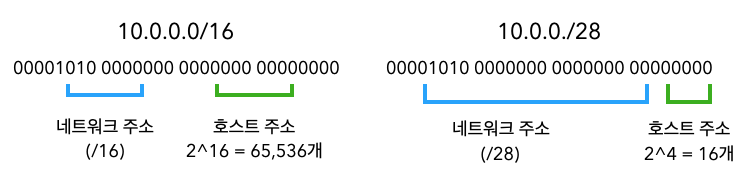
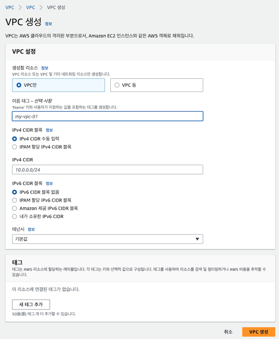

# VPC

`Amazon Virtual Private Cloud(VPC)`는 AWS에서 생성할 수 있는 프라이빗 가상 네트워크 공간이다.  
하나의 VPC를 논리적으로 나눠 분리할 수도 있고 여러 VPC를 연결할 수도 있다. 또한 퍼블릭 VPC나 VPN등을 이용해 접속하는 프라이빗 VPC도 구축가능하다.  

VPC를 만들때 CIDR 블록(IP 주소 범위)를 지정하고 지정한 CIDR 블록 네트워크를 확보한다. 
예를 들어 **"10.0.0.0/16"을 지정하면 65,536개의 IP주소를, "10.0.0.0/28"를 지정하면 16개의 IP 주소를 사용할 수 있다.  

### VPC 사용시 주의사항
VPC는 일반적으로 프라이빗 IP 주소를 사용한다. 필수는 아니지만 AWS에서 권고하는 사항이다.  
임으ㅢ의 퍼블릭 IP 범위에서 CIDR 블록을 지정할 수 있지만, 외부 퍼블릭 IP와 겹치면통신할 수 없으므 기본적으로 프라이빗 IP주소 공간을 CIDR 블록에 지정하는 것이 좋다.  

또한 온프레미스 환경이나 다른 VPC 등 외부 네트워크와의 접속을 고려하고 있다면 **접속할 네트워크와 VPC의 CIDR 블록이 중복되지 않게 주의해야 한다.  
중복되면 직접 연결은 할 수 없다.  

## VPC및 서브넷 생성
VPC는 EC2 및 기타 AWS 서비스와 마찬가지로 AWS Management Console또는 API를 통해 생성 할 수 있다. 관리 콘솔에서 생성하는 경우 화면에서 아래 항목을 설정해야 한다. 
- VPC 이름
- CIDR 블록
- IPv6 tjfwjd
- 테넌시(전용 하드웨어 사용 여부)

  

EC2보다 적은 설정 항목으로 즉시 가상 네트워크를 만들 수 있다.   
VPC만으로는 EC2와 같은 자원을 네트워크에 만들 수 없다. **VPC 안에 더 작은 네트워크 단위인 서브넷을 만드러야 한다.**   
서브넷은 하나의 AZ에 속해야 하며 여러 AZ에 걸쳐 있을 수 없다. 즉, 여러 AZ에 자원을 배치해 가용성을 높이려면 서브넷도 여러 개 만들어야 한다.   

서브넷에는 생성할 VPC의 CIDR 블록 범위 내에서 CIDR 블록을 지정해야 한다. 예를 들어 VPC의 CIDR 블로깅 10.0.0.0/16인 경우 10.0.0.0/24와 같이 CIDR 블록을 지정한다.  
