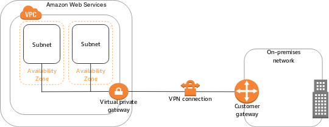

# VPC

`Amazon Virtual Private Cloud(VPC)`는 AWS에서 생성할 수 있는 프라이빗 가상 네트워크 공간이다.  
하나의 VPC를 논리적으로 나눠 분리할 수도 있고 여러 VPC를 연결할 수도 있다. 또한 퍼블릭 VPC나 VPN등을 이용해 접속하는 프라이빗 VPC도 구축가능하다.  

VPC를 만들때 CIDR 블록(IP 주소 범위)를 지정하고 지정한 CIDR 블록 네트워크를 확보한다. 
예를 들어 **"10.0.0.0/16"을 지정하면 65,536개의 IP주소를, "10.0.0.0/28"를 지정하면 16개의 IP 주소를 사용할 수 있다.  

### VPC 사용시 주의사항
VPC는 일반적으로 프라이빗 IP 주소를 사용한다. 필수는 아니지만 AWS에서 권고하는 사항이다.  
임으ㅢ의 퍼블릭 IP 범위에서 CIDR 블록을 지정할 수 있지만, 외부 퍼블릭 IP와 겹치면통신할 수 없으므 기본적으로 프라이빗 IP주소 공간을 CIDR 블록에 지정하는 것이 좋다.  

또한 온프레미스 환경이나 다른 VPC 등 외부 네트워크와의 접속을 고려하고 있다면 **접속할 네트워크와 VPC의 CIDR 블록이 중복되지 않게 주의해야 한다.  
중복되면 직접 연결은 할 수 없다.  

## VPC및 서브넷 생성
VPC는 EC2 및 기타 AWS 서비스와 마찬가지로 AWS Management Console또는 API를 통해 생성 할 수 있다. 관리 콘솔에서 생성하는 경우 화면에서 아래 항목을 설정해야 한다. 
- VPC 이름
- CIDR 블록
- IPv6 tjfwjd
- 테넌시(전용 하드웨어 사용 여부)

  

EC2보다 적은 설정 항목으로 즉시 가상 네트워크를 만들 수 있다.   
VPC만으로는 EC2와 같은 자원을 네트워크에 만들 수 없다. **VPC 안에 더 작은 네트워크 단위인 서브넷을 만드러야 한다.**   
서브넷은 하나의 AZ에 속해야 하며 여러 AZ에 걸쳐 있을 수 없다. 즉, 여러 AZ에 자원을 배치해 가용성을 높이려면 서브넷도 여러 개 만들어야 한다.   

서브넷에는 생성할 VPC의 CIDR 블록 범위 내에서 CIDR 블록을 지정해야 한다. 예를 들어 VPC의 CIDR 블로깅 10.0.0.0/16인 경우 10.0.0.0/24와 같이 CIDR 블록을 지정한다.  

## VPC의 주요 기능 사용법

## 라우팅 정보를설정해 인터넷과 통신
VPC에는 앞에서 설명한 서브넷, 라우팅과 같은 다양한 설정을 할 수 있다.  

### 라우팅 테이블
AWS는 VPC에 라우팅 테이블을 생성하고 각 서브넷에 사용할 라우팅 테이블을 지정한다. VPC를 통해 흐르는 패킷은 이 라우팅 테이블의 정보를 기반으로 경로(어디로 통신할지)를 결정한다.    
VPC를 만들 때 기본적으로 하나의 라우팅 테이블이 만들어 진다. 기본 상태에서는 VCP 내의 라우팅 정보만 있으므로 VPC 외부로는 통신할 수 없다.    
외부와 통신하려는 경우 외부 라우팅 저보를 추가해야 한다. 예를 들어 대상 0.0.0.0/0(모든 네트워크)에 대해 인터넷 게이트웨이로 라우팅 테이블에 등록하면 인터넷 게이트웨이를 통해 인터넷과 통신할 수 있다.   

### 인터넷 게이트웨이
**인터넷 게이트웨이**는 서브넷 안에 있는 EC2와 같은 자원이 인터넷과 통신할 수 있게 하기 위한 기능이다.  
인터넷 게이트웨이를 생성하고 서브넷의 라우팅 테이블에 설정하면 인터넷과 VPC가 서로 통신할 수 있게 된다.    
인터넷 게이트웨이로 가는 경로가 설정된 서브넷을 **퍼블릭 서브넷**이라고하고 인터넷 게이트웨이를 통해 통신할 수 없는 서브넷을 **프라이빗 서브넷**이라고 한다.  

EC2의 경우 `퍼블릭IP` 또는 `Elastic IP`를 부여해 인터넷과 통신할 수 있다.`퍼블릭 IP`는 자동으로 부여되는 IP로 재부팅시 매번 변경되지만, `Elastic IP`는 고정이다. 그래서 Elastic IP는 약간의 요금이 부과된다.  

### NAT게이트웨이 
프라이빗 서브넷에 있는 EC2와 같은 자원은 일반적으로 인터넷과 통신할 없다. 그러나 VPC내에서도 인터넷과 통신해야 하는 경우가 종종있는데 이때 사용하는게 `NAT 게이트웨이` 이다.   
NAT는 `Network Address Translation`의 약자로 프라이빗 IP 주소를 퍼블릭 IP 주소로 변환하는 것을 의미한다.  
NAT 게이트우ㅡㅔ이를 이용해 통신하기 위해서는 외부 통신을 수행한느 서브넷의 라우팅 테이블에 경로 정보(라우팅 정보)를 등록해야 한다.  

### VPC 접근 제어 및 통신 로그 확인
VPC에는 서브넷 단위로 접근 제어를 설정할 수 있는 **네트워크 접근 제어 목록(이후 네트워크 ACL)이라는 기능이 있다. `보안 그룹`과 조합해 접근 제어 설정이 가능하며 보안 그룹과의 차이는 다음과 같다. 

||네트워크 ACL|보안 그룹|
|---|---|---|
설정단위|서브넷 단위로 설정|인스턴스 단위로 설정|
|허용/거부 설정|둘 다 가능|허용만 가능|
|상태 저장 여부|상태 비저장|상태 저장|
|규칙 우선 순위|등록된 규칙의 번호순으로 트래픽 허용 및 거부|등록된 모든 규칙을 평가해 트래픽 허용|
기본 설정 상태에서 네트워크 ACL은 모든 통신을 허가하고 서브넷 전체에서 네트워크 접근을 허용하거나 거부하려는 경우 보안 그룹에서 추가 설정을 해야한다.      

네트워크 ACL이나 보안 그룹에서 허용되거나 거부된 통신 상황은 `VPC 흐름 로그`라고 하는 VPC 내의 IP 트래픽 상황을 로그로 저장할 수 있는 기능(`cloud watch`)을 사용해 확인 할 수 있다.

# VPC와 외부 네트워크 연결
## VPC 피어링
다른 VPC나 VPC외 다른 AWS와 연결하는 기능  
VPC 피어링을 사용해 서로 다른 두 개의 VPC를 연결해 통신할 수 있다.  피어링은 두 개의 VPC 간에 수행되기 때문에 세 개의 VPC가 서로 통신하는 경우 각 VPC끼리 따로 피어링을 구성해야 한다.    
연결된 VPC의 CIDR 블록은 겹치면 안 되므로 주의해야 한다.   

  
## AWS Transit Gateway
Transit Gateway를 사용하면 VPC 연결을 하나의 중앙 허브에서 관리 가능. VPN과 같이 온프레미스 환경과의 연결에도 사용할 수 있으므로 **AWS네트워크 연결을 중앙에서 관리**할 수 있다.  
  

## VPC 엔드포인트
S3등 VPC 외부에서 동작하는 AWS 서비스는 보통 인터넷을 거쳐 통신하지만 `VPC 엔드포인트`를 이용하면 프라이빗 네트워크로 통신할 수 있게 된다.  
VPC 엔드포인트를 설정한 VPC는 VPC 엔드포인트를 통해 S3와 같은 다른 AWS 서비스에 직접 접근할 수 있다.  

S3나 DynamoDB에서 사용하는 VPC 엔드포인트를 **게이트웨이 엔드포인트**라고 하며 AWS 서비스와의 통신은 퍼블릭 IP를 사용한다.   
VPC 엔드포인트 외에 인터페이스 엔드포인트라 깅ㅆ는데, 인터페이스 엔드포인트는 `AWS PrivateLink` 라는 기능을 이용해 서브넷에 서비스 접속용 ENI를 생성해 프라이빗 IP로 통신한다.

# VPC와 온프레미스 네트워크 연결  
VPC는 AWS의 네트워크 및 서비스뿐만 아니라 온프레미스 네트워크와도 연결 가능하다.  
## AWS Site-to-Site VPN
온프레미스 환경의 네트워크와 VPC를 VPN으로 연결하는 기능이다.  VPN은 프라이빗 네트워크를 구성해 통신하는 기술이고 VPN에 접근하면 외부 네트워크와 프라이빗 IP 주소로 통신할 수 있다.  

    
## ASW Client VPN  
온프레미스 환경의 클라이언트 단말(PC)와 VPN을 연결하는 기능제공.  
온프레미스 환경 전체가 아니라 특정 단말과 비공개로 연결하고 싶은 경우 이 서비스를 활용하는게 바람직하다.  
      

이 외에 AWS와 온프레미스 환경을 **전용선**으로 연결하는 기능으로 `AWS Direct Connect`가 있다.  

