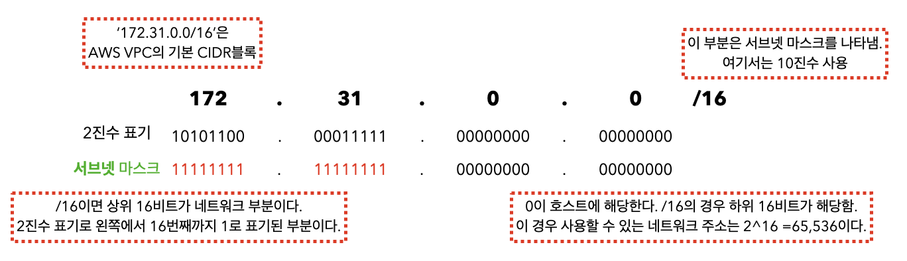
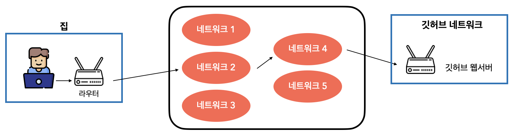

# 네트워크 기본

## IP주소
브라우저를 통해 웹 사이트에 접속할 때 우리에게 보이는 웹 페이지는 실제로 어느 주소에 존재하는 **웹 사이트를 호스팅하는 서버(이후 웹 서버)**에 접속해서 취득한 웹 페이지 정보이다.   
웹 서버는 어디에 존재할까? -> 웹 서버는 데이터 센터이 있을 수도 있고 AWS와 같은 클라우드 서비스에 있을 수도 있다. 그리고 웹 서버에 접근하기 위해서는 웹 서버가 그곳에 있다는 특정 정보가 필요함.  
이것이 `IP주소`이다.  
웹 사이트에 접속할 때 이 IP주소를 바탕으로 위치를 특정해 그곳에 있는 웹 서버에 접속한다. 

웹 서버뿐만 아니라 PC, 스마트폰 등 네트워크와 연결된 모든 장치에는 IP 주소가 할당됨.  
일반적으로 IPv4가 표준이다.  

## 퍼블릭 IP주소와 프라이빗  IP 주소
- IP 주소는 두 가지로 구분 가능하다. 하나는 한국 또는 전 세계에서 **이 주소는 인터넷에서 이곳**이라고 특정할 수 있는 주소다. 이것을 `퍼블릭 Ip 주소`또는 글로벌 IP주소 라고한다. 
- 반면 프라이빗 IP 주소는 닫힌 네트워크(근거리 통신-LAN) 내에서만 식별할 수 있는 IP주소다.  

## CIDR블록으로 IP 주소 범위 결정
아래 그림처럼 IP 주소를 이용해 네트워크 범위를 정의하는 것을 `CIDR 블록`이라고 한다. 
IP 주소를 나타내는 숫자열은 크게 **네트워크** 부분과 **호스트**부분으로 나눌 수 있다.   
네트워크 부분은 문자 그대로 네트워크를 정의하고 호스트 부분은 그 네트워크 내의 호스트, 즉 네트워크 안에서 접속할 수 있는 서버 등을 나타내는 부분이다.     
아래 그림에서 `/16`을 서브넷 마스크라고 하며 IP 주소를 사용해 네트워크 범위를 정의한다면 보통 이 표기르 사용한다.  

## 부하 분산 방지를 위해 서버를 분배하자.
많은 사용자가 사용하는 시스템을 구축한다면 **부하 분산**을 고려해야 한다.  
서버 1대당 한 번에 처리할 수 있는 접속자 수는 정해져 있기 때문에 한 번에 많은 사람이 몰리면 CPU나 메모리의 사용량이 증가해 서버가 느려지고 최악의 경우 서버가 멈출 수 있다.  

부하 분산을 위해 일반적으로 `로드 밸런서`라는 장치를 사용한다.  

출처 : https://tecoble.techcourse.co.kr/post/2021-11-07-load-balancing/

## 라우팅 및 라우팅 테이블
실제 세상의 어떤 주소를 찾아가기 위해서는 그 주소까지의 경로를 알아야 한다. 네트워크 세계에서도 이처럼 어떤 IP주소를 찾아가기 위해서는 해당 주소까지의 경로를 알아야한다.  
`라우터`가 최적의 경로를 찾아서 경로를 결정하고 연결해준다. 라우터가 Ip 주소까지의 경로를 결정하는 것을 `라우팅(routing)`이라고 한다.  
인터넷을 통해 원하는 사이트까지 가는 경로는 여러 라우터를 거치게 되므로 어떠헤 라우팅 하는 것이 효율적일지 결정해야 한다.  

각 라우터는 소유한 경로 정보를 기반으로 목적지 IP 주소를 향해 이동해야 하는 네트워크를 결정하고 이 경로 정보를 `라우팅 테이블`이라 한다.  

AWS에서는 VPC의 라우팅 테이블이라는 기능이 이에 해당한다. 