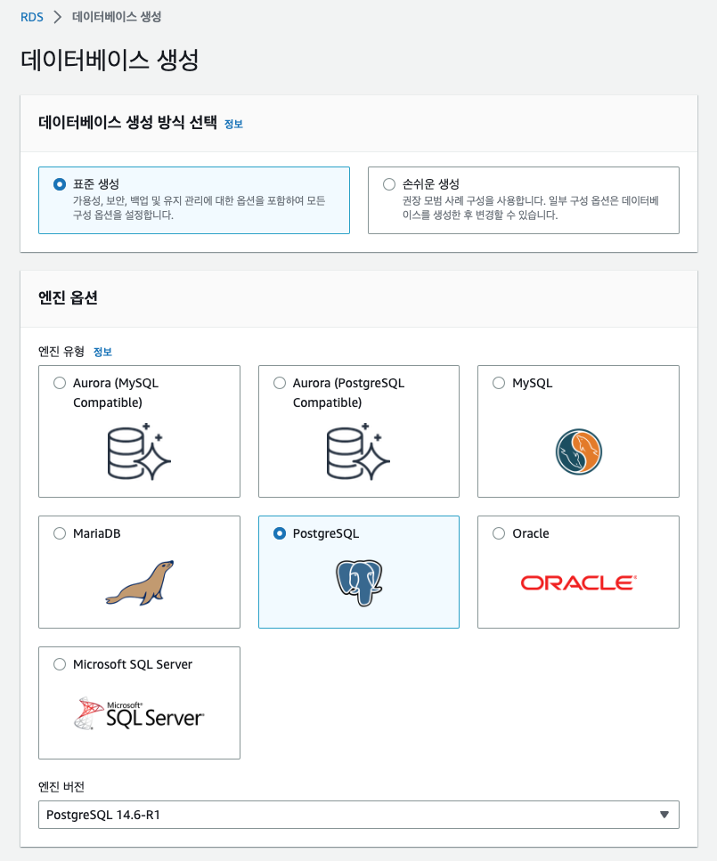
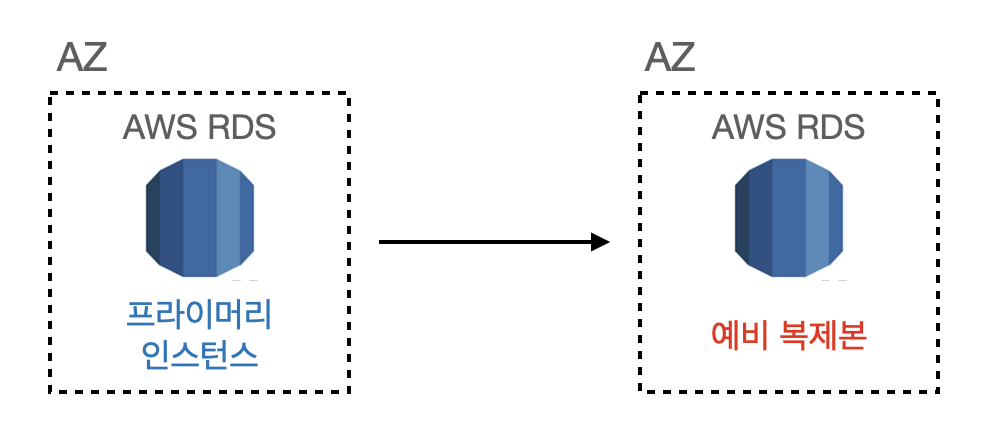
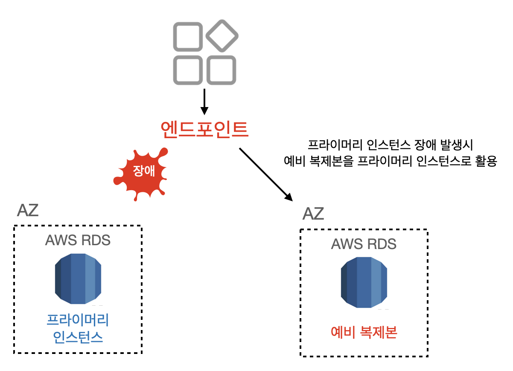
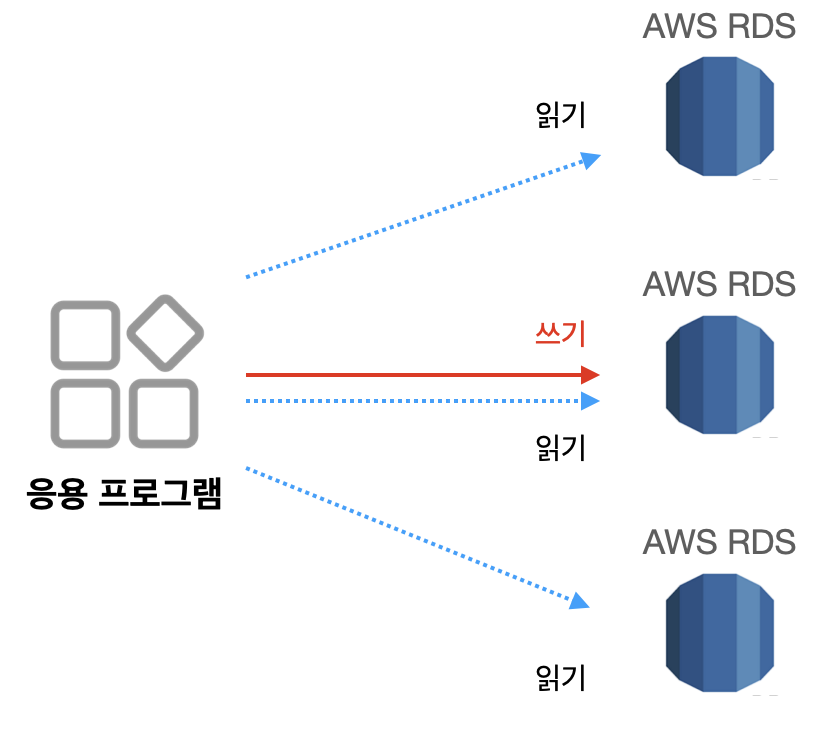
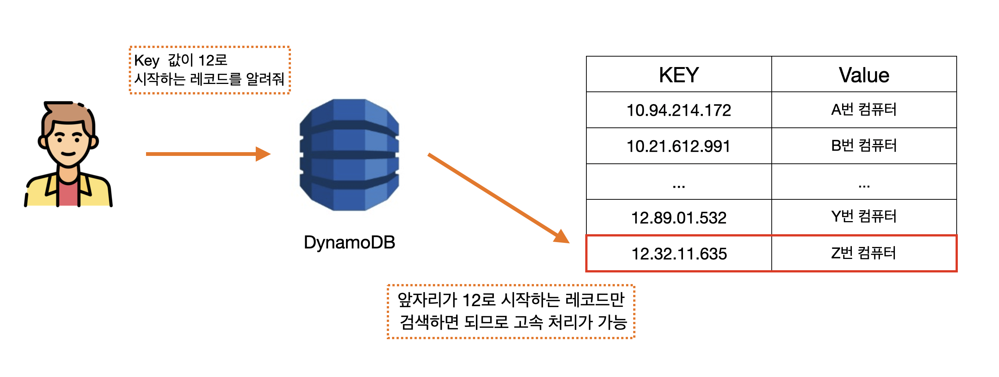
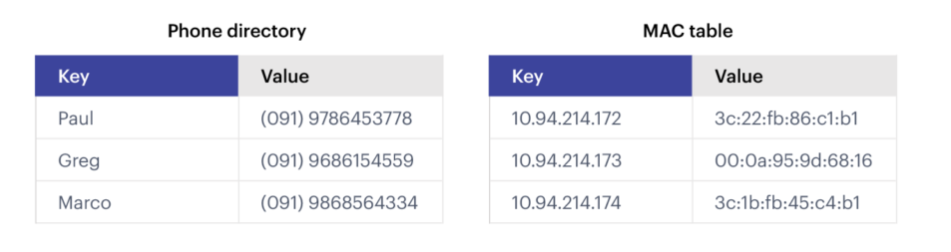

# AWS의 관게형 데이터 베이스 서비스(RDS)
- Amazon RDS는 `관계형 데이터 베이스`를 제공하는 서비스.
- 2023년 5월 기준 아래 6개 엔진 지원
  - MySQL, SQL Server, MariaDB
  - PostgreSQL, Oracle,Amazon Aurora

EC2나 온프레미스로 DB를 구축하면 사용자가 OS 설정이나 DB 엔진 설치 및 걸정등을 해야 하므로 어느정도 시간이 소요된다.
그런가 AWS RDS에서는 OS나 데이터베이스 엔진의 관리는 AWS 측에서 수행하므로 이용자는 몇 분 안에 데티어베이스를 생성해 이용할 수 있다.  

RDS에서 DB를 생성하는 방법은 AWS 관리 콘솔을 이용하거나 APi를 이용하면 된다. 아래 예시는 관리 콘솔을 이용한 DB 생성 예시이다.  
    

## DB용 인스턴스 
RDS도 EC2와 마찬가지로 선택한 **인스턴스**에 따라 성능이 달라진다.  

### RDS 인스턴스 유형

인스턴스의 성능(CPU, 메모리)는 인스턴스 크기를 선택해 결정한다. 아래는 인스턴스 명명 규칙 예시이다.  

### `db.m6g.large`
이름 앞에 'db'가 고정된 것을 제외하고는 EC2와 동일한 규칙이다.   
`m6g`에서 숫자가 클수록 새롭고 고성능을 의미하고, 그 뒤에 large는 인스턴스의 크기를 나타내는데, 크기가 클수록 고성능이고 요금도 비싸다.  

### 스토리지 유형

EBS와 마찬가지로 RDS에서도 데이터 저장을 위한 스토리지 설정이 가능하다. 
사용할 수 있는 스토리지 유형은 아래와 같다.  
|볼륨 유형|개요|
|---|---|
|마그네틱 HDD|저렴한 비용|
|범용 SSD|고성능으로 용량에 따라 읽기/쓰기 성능 결정|
|프로비저닝 IOPS SSD|고성능이며 지정한 읽기/쓰기 성능 확보|

## 예비 복제본
RDS는 데이터를 처리하는 `프라이머리 인스턴스`외에 예비 복제본(Standby replica)을 다중 AZ에 배포해 가용성을 높일 수 있다.  **고가용성**이란 시스템이 중단되지 않고 작동할 수 있는 능력으로, RDS에서는 이를 예비 복제본으로 구현한다.  이 구성을 `다중 AZ배포`라고 한다.   

    

프라이머리 인스턴스나 AZ에 장애가 발생하면 예비 복제본으로 전환해 DB를 게속 이용할 수 있다. 이 같은 작업을 **장애 조치(Fail Over)**라고 한다.   

응용 프로그램에서 RDS에 속할 때는 **엔드포인트**라는 DNS 형식의 접속 정보를 사용한다.  프라미어리 인스ㅓㄴ스에 장애가 발생하면 이 엔드포인트의 목적지가 자동으로 예비 복제본으로 전환된다.  

    

## 읽기 전용 복제본
RDS에는 읽기 전용으로 사용할 수 있는 `읽기 전용 레플리카`라는 기능이 있다. ㅇ릭기 전용 래플리카는 프라이머리 인스턴스에서 복제된 인스턴스다. 읽기 요청이 늘어나면 인스턴스의 수를 늘리는 스케일 아웃 방식으로 성능을 향상할 수 있다.  

 

# DynamoDB
DynamoDB는 AWS가 만든 고속 키-값 데이터베이스다.  
키-값 데이터는 기본적으로 프라이머리 키로만 검색해 데이터를 가져온다. DynamoDB도 내부적으로 프라이머리 키 검색을 쉽게 할 수 있게 데이터를 정리해 보존한다.  

    

또한 DynamoDB는 EC2나 RDS와 같이 사용자가 인스턴스(=서버)를 소유한다는 개념이 없기때문에 서버리스라는 특징을 가진다.  

### key-value DB

`key-value`라는 이름에서 유추할 수 있듯이 키의 이름과 그에 대한 값으로 구성된 데이터다. 키와 값이 하나의 쌍으로 구성되면 되기 때문에 **데이터 형태로는 자유도가 매우 높지만 관계형 데이터베이스처럼 표 형식으로 저장돼 있지 않기 때문에 집계나 검색이 매우 어렵다.**    

  

### 장애 대비
AWS에서는 장애 대비를 위해 DynamoDB데이터를 이중화하여 저장한다. 3개의 AZ에 실시간으로 데이터를 복제해 어느 하나의 AZ에 장애가 발생하더라도 문제없이 서비스를 이용할 수 있다.   
또한 DynamoDB에는 `특정 시점 복구(PITR)`라는 실시간 백업 기능이 있는데, 해당 기능을 활성화하면 지난 35일 내 임의의 시점으로 테이블 데이터를 되돌릴 수 있다.  
갑자기 데이터 손실이 발생해도 대응할 수 있고 또한 임의의 시점을 지정해 백업을 취득할 수도 있다.  
수동으로 취득한 백업은 무기한으로 보관할 수 있어서 특정 시점의 데이터를 보존하고자 할때 유용하다.  

# 분석용 데이터 베이스 RedShift

- AWS Redshift는 데이터 분석을 위한 `데이터 웨어하우스 서비스`이다.  
- 웨어하우스는 창고라는 의미로, 짐을 창고에 쌓아두듯이 데이터를 쌓아두는 역할을 하기 때문에 데이터 웨어하우스라고 한다.      
다른 리전에 있는 대량의 S3나 RDS 데이터를 Redshift로 가져와 SQL이나 BI도구르 이용해 분석할 수 있게 해준다.     

또한 Redshift는 SQL 연결을 받아들이는 **리더 노드**와 스토리지 및 SQL 문을 실행하는 **컴퓨터 노드**라는 두 가지 노드로 구성된다. 컴퓨터 노드는 여러 개 존재하므로 처리를 분산해 고속으로 실행한다.  

Redshift는 분석 및 데이터 읽기에 특화된 데이터베이스미으로 SQL의 Insert 문이나 Update 문을 실행해 데이터를 하나씩 삽입하는 것은 권장하지 않는다.  
대신 **COPY 명령**을 사용해 S3 버킷에서 여러 개의 텍스트 데이터를 병렬로 업로드하는 것을 추천한다. S3외에도 DynamoDB, Ec2와 같은 외부 서버로부터 COPY를 사용한 업로드도 가능하다.  
