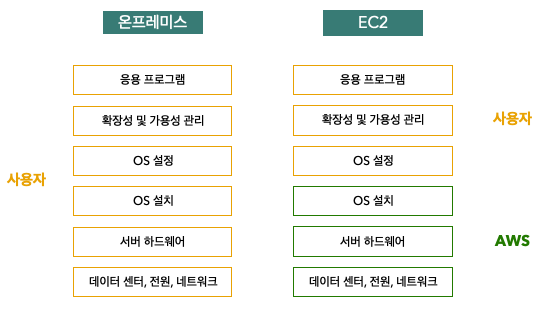
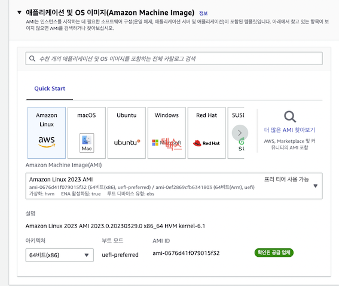
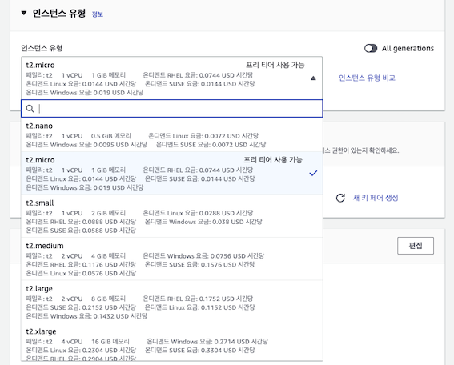
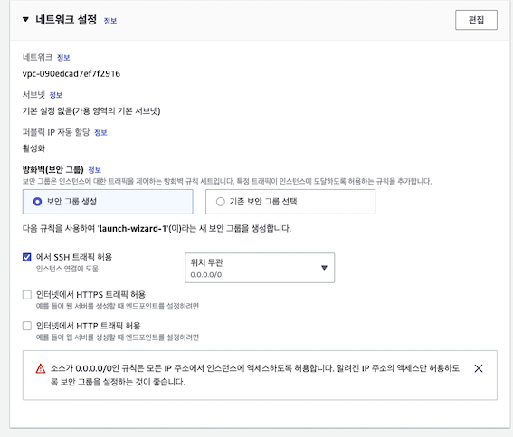
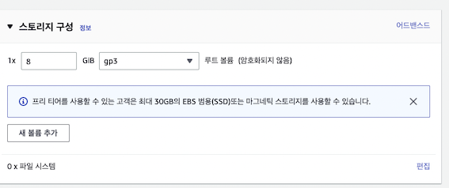
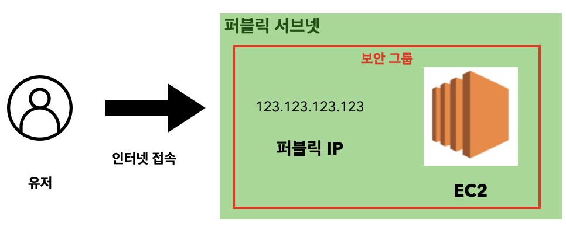
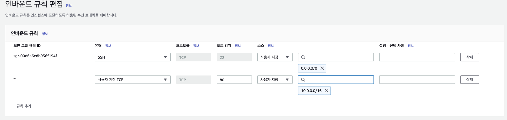
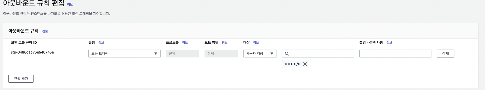

# EC2
## Amazon Ec2는 가상 서버서비스이다.
- Amazon EC2는 몇 분 만에 가상 서버를 생성할 수 있는 서비스다.
- 리눅스나 윈도우와 같은 OS는 AWS가 제공하는 것을 선택할 수 있다.
- 하드웨어 준비부터 OS설치까지 모두 사용자가 해야하는 온프레미스와 달리, 
- EC2는 가상 머신을 생성할때, OS를 함계 설치하므로 사용자는 가상민 사용 준비가 완료되면 바로 OS를 사용가능하다.

CPU나 메모리와 같은 서버 사양도 자유롭게 선택할 수 있고, 머신을 생성한 후에도 변경(확장) 가능하다.  
물론 데이터를 저장하는 스토리지 용량도 가능.  

 

EC2는 가상 서버를 인스턴스 단위로 관리한다.  
사용자가 인스턴스 유형을 결정해 생성하면 인스턴스 유형과 이용 기간에 따라 요금이 발생한다.(정지해두면 발생하지 않음.)

## 가상 서버 생성
EC2 인스턴스를 생성하기 위해서는 아래 내용을 반드시 설정해야 한다. 
### Amazon 머신 이미지(AMI)
AMI는 OS와 소프트웨어가 설정된 템플릿이다. AWS에서 미리 준비한 AMI가 제공되며 사용자는 제공된 AMI 중 하나를 선택한다.
나중에 스스로 설정한 AMI를 활용할 수도 있다.  

### 인스턴스 사양(인스턴스 유형)
인스턴스 유형을 선택하면 가상 서버의 성능이 결정된다. CPU와 메모리 용량이 함꼐 표시되므로 적절한 유현을 선택하자.  (생성 후 변경 가능))  

### 배포할 네트워크 / 사용 권한 설정(보안그룹)
가상 머신이 위치할 네트워크는 사용자가 생성한 VPC를 선택하고 스토리지 용량(EBS를 성정한 후 마지막으로 접근 권한 설정을 위해 보안 그룹을 선택한다.  

### 데이터를 저장할 스토리지 용량

## 서버 외부 공개
EC2에서 구축한 웹 응용 프로그램을 외부에 공개할 때 몇가지 추가 설정이 필요하다.    
공개된 응용 프로그램은 인터넷을 통해 PC나 스마트폰에서 접속해서 사용할 수 있어야 하기 때문에 EC2와 인터넷 간 통로를 설정해야 한다.   
EC2를 인터넷에 공개하려면 아래 3가지 조건을 충족해야 한다.
- EC2를 `퍼블릭 서브넷`에 배치
- `퍼블릭 IP 주소`를 EC2에 부여
- 보안 그룹에서 외부로부터의 접근 허가 

  
- 퍼블릭 서브넷 : 인터넷과 통신할 수 있는 서브넷, 서브넷은 EC2를 배치하는 네트워크이다.
- 보안그룹 : 보안그룹에서 접속 허가. 웹사이트라면 80번이나 443번 포트를 허가한다.
- 퍼블릭 IP : 인터넷과 통신할수 있는 IP 주소, IP 주소는 EC2의 위치를 나타내는 주소이다.

## 서버 접근제어
어느 곳에서 어느 곳으로 접속을 허가할지에 대한 접근 제어는 `보안 그룹`을 이용한다. 보안 그룹은 온프레미스의 `방화벽`기능을 수행한다.   
외부에서 EC2로의 통신을 `인바운드 규칙`으로 정의하고 EC2에서 외부로의 통신을 `아웃바운드` 규칙으로 정의하며 둘 다 통신을 허용할 네트워크와 포트 번호를 지정한다.

### 인바운드 규칙
아래는 리눅스 터미널 접속을 위한 SSH는 22번 포트, 웹 접속을 위한 HHTP는 80번 포트를 사용한다는 인바운드 규칙이다.
  

### 아웃바운드 규칙
아래는 외부로의 모든 트래픽(통신)을 허용한다는 아웃바운드 규칙 예시이다.  
    

보안 그룹에 규칙을 추가할 때 대상에 IP가 아니라 다른 보안 그룹을 지정하는 것도 가능하다. 예를 들어 EC2-A와 EC2-B 인스턴스가 있고, EC2-A에서 EC2-B로 통신을 허가해야 하는 경우 EC2-B의 보안 그룹에 EC2-A의 보안 그룹 ID를 지정하면 내부적으로 EC2-A의 IP가 지정돼 통신이 허가 된다.

## 서버 자동 추가 및 제거
`EC2의 Auto Scaling` 기능을 사용하면 서버 추가 및 제거를 부하 상황에 맞게 자동으로 수행할 수 있다. 서버를 추가하는 것을 `스케일 아웃`이라고하고 서버를 제거하는 것을 `스케일 인`이라고 한다.   
시작 템플릿에 AMI 정보와 서버가 추가될 조건을 설정해두면 조건에 맞춰 서버가 자동으로 추가 된다. 조건의 예시는 다음과 같다.
- CPU 사용률이 50%를 초과하면 서버 추가.
- 평일에는 서버 3개, 주말에는 서버 1개 
- 장애 대비 - 예상치 못한 장애기 발생해 인스턴스가 멈추면 자동으로 새로운 인스턴스 생성