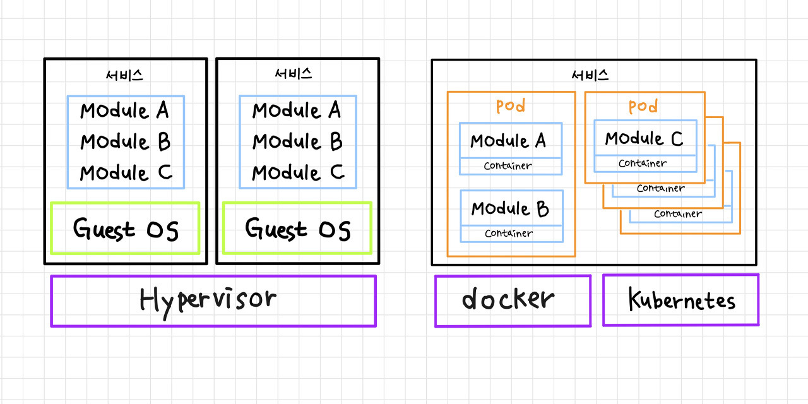
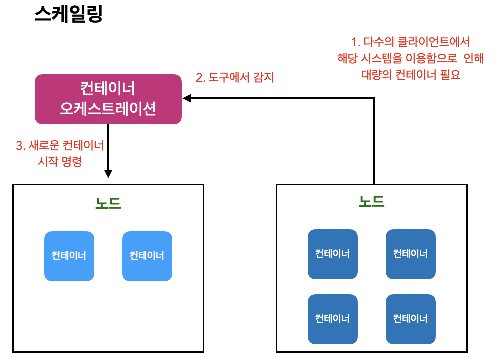

# ECS
AWS에서 컨테이너 시스템을 구축하는 경우 일반적으로 Amazon Elastic Container Service와 Amazon Elastic Kubernetes Service라는 두 가지 서비스 중에서 선택할 수 있다. 우선 컨테이너에 대해 알아보자.
## 컨테이너란
`컨테이너`는 서버 가상화와 비교되는 경우가 있는데 서버를 집으로 비유하고 서버에서 실행되는 응용 프로그램 프로세스를 집에 사는 거주자로 비유하면 가상화와 컨테이너는 아래 그림과 같은 형태로 표현할 수 있다.  

  
  
 출처 : https://daaa0555.tistory.com/464

 |가상서버|컨테이너|
 |---|----|
 |1대의 물리 서버에서 복수의 가상서버가 동작|1개의 물리 서버에 여러 컨테이너가 동작|
 |가상 하드웨어 위에 OS, 미들웨어가 설치돼 그 위에서 프로세스(응용프로그램)이 동작|서버의 OS와 물리 자원은 각 컨테이너가 공동으로 이용하고 각 컨테이너는 네트워크가 분리돼 있지만 외부 네트워크와의 통신이나 컨테이너 간 통신을 할 때 컨테이너 런타임을 통해 이뤄진다.|  
 컨테이너는 어떤 응용 프로그램을 실행할지 미리 정의해둔 파일을 바탕으로 실행된다. 이것을 `컨테이너 이미지`라고한다.  

 ## 컨테이너 오케스트레이션
 컨테이너를 이용해 실제 서비스를 운영할 때 각 기능을 컨테이너로 분리해 여러 컨테이너를 하나의 시스템처럼 유기적으로 결합해 사용하는 경우가 많다. 이때 컨테이너를 모두 따로 관리하려고 하면 관리 부하가 굉장히 높아진다.  
   

예를 들어 컨테이너가 비정상적으로 종료될 때마다 사람이 직접 재시작을 해준다거나 시스템 부하에 따른 컨테이너 증가 감소 등의 관리까지 생각하면 운영 부하뿐만 아니라 관리 난이도도 높아진다.  

`컨테이너 오케스트레이션 도구`를 이용하면 이러한 관리를 자동화해 운영 부하를 줄일 수 있다. 오케스트레이터는 컨테이너를 이용한 시스템 개발에 필수 존재가 되었다.   

  
  

## AWS의 컨테이너 오케스트레이션
AWS에는 ECS와 EKS라는 2개의 컨테이너 오케스트레이션 서비스가 있다. 두개의 차이는 컨테이너 오케스트레이션 기능을 AWS가 담당하느냐 쿠버네티스가 담당하느냐다.  

### ECS
ECS는 AWS의 관리형 컨테이너 오케스트레이션이다. 컨테이너 오케스트레이션 도구를 구축하고 관리하기 위해서는 상당한 노력과 시간이 요구되는데 이 부분을 AWS에 모두 맡길 수 있다. 그리고 ECR이라는 컨테이너 이미지 레지스트리 서비스도 제공한다.   

이를 이용하면 사용자 정의된 컨테이너 이미지를 AWSD에서 관리할수 있고 ECS에서 쉽게 배포할 수 있다.    

### EC2와 Fargte
ECS를 이용해 컨테이너를 기동할 때 어떤 플랫폼에서 시작할지 선택할 수 있다. 선택 가능한 플랫폼은 EC2와 AWS Fargate 두 가지다.  
EC2는 EC2 인스턴스 내에서 실행되는 컨테이너 런타임에서 컨테이너를 실행하는 타입이다. 이 경우 사용자가 컨테이너 런타임이 설치된 서버(EC2 인스턴스)를 관리해야 한다.  

반대로 Fargate는 AWS에서 관리하는 서버에서 컨테이너를 실행한다. Fargate는 컨테이너 런타임, OS 버전업과 같은 서버 관리를 AWS에서 하므로 사용자는 컨테이너 이미지만관리하면 된다.   
서버의 컨테이너 런터임, OS와 같은 버전은 플랫폼 버전(PV)를 통해 관리되므로 Fargate를 실행할때 PV를 지정해야 한다.
  

노드에서 할당하는 하드웨어 자원의 할당 방법에도 차이가 있는데, EC2의 경우 CPU/메모리를 늘리고 싶다면 인스턴스 타입을 적절한 것으로 변경하고, 스토리지를 늘리고 싶다면 스토리지(EBS)의 볼륨 크기를 확장하면 된다.  

Fargate는 CPU와 메모리를 직접 할당할 수 있지만, 지정한 CPU 값에 따라 할당할 수 있는 메모리 크기가 정해져 있다. 

## EKS
EKS는 ECS와 쿠버네티스를 사용할수 있는 서비스이다.  

쿠버네티스는 구글에서 개발한 컨테이너 오케스트레이션 도구이다. 제일 앞 글자 K와 마지막 글자 s 사이에 8글자가 있다고 해서 `k8s`라고 표기하기도 한다. k8s 환경을 직접 구축해 이용하기 위해서는 필수 구성요소를 설치하고 관리해야 한다. k8s는 구축과 그 이후의 운영에 시간과 비용이 든다는 문제가 있지만, EKS를 이용하면 이런 문제를 해결할 수 있다. 