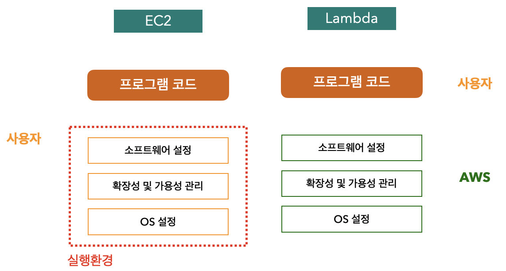
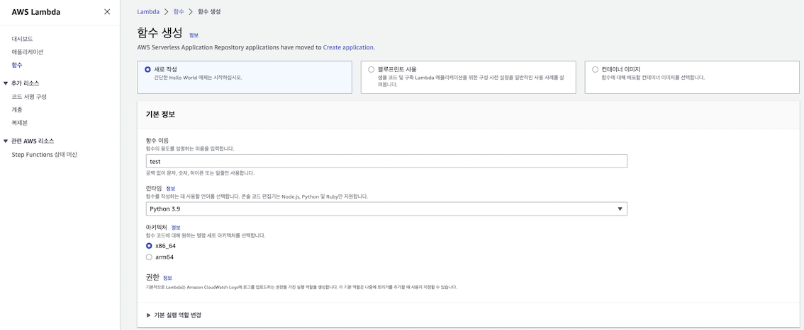
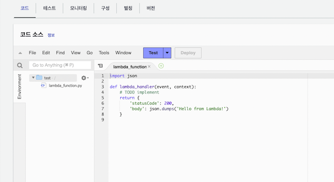
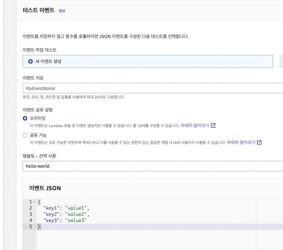
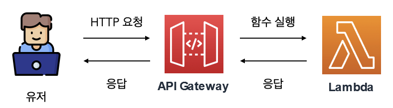
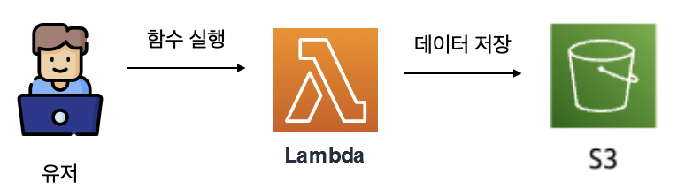
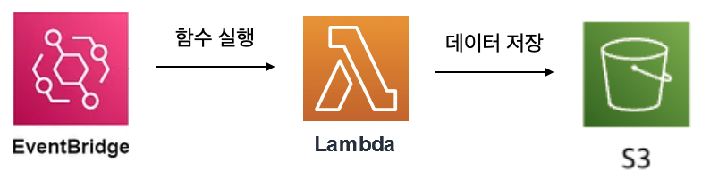
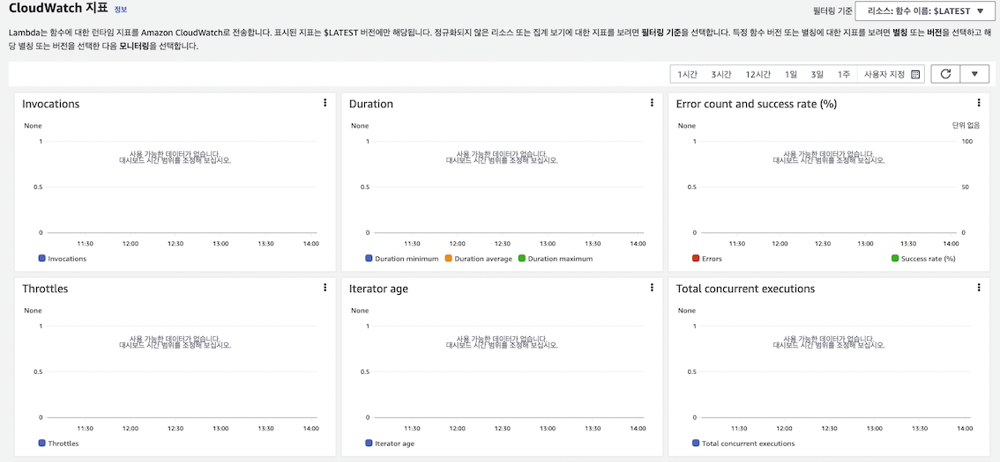

# 서버리스 컴퓨팅 서비스 Lambda 
AWS LAmbda는 서버리스 컴퓨팅 서비스다. OS같은 인프라를 관리할 필요가 없으므로 사용자는 프로그램 코드를 준비하고 Lambda에 업로드만 하면 된다.  

`서버리스`란 실제로 가동하는 서버가 없다는 뜻이 아니라 AWS에서 서비스가 실행될 핀프라를 관리하므로 사용자가 관리할 서버가 없다는 것이다.  

### EC2 vs Lambda
EC2와 비교했을 때 Lambda는 실행 환경도 AWS에 맡긴다. 사용자는 코드만 작성해서 바로 실행하면 된다. 
 

## Lambda의 장점
- 보안
    - AWS에서 OS와 미들웨어 등의 기반 시스템을 모두 관리한다. 장애와 보안 패치 등도 모두 AWS 소관하에 이뤄지므로 이용자는 Lambda 코드만 관리하면 된다.
- 비용
    - EC2는 사용하지 않아도 실행중이라면 시간만큼 요금이 발생한다. 하지만 Lambda는 코드가 실행될 때만 요금이 부과되므로 비용이 효율적이다.
- 가용성
    - AWS에는 물리적으로 독립된 여러 개의 가용 영역(AZ)이 있으며 Lambda는 복수의 가용 영역에서 실행된다. 예를 들어 처음 실행은 AZ-A에서 , 두번쨰는 AZ-C에서 실행 될 수 있다. 사용자가 설정하지 않아도 고 가용성, 장애 대응성으 유지된다. 
- 확장성
    - Lambda는 동시에 다수의 처리를 해야 하는 경우 자동으로 AWS가 관리하는 처리용 인스턴스가 시작되면서 확장된다.  서울 리전의 동시 실행 수는 최대 1,000개 이며 별도 확장 신청을 통해 동시 실행수를 늘리는 것도 가능하다.  

## 함수 생성 및 실행

Lambda에서는 함수라고 하는 단위로 프로그램 코드를 관리하고 처리한다.  
함수는 AWS 관리 콘솔 및 여러 도구로 생성할 수 있다.
1. Lambda에서 함수 생성을 선택한 후 원하는 함수 이름, 사용할 런타임(프로그래밍 언어 및 버전)을 저장하고 생성 버튼을 누른다.     
2. 함수가 생성되면 브라우저 화면에 기본 프로그램 코드가 표시되고 편집할 수 있다.
    

3. 작성한 함수는 브라우저 화면상에서 테스트 실행이 가능하다. 함수에 전달할 테스트 데이터를 JSON 형식으로 지정해야한다.  
   

## 람다를 더 똑똑하게 활용하기
### 사용자 요청에 따라 Lambda 함수 실행
Amazon API Gateway서비스와 Lambda를 결합해 사용자의 HTTP 요청을 Lambda 함수로 처리 할 수 있다. 이를 통해 간단한 웹 응용 프로그램도 만들 수 있다.  

API Gateway는 사용자로 부터 HTTP 요청을 받으면 GET과 같은 HTTP 메서드나 /api등의 요청 경로에 대한 정보가 포함된 JSON 데이터를 Lambda 함수에 전달한다. Lambda함수에서 응답 내용을 반환하도록 코드를 작성하면 API Gateway를 통해 응답이 반환된다.  

   

### S3에 데이터를 자동 처리
Amazon S3 버킷에 데이터가 저장되면 저장된 데이터를 Lambda로 작동 처리할 수 있다. 예를 들어 데이터에 포함된 정보를 가공해 다른 S3버킷에 저장하는 등의 처리가 가능하다. 

   

### 주기적으로 Lambda 함수 실행
매일 12:00 등 주기적으로 정해진 시간에 어떤 처리를 하고 싶다면 EventBridge라는 서비스와 Lambda를 연계해 구현할 수 있다. EventBridge에 규칙이라는 형태로 매일 실행할 내용을 정의해두고 실행 대상에 Lambda 함수를 지정하면 주기적인 실행이 가능하다.  

   

### Lambda 함수 실행 상태 모니터링
Lambda 함수를 만들어 배포하면 AWS 모니터링 서비스인 CloudWatch에 다음과 같은 정보가 자동으로 전송되므로 사용자는 Lambda 실행 상황을 확인할 수 있다.
- 실행 횟수
- 오류 수와 실행 성공률
- 실행 시간(최소,최대,평균)
     
CloudWatch를 사용하면 별도의 설정 없이 이러한 모니터링이 가능하지만 AWS의 다른 서비스나 외부 서비스를 결합하면 다양한 조건을 넣어 모니터링할 수 있다.