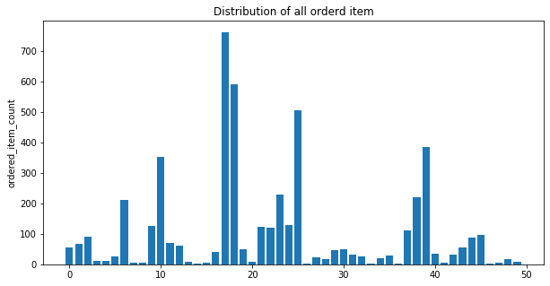

```python
import pandas as pd
chipo = pd.read_csv('C:/Users/ariz/Desktop/슬기로운 방학생활/이것이 데이터 분석이다/data/chipotle.tsv',sep='\t')
print(chipo.shape)
print('---------------------------------')
print(chipo.info())      
chipo.head()
```

    (4622, 5)
    ---------------------------------
    <class 'pandas.core.frame.DataFrame'>
    RangeIndex: 4622 entries, 0 to 4621
    Data columns (total 5 columns):
     #   Column              Non-Null Count  Dtype 
    ---  ------              --------------  ----- 
     0   order_id            4622 non-null   int64 
     1   quantity            4622 non-null   int64 
     2   item_name           4622 non-null   object
     3   choice_description  3376 non-null   object
     4   item_price          4622 non-null   object
    dtypes: int64(2), object(3)
    memory usage: 180.7+ KB
    None
    


<div>
<style scoped>
    .dataframe tbody tr th:only-of-type {
        vertical-align: middle;
    }

    .dataframe tbody tr th {
        vertical-align: top;
    }

    .dataframe thead th {
        text-align: right;
    }
</style>
<table border="1" class="dataframe">
  <thead>
    <tr style="text-align: right;">
      <th></th>
      <th>order_id</th>
      <th>quantity</th>
      <th>item_name</th>
      <th>choice_description</th>
      <th>item_price</th>
    </tr>
  </thead>
  <tbody>
    <tr>
      <th>0</th>
      <td>1</td>
      <td>1</td>
      <td>Chips and Fresh Tomato Salsa</td>
      <td>NaN</td>
      <td>$2.39</td>
    </tr>
    <tr>
      <th>1</th>
      <td>1</td>
      <td>1</td>
      <td>Izze</td>
      <td>[Clementine]</td>
      <td>$3.39</td>
    </tr>
    <tr>
      <th>2</th>
      <td>1</td>
      <td>1</td>
      <td>Nantucket Nectar</td>
      <td>[Apple]</td>
      <td>$3.39</td>
    </tr>
    <tr>
      <th>3</th>
      <td>1</td>
      <td>1</td>
      <td>Chips and Tomatillo-Green Chili Salsa</td>
      <td>NaN</td>
      <td>$2.39</td>
    </tr>
    <tr>
      <th>4</th>
      <td>2</td>
      <td>2</td>
      <td>Chicken Bowl</td>
      <td>[Tomatillo-Red Chili Salsa (Hot), [Black Beans...</td>
      <td>$16.98</td>
    </tr>
  </tbody>
</table>
</div>


# 데이터 탐색과 시각화
---


## 가장 많이 주문한 아이템 top 10
---
value_counts() 함수는 컬럼내 데이터의 빈도수를 반환한다(내림차순)


```python
item_count = chipo['item_name'].value_counts()[:10]
print(item_count)

```

    Chicken Bowl           726
    Chicken Burrito        553
    Chips and Guacamole    479
    Steak Burrito          368
    Canned Soft Drink      301
    Chips                  211
    Steak Bowl             211
    Bottled Water          162
    Chicken Soft Tacos     115
    Chicken Salad Bowl     110
    Name: item_name, dtype: int64
    

## 아이템 주문 개수와 총량
---
group by() 함수를 이용하여 아이템별 주문 개수와 총량을 구함


```python
# 아이템별 주문 수 출력
item_count = chipo.groupby('item_name')['order_id'].count()
item_count
```


    item_name
    6 Pack Soft Drink                         54
    Barbacoa Bowl                             66
    Barbacoa Burrito                          91
    Barbacoa Crispy Tacos                     11
    Barbacoa Salad Bowl                       10
    Barbacoa Soft Tacos                       25
    Bottled Water                            162
    Bowl                                       2
    Burrito                                    6
    Canned Soda                              104
    Canned Soft Drink                        301
    Carnitas Bowl                             68
    Carnitas Burrito                          59
    Carnitas Crispy Tacos                      7
    Carnitas Salad                             1
    Carnitas Salad Bowl                        6
    Carnitas Soft Tacos                       40
    Chicken Bowl                             726
    Chicken Burrito                          553
    Chicken Crispy Tacos                      47
    Chicken Salad                              9
    Chicken Salad Bowl                       110
    Chicken Soft Tacos                       115
    Chips                                    211
    Chips and Fresh Tomato Salsa             110
    Chips and Guacamole                      479
    Chips and Mild Fresh Tomato Salsa          1
    Chips and Roasted Chili Corn Salsa        22
    Chips and Roasted Chili-Corn Salsa        18
    Chips and Tomatillo Green Chili Salsa     43
    Chips and Tomatillo Red Chili Salsa       48
    Chips and Tomatillo-Green Chili Salsa     31
    Chips and Tomatillo-Red Chili Salsa       20
    Crispy Tacos                               2
    Izze                                      20
    Nantucket Nectar                          27
    Salad                                      2
    Side of Chips                            101
    Steak Bowl                               211
    Steak Burrito                            368
    Steak Crispy Tacos                        35
    Steak Salad                                4
    Steak Salad Bowl                          29
    Steak Soft Tacos                          55
    Veggie Bowl                               85
    Veggie Burrito                            95
    Veggie Crispy Tacos                        1
    Veggie Salad                               6
    Veggie Salad Bowl                         18
    Veggie Soft Tacos                          7
    Name: order_id, dtype: int64


```python
# 아이템별 주문 총량
item_quantity = chipo.groupby('item_name')['quantity'].sum()
item_quantity
```


    item_name
    6 Pack Soft Drink                         55
    Barbacoa Bowl                             66
    Barbacoa Burrito                          91
    Barbacoa Crispy Tacos                     12
    Barbacoa Salad Bowl                       10
    Barbacoa Soft Tacos                       25
    Bottled Water                            211
    Bowl                                       4
    Burrito                                    6
    Canned Soda                              126
    Canned Soft Drink                        351
    Carnitas Bowl                             71
    Carnitas Burrito                          60
    Carnitas Crispy Tacos                      8
    Carnitas Salad                             1
    Carnitas Salad Bowl                        6
    Carnitas Soft Tacos                       40
    Chicken Bowl                             761
    Chicken Burrito                          591
    Chicken Crispy Tacos                      50
    Chicken Salad                              9
    Chicken Salad Bowl                       123
    Chicken Soft Tacos                       120
    Chips                                    230
    Chips and Fresh Tomato Salsa             130
    Chips and Guacamole                      506
    Chips and Mild Fresh Tomato Salsa          1
    Chips and Roasted Chili Corn Salsa        23
    Chips and Roasted Chili-Corn Salsa        18
    Chips and Tomatillo Green Chili Salsa     45
    Chips and Tomatillo Red Chili Salsa       50
    Chips and Tomatillo-Green Chili Salsa     33
    Chips and Tomatillo-Red Chili Salsa       25
    Crispy Tacos                               2
    Izze                                      20
    Nantucket Nectar                          29
    Salad                                      2
    Side of Chips                            110
    Steak Bowl                               221
    Steak Burrito                            386
    Steak Crispy Tacos                        36
    Steak Salad                                4
    Steak Salad Bowl                          31
    Steak Soft Tacos                          56
    Veggie Bowl                               87
    Veggie Burrito                            97
    Veggie Crispy Tacos                        1
    Veggie Salad                               6
    Veggie Salad Bowl                         18
    Veggie Soft Tacos                          8
    Name: quantity, dtype: int64


## 시각화
---
x축에는 0~50까지의 숫자를 y축에는 주문 총량에 해당하는 값을 사용 


```python
import numpy as np
import matplotlib.pyplot as plt

item_name_list = list(item_quantity.index)
x_pos = list(range(len(item_name_list)))
order_cnt = list(item_quantity.values)
plt.figure(figsize=(10,5))
plt.bar(x_pos,order_cnt,align = 'center')
plt.ylabel ('ordered_item_count')
plt.title('Distribution of all orderd item')
plt.show()
```




