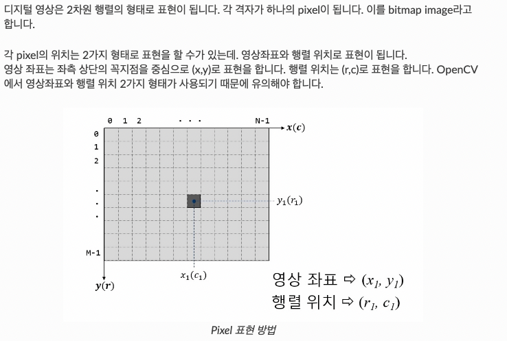

# open CV 정리

## Digital Image란 ?



### Digital image 유형

**Binary Image : pixel당 1bit로 표현하는 영상**

즉 흰색과 검은색으로 표현되는 영상이다.


**Grayscale Image : Pixel당 8bit, 즉 256 단계의 명암(빛의 세기)를 표현할 수 있는 이미지.**


**Color Image : Color 이미지는 pixel의 색을 표현하기 위해 pixel당 24bit 사용** (총 16,777,216가지 색 표현가능)  

pixel은 RGB각각을 위해서 8bit를 사용한다. 또한 각 pixel당 3Byte를 사용하기 때문에 용량이 크다. 


## 이미지 읽기 / 저장


## 도형 그리기


## 개별 pixel 다루기


## 더하기 연산

이미지를 더하기 위해서는 사이즈가 같아야 한다.


## 이미지 임계처리

이미지 임계처리를 통해 이미지를 이진화 처리 할 수 있다. 

임계처리란 임계값보다 크면 백, 작으면 흑이 된다. 기본 임계처리는 사용자가 고정된 임계값을 결정하고 그 결과를 보여주는 단순한 형태이다.  


### type별 thresholding 결과


### Otsu의 이진화

Otsu의 이진화(Otsu’s Binarization)란 bimodal image에서 임계값을 자동으로 계산해주는 것을 말한다.

**bimodal image** (히스토그램으로 분석하면 2개의 peak가 있는 이미지)의 경우는 히스토그램에서 임계값을 어느정도 정확히 계산 할 수 있다.  

적용 방법은 `cv2.threshold()`함수의 flag에 추가로 `cv2.THRESH_STSU` 를 적용하면 된다. 이때 임계값은 0으로 전달하면 된다.

아래 결과값은 global threshold값, Otsu thresholding적용, Gaussian blur를 통해 nosise를 제거한 후 Otsu thresholding적용 결과이다.


## 이미지의 기하학적 변형

이미지 변형의 예시로는 사이즈 변경(Scaling), 위치변경(Translation), 회전(Rotation) 등이 있다. 변환의 종류에는 몇가지 분류가 있다.

- 강체변환(Ridid-Body) : 크기 및 각도가 보존(ex; Translation, Rotation)
- 유사변환(Similarity) : 크기는 변하고 각도는 보존(ex; Scaling)
- 선형변환(Linear) : Vector 공간에서의 이동. 이동변환은 제외.
- Affine : 선형변환과 이동변환까지 포함. 선의 수평성은 유지.(ex;사각형->평행사변형)
- Perspective : Affine변환에 수평성도 유지되지 않음. 원근변환

### Scaling

Scaling은 이미지의 사이즈가 변하는 것 이다. OpenCV 에서는 `cv2.resize()` 함수를 사용하여 적용할 수 있다.  사이즈가 변하면 pixel 사이의 값을 결정 해야 하는데, 이때 사용하는 것을 보간법(Interpolation method)이라고 한다. 많이 사용 되는 보간법은 사이즈를 줄일때는 `cv2.INTER_AREA`, 사이즈를 크게 할 때는 `cv2.INTER_CUBIC` , `cv2.INTER_LINEAR` 을 사용한다.   


### Translation

이미지의 위치를 변경하는 변환


### Rotation

물체를 평면상의 한 점을 중심으로 𝜃 만큼 회전하는 변환이다. 양의 각도는 시계반대방향으로 회전을 한다. 역시 변환 행렬이 필요한데, 변환 행렬을 생성하는 함수는 `cv2.getRotationMatrix2D()`
 함수이다.


이미지의 중심점을 기준으로 90도 회전 하면서 0.5배 Scale


### Affine Transformation

Affine Transformation은 선의 평행성은 유지가 되면서 이미지를 변환하는 작업이다. 이동, 확대, Scale, 반전까지 포함된 변환이다. Affine 변환을 위해서는 3개의 Match가 되는 점이 있으면 변환행렬을 구할 수 있다.

이미지에 원을 그리고 Affine 변환 후 이동 점 확인


### ****Perspective Transformation****

Perspective(원근법) 변환은 직선의 성질만 유지가 되고, 선의 평행성은 유지가 되지 않는 변환이다. 기차길은 서로 평행하지만 원근변환을 거치면 평행성은 유지 되지 못하고 하나의 점에서 만나는 것 처럼 보인다.(반대의 변환도 가능)  


## Image Smoothing

### Image Filtering

이미지도 음성 신호처럼 주파수로 표현할 수 있다. 일반적으로 고주파는 밝기의 변화가 많은 곳, 즉 경계선 영역에서 나타나며, 일반적인 배경은 저주파로 나타난다. 이것을 바탕으로 고주파를 제거하면 Blur처리가 되며, 저주파를 제거하면 대상의 영역을 확인할 수 있다.    

`Low-pass filter(LPF)`와 `High-pass filter(HPF)`를 이용하여, LPF를 적용하면 노이즈제거나 blur처리를 할 수 있으며, HPF를 적용하면 경계선을 찾을 수 있습니다.  

OpenCV에서는 `cv2.filter2D()` 함수를 이용하여 이미지에 kernel(filter)를 적용하여 이미지를 Filtering할 수 있다. kernel은 행렬을 의미하는데 kernel의 크기가 크면 이미지 전체가 blur처리가 많이 된다. 일반적으로 5X5행렬을 사용한다.  

Filter가 적용되는 방법은 

1. 이미지의 각 pixel에 kernel을 적용한다.  
2. 5x5 kernel을 예로들면 각 pixel에 5x5윈도우를 올려 놓고, 그 영역안에 포함되는 값의 Sum을 한 후에 25로 나눈다.
3. 그 결과는 해당 위도우 영역안의 평균값이되고, 그 값을 해당 pixel에 적용하는 방식이다.  


### Image Blurring

Image Blurring은 low-pass filter를 이미지에 적용하여 얻을 수 있습니다. 고주파영역을 제거함으로써 노이즈를 제거하거나 경계선을 흐리게 할 수 있습니다. OpenCV에는 4가지 형태의 blurring 방법을 제공하고 있습니다.

**Averaging**

Box형태의 kernel을 이미지에 적용한 후 평균값을 box의 중심점에 적용하는 형태


****Gaussian Filtering****

box filter는 동일한 값으로 구성된 kernel을 사용하지만, Gaussian Filter는 Gaussian함수를 이용한 Kernel을 적용한다. 즉, kernel 행렬의 값을 Gaussian 함수를 통해서 수학적으로 생성하여 적용한다.  


****Median Filtering****

kernel window와 pixel의 값들을 정렬한 후에 중간값을 선택하여 적용한다. [salt-and-pepper noise](https://ko.wikipedia.org/wiki/%EC%A0%90%EC%9E%A1%EC%9D%8C) 제거에 가장 효과적입니다. 예를 들면 아래와 같이 kernel window을 적용시킨 결과가 다음과 같다면


크기순으로 정렬을 하면 33,54,67,84,102,163,189,212,224 이다. 이중에 중간값인 102가 중앙값으로 결정된다.(중앙에 있는 189가 102로 변경됨.)


****Bilateral Filtering****

지금까지의 Blur처리는 경계선까지 Blur처리가 되어, 경계선이 흐려지게 된다. Bilateral Filtering(양방향 필터)은 경계선을 유지하면서 Gaussian Blur처리를 해주는 방법이다.

Gaussian 필터를 적용하고, 또 하나의 Gaussian 필터를 주변 pixel까지 고려하여 적용하는 방식이다.


### 블러처리 예시


## ****Morphological Transformations****

`Morphologicla Transformation`은 이미지를 Segmentation하여 단순화, 제거, 보정을 통해서 형태를 파악하는 목적으로 사용된다. 일반적으로 binary나 grayscale image에 사용된다. 사용하는 방법으로는 `Dilation(팽창)`, `Erosion(침식)`, 그리고 2개를 조합한 `Opening`과 `Closing`이 있습니다.  

### Erosion

각 Pixel에 structuring element를 적용하여 하나라도 0이 있으면 대상 pixel을 제거하는 방법이다.  


위 그림에서 가운데 있는 십자형 Structuring Element를 Original Image에 적용을 한다. 원본의 각 pixel에 적용을 하여 겹치는 부분이 없는 부분이 하나라도 있으면 그 중심 pixel을 제거하는 방식이다. 최종적으로 우측의 분홍색 영역만 남게 되고, **이 방법은 작은 Object를 제거하는 효과가 있다**.


### ****Dilation****

Erosion과 반대로 대상을 확장한 후 작은 구멍을 채우는 방법이다. Erosion과 마찬가지로 각 pixel에 structuring element를 적용한다. 대상 pixel에 대해서 OR 연산을 수행합니다. 즉 겹치는 부분이 하나라도 있으면 이미지를 확장한다.    


위 그림은 십자형 structuring element를 원본이미지에 OR 연산을 적용한다. 최종적으로 확장된 이미지를 얻을 수 있다. **결과적으로 경계가 부드러워 지고, 구멍이 메꿔지는 효과를 얻을 수 있다.**


### ****Opening & Closing****

Opening과 Closing은 Erosion과 Dilation의 조합 결과 입니다. 차이는 어느 것을 먼저 적용을 하는 차이 입니다.

- Opeing : Erosion적용 후 Dilation 적용. 작은 Object나 돌기 제거에 적합
- Closing : Dilation적용 후 Erosion 적용. 전체적인 윤곽 파악에 적합


Morphological 변환 예제


## ****Image Gradients****

Gradient(기울기)는 스칼라장(즉, 공간)에서 최대의 증가율을 나타내는 벡터장(방향과 힘)을 뜻한다.  

영상처리에서 gradient는 영상의 edge 및 그 방향을 찾는 용도로 활용되는데,  이미지 (x,y)에서의 벡터값(크기와 방향, 즉 밝기와 밝기의 변화하는 방향)을 구해서 해당 pixel이 edge에 얼마나 가까운지, 그리고 그 방향이 어디인지 쉽게 알수 있게 한다.

### ****Sobel & Scharr Filter****

Gaussian smoothing과 미분을 이용한 방법이다. 그래서 노이즈가 있는 이지미에 적용하면 좋다. X축과 Y축을 미분하는 방법으로 경계값을 계산한다.  

직선을 미분하면 상수, 곡선을 미분하면 또 다른 방정식이 나오는 성질을 이용하여 edge에 대한 선을 그려주는 기능을 한다.  또한 미분시 소실되는 표본의 정보가 많을 수 있어 `aperture_size`값을 이용하여 소실되는 정도를 조절할 수 있다.  

cv2.Sobel 함수에서 ksize가 -1이면 3x3 Scharr filter가 적용이 되어 Sobel의 3x3보다 좀 더 나은 결과를 보여 준다. 


### Laplacian 함수

이미지의 가로와 세로에 대한 Gradient를 2차 미분한 값이다. Sobel filter에 미분의 정도가 더해진 것과 비슷하다.  


### Canny Edge Detection

가장 유명한 Edge Detection방법이다. 여러 단계의 Algorithm을 통해서 경계를 찾아 낸다.  

1. **Noise Reduction**
    - 이미지의 Noise를 제거한다. 이때 5x5의 Gaussian filter를 이용합니다.
2. Edge Gradient Detection
    - 이미지에서 Gradient의 방향과 강도를 확인한다. 경계값에서는 주변과 색이 다르기 때문에 미분값이 급속도로 변하게 된다. 이를 통해 경계값 후보군을 선별한다.
3. Non-maximum Suppression
    - 이미지의 pixel을 Full scan하여 Edge가 아닌 pixel은 제거한다.
4. Hysteresis Thresholding
    - 이제 지금까지 Edge로 판단된 pixel이 진짜 edge인지 판별하는 작업을 한다. max val과 minVal(임계값)을 설정하여 maxVal 이상은 강한 Edge, min과 max사이는 약한 edge로 설정한다. 이제 약한 edge가 진짜 edge인지 확인하기 위해서 강한 edge와 연결이 되어 있으면 edge로 판단하고, 그러지 않으면 제거한다.


### edge detection 예제


## Image Pyramids

일반적으로는 고정된 이미지 사이즈를 작업을 하지만, 때때로 동일한 이미지에 대해서 다양한 사이즈를 가지고 작업을 해야 하는 경우가 있습니다. 만일, 이미지에서 얼굴을 찾을 경우에 얼굴의 사이즈를 확신할 수 없습니다. 이럴 경우에는 원본 이미지에 대한 다양한 사이즈에서 얼굴을 찾는다면 좀더 정확하고 확실한 이미지를 찾을 수 있습니다. 이 처럼 동일 이미지의 서로 다른 사이즈의 set을 Image Pyramids라고 합니다

Image Pyramid의 종류는 1) Gaussian Pyramids 와 2) Laplacian Pyramids 가 있습니다.

Gaussian Pyramid의 High Level(낮은 해상도. Pyramid의 상단)은 Lower level에서 row와 column을 연속적으로 제거하면서 생성됩니다. M x N 사이지의 이미지는 M/2 X N/2 가 적용되연 1/4사이즈로 줄어들게 됩니다.

이미지 Pyramid를 이용하면 이미지 결합을 자연스럽게 처리할 수 있습니다. 작업 순서는 아래와 같습니다.

1. 2개의 이미지를 각각 Load함.
2. 각 이미지에 대해서 적당한 Gaussian Pyramid를 생성함.Gaussian Pyramid를 이용하여 Laplacian Pyramid를 생성함.
3. 각 단계의 Laplicain Pyramid를 이용하여 각 이미지의 좌측과 우측을 결함.
4. 결함한 결과중 가장 작은 이미지를 확대하면서 동일 사이즈의 결합결과와 Add하여 외곽선을 선명하게 처리함.

위 작업단계 순서대로 2개의 이미지를 결합한 결과는 다음과 같다. 


## Image Contours

### Contours

Contours란 동일한 색 또는 동일한 강도를 가지고 있는 영역의 경계선을 연결한 선이다.  

대상의 외형을 파악하는데 유용하게 사용 된다.  

- 정확도를 높이기 위해서 Binary Image를 사용한다. threshold나 canny edge를 선처리로 수행한다.
- `cv2.findContours()` 함수는 원본 이미지를 직접 수정하기 때문에, 원본 이미지를 보존 하려면 Copy해서 사용해야 한다.

### Find & Draw Contours

OpenCV에서 contours를 찾고, 그리기 위해서 아래 2개의 함수를 사용한다.  


Method에 대해서 설명을 하면 아래 예제의 결과에서 처럼 사각형의 contours line을 그릴 때, `cv2.CHAIN_APPROX_NONE` 는 모든 point를 저장하고 `cv2.CHAIN_APPROX_SIMPLE`
는 4개의 point만을 저장하여 메모리를 절약한다.  


## Contour Feature

### Moments

Image Moment는 대상을 구분할 수 있는 특징을 의미한다. 특징으로는 Area, Perimeter, 중심점 등이 있다. Image Moments는 대상을 구분한 후, 다른 대상과 구분하기 위해 대상을 설명하는 자료로 사용된다.  

```jsx
image, contours, hierachy = cv2.findContours(thresh, cv2.RETR_TREE,cv2.CHAIN_APPROX_SIMPLE)

# 첫번째 contours의 moment 특징 추출
cnt = contours[0]
M = cv2.moments(cnt)
```

### Contour Area

Contour면적은 moments의 `m00` 값이거나 `cv2.contourArea()` 함수로 구할 수 있다.  

```jsx
>>> cv2.contourArea(cnt)
30464.0
```

### Countour Perimeter

Contour의 둘레 길이를 구할 수 있습니다. 사각형의 경우는 둘레길이의 합이다. 아래 함수의 2번째 argument가 true이면 폐곡선 도형을 만들어 둘레길이를 구하고, False이면 시작점과 끝점을 연결하지 않고 둘레 길이를 구한다.  

```jsx
>>> cv2.arcLength(cnt, True)
750.0
>>> cv2.arcLength(cnt, False)
494.0
```

### Contour Approximation

`cv2.findContours()` 함수에 의해서 찾은 contours line은 각각의 contours point를 가지고 있다.  

이 Point를 연결하여 Line을 그리게 됩니다. 이때 이 point의 수를 줄여 근사한 line을 그릴 때 사용되는 방법이다.  

근사치를 찾는데 사용되는 함수는 `cv2.approxPolyDP()` 이다. 


### ****Convex Hull****

Convex Hull이란 contours point를 모두 포함하는 볼록한 외관선을 의미한다. 

Contour Approximation과 유사한 결과지만, 방법은 전혀 다르다.

아래 그림에서 붉은 선이 Convex Hull을 나타내고 화살표의 차이가 convexity defect라고 한다. 

convexity defect는 contours와 hull과의 최대차이를 나타낸다.  


## Contour Property

### Aspect Ratio

Contours Line의 가로 세로 비율 속성이다.  


 `cv2.boundingRect()` 함수를 이용하여 가로/세로 크기를 구한 후에 사용한다.

```jsx
x, y, w, h = cv2.boundingRect(cnt)
aspect_ratio = float(w)/h
```

### Extend

Contour Line를 포함하는 사각형 면적대비 Contour의 면적 비율이다.  


```jsx
area = cv2.contourArea(cnt) # Contour Line의 면적
x, y, w, h = cv2.boundingRect(cnt)
rect_area = w * h  # 사각형 면적
extend = float(area) / rect_area
```

### Solidity

Solidity Ratio(고형비)는 Convex hull면적 대비 Contour의 면적 비율이다.  


```jsx
area = cv2.contourArea(cnt) # Contour Line면적
hull = cv2.convexHull(cnt) # Convex hull line
hull_area = cv2.contourArea(hull) # Convex hull 면적
solidity = float(area) / hull_area
```

### Extream Points

Contour Line의 좌우상하의 끝점을 찾는 방법이다. 

```jsx
leftmost = tuple(cnt[cnt[:,:,0].argmin()][0])
rightmost = tuple(cnt[cnt[:,:,0].argmax()][0])
topmost = tuple(cnt[cnt[:,:,1].argmin()][0])
bottommost = tuple(cnt[cnt[:,:,1].argmax()][0])
```

cnt는 contour point가 포함된 array이다. 여기서 `cnt[:,:,0]` 의 의미는 point의 x 좌표 값만 포함하는 배열이 된다. 여기에 `argmin()` 을 적용하면 x좌표가 가장 작은 array의 위치가 나오게 된다. 그 위치를 다시 cnt에서 찾으면 가장 왼쪽에 있는 좌표를 얻을 수 있다. 나머지도 동일한 방법으로 좌우상하의 끝점을 찾을 수 있다.

## Contours Hierarchy

Image에는 여러개의 Contours가 존재하고, 그사이에는 서로 포함하는 관계가 존재한다.  그 관계를 Contours Hierarchy라고 한다. 이전, 이후, Parent, child 관계를 파악할 수 있다.  

이런 관계를 파악하기 위해서는 `cv2.findContours()` 에 Contour Retrieval Model값에 의해서 결정이 된다.  

### Hierarchy

아래 원본 이미지에 대해서 Contour Line을 적용한 결과 이다.  


위 결과는 총 9개의 contour line으로 구성이 되어 있다. 주의해서 봐야할 부분은 3,3a 와 4,4a이다.  

Hirerarchy 구성시 child의 child가 있을 경우 바깥선과 안쪽선이 서로 분리가 되어 contour line을 구성한다. 이는 포함 관계를 표현하기 위해서 이다. 

다음으로 contour retrival mode에 따라서 hirerarchy값이 어떻게 표현되는지 알아 보자.

### RETR_LIST

hierarchy의 shape는 (1, x, 4)의 형태이다. 여기서 3번째 차원의 4개의 값이 hierarchy를 표현한다.  

각 값의 의미는 (next, prev, child, parent) 입니다. RETR_LIST는 선/후 관계만을 표현하고, parent/child관계를 표현하지 않는 mode입니다. 먼저 위 예제에서 mode를 `cv2.RETR_LIST`
 로 한 결과를 확인해 보자.

```jsx
>>> hierarchy
array([[[ 1, -1, -1, -1],
        [ 2,  0, -1, -1],
        [ 3,  1, -1, -1],
        [ 4,  2, -1, -1],
        [ 5,  3, -1, -1],
        [ 6,  4, -1, -1],
        [ 7,  5, -1, -1],
        [ 8,  6, -1, -1],
        [-1,  7, -1, -1]]])
```

mode의 특성대로 next와 prev는 값이 있지만, child와 parent는 모두 -1이다. 예를 들어 보면 Hierarchy를 구할 필요가 없을 때 사용하면 좋다.  

### RETR_EXTERNAL

이 mode는 가장 바깥쪽(다른 Contours Line에 포함되지 않는)에 있는 contour만을 return한다. 위 예에서는 1,2,3번 line이다.(parent/child는 구성하지 않습니다.)

```jsx
>>> hierarchy
array([[[ 1, -1, -1, -1],
        [ 2,  0, -1, -1],
        [-1,  1, -1, -1]]])
```

### RETR_CCOMP

이 mode는 Hierarchy를 2-Level로 표현합니다. 바깥쪽(외곽선)은 모두 1-Level, 안에 포함된 것은 2-Level이 됩니다.


위 그림을 보면 괄호 밖 숫자는 contours의 순서이고 괄호 안 숫자는 hierachy를 나타낸다. 이전과 다른 점은 가장 안쪽에서 부터 contour의 순서를 부여하게 된다.  

먼저 contour-0은 2개의 contour를 포함하기 때문에 hierarchy-1입니다. 동일 level의 next는 3이고, previous는 없다.  child는 contour-1이고, parent는 없습니다. 그래서 결과적으로 [3,-1,1,-1]의 값을 갖게 됩니다.

contour-1은 contour-0에 포함이 되기 때문에 hierachy-2가 된다. 동일 level의 next는 contour-2가 되고, previous와 child는 없으며, parent는 contour-0입니다. 그래서 [2,-1,-1,0]의 값을 갖게 됩니다.

### RETR_TREE

이 mode는 Hierarchy를 완전하게 표현한다. 즉 누구에게도 포함되지 않은 contour는 hierarchy-0이 되고, 그 안쪽으로 포한되는 contours는 순서대로 hierachy를 부여 받는다.  


contour-0은 next는 contour-7, previous는 없으며, child는 contour-1, parent는 없다. 결과는 [7,-1,1,-1] 입니다. contour-1은 next는 없고, previous도 없고, child는 contour-2, parent는 contour-0이다. 결과는 [-1,-1,2,0] 입니다.

```jsx
>>> hierarchy
array([[[ 7, -1,  1, -1],
        [-1, -1,  2,  0],
        [-1, -1,  3,  1],
        [-1, -1,  4,  2],
        [-1, -1,  5,  3],
        [ 6, -1, -1,  4],
        [-1,  5, -1,  4],
        [ 8,  0, -1, -1],
        [-1,  7, -1, -1]]])
```