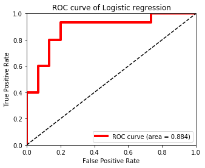

## 긍정 부정 리뷰 분류 하기

### 분류 모델링
---

**데이터셋 분리**


```python
from sklearn.model_selection import train_test_split

y = df['y']
X_train, X_test, y_train, y_test = train_test_split(X,y ,test_size =0.3)
print(X_train.shape)
print(X_test.shape)
```

    (381, 3030)
    (164, 3030)
    

**로지스틱 회귀 분석**


```python
# 수정된 get_clf_eval() 함수 
def get_clf_eval(y_test, pred=None, pred_proba=None):
    confusion = confusion_matrix( y_test, pred)
    accuracy = accuracy_score(y_test , pred)
    precision = precision_score(y_test , pred)
    recall = recall_score(y_test , pred)
    f1 = f1_score(y_test,pred)
    # ROC-AUC 추가 
    roc_auc = roc_auc_score(y_test, pred_proba)
    print('오차 행렬')
    print(confusion)
    # ROC-AUC print 추가
    print('정확도: {0:.4f}, 정밀도: {1:.4f}, 재현율: {2:.4f},\
    F1: {3:.4f}, AUC:{4:.4f}'.format(accuracy, precision, recall, f1, roc_auc))

```


```python
def precision_recall_curve_plot(y_test=None, pred_proba_c1=None):
    # threshold ndarray와 이 threshold에 따른 정밀도, 재현율 ndarray 추출. 
    precisions, recalls, thresholds = precision_recall_curve( y_test, pred_proba_c1)
    
    # X축을 threshold값으로, Y축은 정밀도, 재현율 값으로 각각 Plot 수행. 정밀도는 점선으로 표시
    plt.figure(figsize=(8,6))
    threshold_boundary = thresholds.shape[0]
    plt.plot(thresholds, precisions[0:threshold_boundary], linestyle='--', label='precision')
    plt.plot(thresholds, recalls[0:threshold_boundary],label='recall')
    
    # threshold 값 X 축의 Scale을 0.1 단위로 변경
    start, end = plt.xlim()
    plt.xticks(np.round(np.arange(start, end, 0.1),2))
    
    # x축, y축 label과 legend, 그리고 grid 설정
    plt.xlabel('Threshold value'); plt.ylabel('Precision and Recall value')
    plt.legend(); plt.grid()
    plt.show()
```


```python
def roc_curve_plot(y_test , y_pred_probability):
    # AUC를 계산합니다.
    false_positive_rate, true_positive_rate, thresholds = roc_curve(y_test, y_pred_probability)
    roc_auc = roc_auc_score(y_test, y_pred_probability)
    print("AUC : %.3f" % roc_auc)

    # ROC curve 그래프를 출력합니다.
    plt.rcParams['figure.figsize'] = [5, 4]
    plt.plot(false_positive_rate, true_positive_rate, label='ROC curve (area = %0.3f)' % roc_auc, 
             color='red', linewidth=4.0)
    plt.plot([0, 1], [0, 1], 'k--')
    plt.xlim([0.0, 1.0])
    plt.ylim([0.0, 1.0])
    plt.xlabel('False Positive Rate')
    plt.ylabel('True Positive Rate')
    plt.title('ROC curve of Logistic regression')
    plt.legend(loc="lower right")
```


```python
from sklearn.linear_model import LogisticRegression
from sklearn.metrics import accuracy_score, precision_score, recall_score, roc_auc_score
from sklearn.metrics import f1_score, confusion_matrix, precision_recall_curve, roc_curve
# 로지스틱 회귀 모델 학습

lr = LogisticRegression(random_state=0)
lr.fit(X_train,y_train)
pred = lr.predict(X_test)
pred_proba = lr.predict_proba(X_test)[:, 1]

get_clf_eval(y_test , pred, pred_proba)
```

    오차 행렬
    [[  0  16]
     [  0 148]]
    정확도: 0.9024, 정밀도: 0.9024, 재현율: 1.0000,    F1: 0.9487, AUC:0.8843
    


```python
# 정밀도-재현율 트레이드오프
precision_recall_curve_plot(y_test,pred_proba)
```


```python
# ROC 커브
roc_curve_plot(y_test, lr.predict_proba(X_test)[:, 1] )
```

    AUC : 0.884
    


## 분류 모델 개선
---
클래스 불균형 문제 해결하기


```python
# y가 0과 1을 각각 얼마나 가지고 있는지 출력
df['y'].value_counts()
```


    1    492
    0     53
    Name: y, dtype: int64


클래스가 불균형하므로 1:1 비율로 샘플링 하기 위해 y가 1인 50개의 샘플, y가 0인 50개의 샘플을 임의로 추출한다.  
그리고 이데이터를 다시 학습 데이터 셋(70개)와 테스트 데이터셋(30개)로 분리하는 방법을 사용한다.


```python
# 1:1비율로 랜덤 샘플링

positive_random_idx = df[df['y']==1].sample(50, random_state=30).index.tolist()
negative_random_idx = df[df['y']==0].sample(50, random_state=30).index.tolist()
```


```python
# 랜덤 데이터로 데이터셋을 나눔
random_idx = positive_random_idx + negative_random_idx
sample_X = X[random_idx,:]
y = df['y'][random_idx]
X_train, X_test, y_train, y_test = train_test_split(sample_X, y, test_size=0.30)
print(X_train.shape)
print(X_test.shape)
```

    (70, 3030)
    (30, 3030)
    

**로지스틱 회귀 다시 학습**


```python
# 로지스틱 회귀모델을 다시 학습합니다.
lr = LogisticRegression(random_state=0)
lr.fit(X_train, y_train)
pred = lr.predict(X_test)
pred_proba = lr.predict_proba(X_test)[:,1]

get_clf_eval(y_test , pred, pred_proba)

# 정밀도-재현율 트레이드오프
precision_recall_curve_plot(y_test,pred_proba)

# ROC 커브
roc_curve_plot(y_test, lr.predict_proba(X_test)[:, 1] )
```

    오차 행렬
    [[12  3]
     [ 3 12]]
    정확도: 0.8000, 정밀도: 0.8000, 재현율: 0.8000,    F1: 0.8000, AUC:0.8844
    


    AUC : 0.884
    





