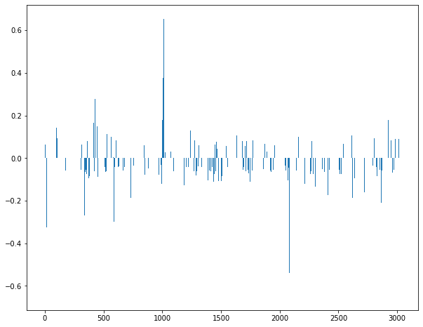

## 중요 키워드 분석

### 회귀 모델의 피처 영향력 출력
---


```python
# 학습한 회귀 모델의 계수 출력
plt.rcParams['figure.figsize'] = [10,8]
plt.bar(range(len(lr.coef_[0])),lr.coef_[0])
```


    <BarContainer object of 3030 artists>





```python
print(sorted(((value, index) for index, value in enumerate(lr.coef_[0])), reverse=True)[:5])
print(sorted(((value, index) for index, value in enumerate(lr.coef_[0])), reverse=True)[-5:])
```

    [(0.6540160444137673, 1013), (0.4568561652249176, 138), (0.4091355775358284, 1093), (0.3751499899043994, 1007), (0.3335883833201525, 999)]
    [(-0.40575682141855596, 980), (-0.461921942776444, 901), (-0.5392326363608677, 2082), (-0.5543021802612601, 1309), (-0.6481677251131319, 2069)]
    

## 중요 피처의형태소(더 공부해야될듯)
---


```python
# 회귀 모델의 계수를 높은 순으로 정렬

coef_pos_index = sorted(((value,index) for index, value in 
                         enumerate(lr.coef_[0])),reverse=True)

# 회귀 모델의 계수를 index_vectorizer에 맵핑하여, 어떤 형태소인지 출력할 수 있게 합니다.
invert_index_vectorizer = {v: k for k, v in index_vectorizer.vocabulary_.items()}

# 계수가 높은 순으로, 피처에 형태소를 맵핑한 결과를 출력합니다. 계수가 높은 피처는 리뷰에 긍정적인 영향을 주는 형태소라고 할 수 있습니다.
print(str(invert_index_vectorizer)[:100]+'..')
```

    {2647: '친절하시고/Adjective', 428: '깔끔하고/Adjective', 2403: '좋았습니다/Adjective', 2356: '조용하고/Adjective', 23..
    


```python
# 상위 20개 긍정 형태소를 출력합니다.
for coef in coef_pos_index[:20]:
    print(invert_index_vectorizer[coef[1]], coef[0])
```

    맛있습니다/Adjective 0.6540160444137673
    갑니다/Verb 0.4568561652249176
    먹었습니다/Verb 0.4091355775358284
    맛있는/Adjective 0.3751499899043994
    맛있게/Adjective 0.3335883833201525
    생생하니/Adjective 0.3320684210517733
    음식/Noun 0.3047744964547242
    맛있어용/Adjective 0.29400451750145273
    갈비살/Noun 0.29400451750145273
    잘/VerbPrefix 0.2841364828193678
    친절하시고/Adjective 0.2837620517041854
    친절해요/Adjective 0.2821306699100331
    깔끔하고/Adjective 0.27592595091105826
    진짜/Noun 0.2722584049319465
    환기/Noun 0.2682401240552626
    합/Noun 0.2563863959595079
    다음/Noun 0.25355750734783006
    삼/Modifier 0.24921471299628203
    입니다/Adjective 0.24735166611028506
    사랑/Noun 0.24259575667670308
    


```python
# 상위 20개 부정 형태소를 출력합니다.
for coef in coef_pos_index[-20:]:
    print(invert_index_vectorizer[coef[1]], coef[0])
```

    조금/Noun -0.23727443243972246
    적/Suffix -0.25153660914691894
    종업원/Noun -0.25213784865576977
    점/Noun -0.25871448519560175
    안/Noun -0.2600050203233324
    그/Determiner -0.2695927909158421
    시끄러워요/Adjective -0.273285111679352
    ㅠㅠㅠㅠ/KoreanParticle -0.273285111679352
    서비스/Noun -0.28444336854932945
    는/Josa -0.29932408367037217
    명/Noun -0.29987304159026673
    비해/Verb -0.30571722935960366
    ㅠㅠ/KoreanParticle -0.3267319331898034
    매우/Noun -0.3776013919230614
    기대이하였음/Verb -0.3864835113315854
    많이/Adverb -0.40575682141855596
    를/Josa -0.461921942776444
    이/Josa -0.5392326363608677
    별로/Noun -0.5543021802612601
    은/Josa -0.6481677251131319
    
