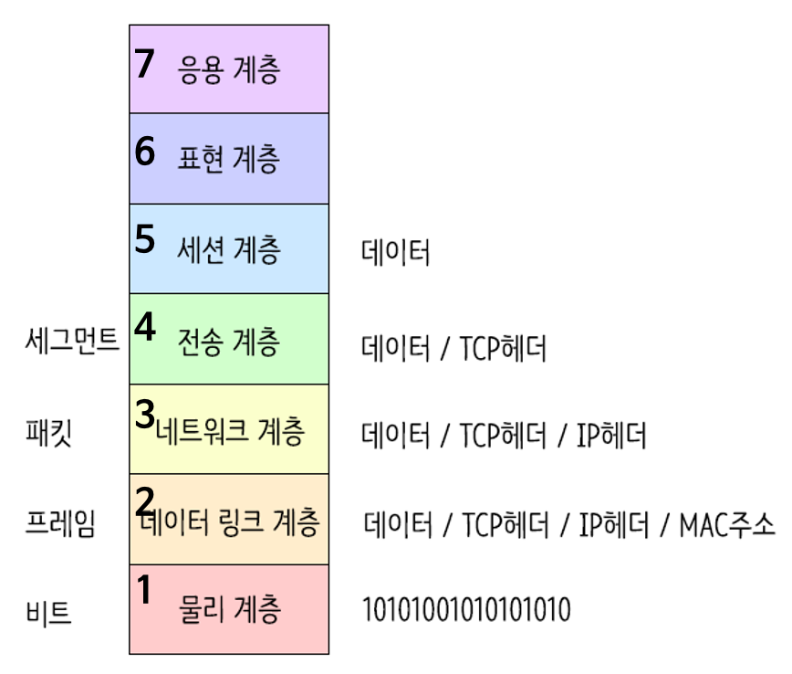

# OSI 7계층
    
## **OSI 7 계층이란?**

OSI 7 계층은 **네트워크 통신**이 일어나는 과정을 7단계로 나눈 국제 표준화 기구(ISO)에서 정의한 네트워크 표준 모델

아래 그림에서 아래부터 **1계층(물리 계층) ~ 7계층(응용 계층)**으로 구성되어 있다.

또 그림과 같이 각 계층을 지날 때마다 각 계층에서 Header가 붙게되고 수신측은 역순으로 헤더를 분석하게 된다.

### **1계층 - 물리계층(Physical Layer)**

- 주로 전기적, 기계적, 기능적인 특성을 이용해서 통신 케이블로 데이터를 전송하는 **물리적인 장비**
- 단지 데이터 전기적인 신호(0,1)로 변환해서 주고받는 기능만 할 뿐
- 이 계층에서 사용되는 통신 단위 : **비트(Bit)**이며 이것은 **1과 0**으로 나타내어지는, 즉 전기적으로 On, Off 상태
- 장비 : **통신 케이블, 리피터, 허브** 등

---

### **2계층 - 데이터 링크계층(DataLink Layer)**

- 물리계층을 통해 송수신되는 정보의 오류와 흐름을 관리하여 안전한**통신의 흐름을 관리**
- 프레임에 물리적 **주소(MAC address)**를 부여하고 에러검출, 재전송, 흐름제어를 수행
- 이 계층에서 전송되는 단위 : 프레임(Frame)
- 장비 : **브리지, 스위치, 이더넷** 등(여기서 MAC주소를 사용)
- > **브릿지나 스위치를 통해 맥주소를 가지고 물리계층에서 받은 정보를 전달함**.

---

### **3계층 - 네트워크 계층(Network Layer)**

- 데이터를 목적지까지 가장 안전하고 빠르게 전달
- 라우터(Router)를 통해 경로를 선택하고 주소를 정하고**(IP)** 경로(Route)에 따라 패킷을 전달 > IP 헤더 붙음
- 이 계층에서 전송되는 단위 : **패킷(Packet)**
- 장비 : **라우터**

---

### **4계층 - 전송 계층(Transport Layer)**

- **port 번호**, 전송방식**(TCP/UDP)** 결정 > **TCP 헤더** 붙음
    - TCP : 신뢰성, 연결지향적
    - UDP : 비신뢰성, 비연결성, 실시간
- 두 지점간의 **신뢰성** 있는 데이터를 주고 받게 해주는 역할
- 신호를 분산하고 다시 합치는 과정을 통해서 에러와 경로를 제어

---

### **5계층 - 세션 계층(Session Layer)**

- 주 지점간의 프로세스 및 통신하는 호스트 간의 연결 유지
- TCP/IP 세션 체결, 포트번호를 기반으로 **통신 세션** 구성
- API, Socket

---

### **6계층 - 표현 계층(Presentation Layer)**

- 전송하는 **데이터의 표현방식**을 결정(ex. 데이터변환, 압축, 암호화 등)
- 파일인코딩, 명령어를 포장, 압축, 암호화
- JPEF, MPEG, GIF, ASCII 등

---

    **7계층 - 응용 계층(Application Layer)**

- 최종 목적지로, 응용 프로세스와 직접 관계하여 일반적인 응용 서비스를 수행(ex. explore, chrome 등)
- HTTP, FTP, SMTP, POP3, IMAP, Telnet 등과 같은 프로토콜이 있다.
# TCP/IP 4계층

## TCP/IP 4계층**이란?**

TCP/IP는 OSI 참조 모델을 기반으로 상업적이고 실무적으로 이용될 수 있도록 단순화된 모형이다

네트워크 전송 시 데이터 표준을 정리한 것이 OSI 7계층, 이 이론을 실제 사용하는 인터넷 표준이 TCP/IP 4계층이다.

### **1계층 - 네트워크 액세스 계층(Network Access Layer)**

1. OSI 7계층의 **물리계층(1)과 데이터 링크 계층(2)**에 해당
2. TCP/IP 패킷을 네트워크 매체로 전달하는 것과 네트워크 매체에서 TCP/IP 패킷을 받아들이는 과정을 담당
3. 에러 검출 기능(Detecting errors), 패킷의 프레임화(Fraimg packets)
4. 네트워크 접근 방법, 프레임 포맷, 매체에 대해 독립적으로 동작하도록 설계.
5. 물리적인 주소로 **MAC**을 사용
6. LAN, 패킷망, 등에 사용됨

---

### **2계층 - 인터넷 계층(Internet Layer)**

1. OSI 7계층의 네트워크 계층(3)에 해당
2. 어드레싱(addressing), 패키징(packaging), 라우팅(routing) 기능을 제공
3. 네트워크상 최종 목적지까지 정확하게 연결되도록 연결성을 제공하게 됨.
4. 프로토콜 종류 – IP, ARP, RARP

---

### **3계층 - 전송 계층(Transport Layer)**

1. OSI 7계층의 전송 계층(4)에 해당
2. **IP와 Port**를 이용하여 프로세스와 통신
3. 애플리케이션 계층의 세션과 데이터그램(datagram) 통신서비스 제공
4. 통신 노드 간의 연결을 제어하고, **신뢰성** 있는 데이터 전송을 담당한다.
5. 프로토콜 종류 – TCP, UDP

---

### **4계층 - 응용 계층(Application Layer)**

1. OSI 7계층의 **세션 계층(5), 표현 계층(6), 응용 계층(7)**에 해당한다.
2. 프로그램(브라우저)가 직접 인터액트하는 레이어. 데이터를 처음으로 받는곳
3. 다른 계층의 서비스에 접근할 수 있게 하는 애플리케이션을 제공
4. 애플리케이션들이 데이터를 교환하기 위해 사용하는 프로토콜을 정의
5. HTTP, SMTP등의 프로토콜을 가진다.
6. TCP/UDP 기반의 응용 프로그램을 구현할 때 사용한다.
7. 프로토콜 종류 – FTP, HTTP, SSH

---
# TCP / UDP
- TCP에만 연결(Connection, Session) 개념이 있다.
- 연결은 결과적으로 순서번호로 구현된다.
    - byte수만큼 순서번호가 증가됨.
- 연결은 `상태(전이` 개념을 동반한다.
    - 전화통화를 생각하면 됨
    - 통화전 - 연결 -  통화 - 통화 후    
- TCP는 상대방이 수신할 수없으면 보내지 않는다
- UDP는 수신할 수 있든 없든 그냥 보내버림

- 전송계층
    - `TCP`와 `UDP`는 TCP/IP의 `전송계층`에서 사용되는 프로토콜이다. **전송계층은 IP에 의해 전달되는 패킷의 오류를 검사하고 재전송 요구 등의 제어를 담당**하는 계층이다.
    
    - TCP는 Transmission Control Protocol의 약자이고, UDP는 User Datagram Protocol의 약자이다. 두 프로토콜은 모두 패킷을 한 컴퓨터에서 다른 컴퓨터로 전달해주는 `IP 프로토콜`을 기반으로 구현되어 있지만, 서로 다른 특징을 가지고 있다.
    
### TCP

TCP는 네트워크 계층 중 전송 계층에서 사용하는 프로토콜로서, 장치들 사이에 논리적인 접속을 성립(establish)하기 위하여 연결을 설정하여 **신뢰성을 보장하는 연결형 서비스** 이다. TCP는 네트워크에 연결된 컴퓨터에서 실행되는 프로그램 간에 **일련의 옥텟(데이터, 메세지, 세그먼트라는 블록 단위)를 `안정적`으로, `순서대로`, `에러없이` 교환**할 수 있게 한다.

### UDP

즉, **신뢰성이 요구되는 애플리케이션에서는 TCP를 사용**하고 **간단한 데이터를 빠른 속도로 전송하고자 하는 애플리케이션에서는 UDP를 사용**한다.

### **공통점**

- 포트 번호를 이용하여 주소를 지정

- 데이터 오류 검사를 위한 체크섬 존재

### 차이점

| TCP(Transfer Control Protocol) | UDP(User Datagram Protocol) |
| --- | --- |
| 연결이 성공해야 통신 가능(연결형 프로토콜) | 비연결형 프로토콜(연결 없이 통신이 가능) |
| 데이터의 경계를 구분하지 않음(Byte-Stream Service) | 데이터의 경계를 구분함(Datagram Service) |
| 신뢰성 있는 데이터 전송(데이터의 재전송 존재) | 비신뢰성 있는 데이터 전송(데이터의 재전송 없음) |
| 일 대 일(Unicast) 통신 | 일 대 일, 일 대 다(Broadcast), 다 대 다(Multicast) 통신 |

--- 
# URI/URN/URL

# DNS

# HTTP/ HTTPS
## HTTP (Hypertext Transfer Protocol)

HTTP(Hyper Text Transfer Protocol)란 서버/클라이언트 모델을 따라 데이터를 주고 받기 위한 `프로토콜(TCP/IP에서 4번째 계층에서 활용되는 프로토콜)`이다. 

즉, HTTP는 인터넷에서 하이퍼텍스트를 교환하기 위한 통신 규약으로, 80번 포트를 사용하고 있다. 따라서 HTTP 서버가 80번 포트에서 요청을 기다리고 있으며, 클라이언트는 80번 포트로 요청을 보내게 된다.

HTTP는 1989년 팀 버너스 리(Tim Berners Lee)에 의해 처음 설계되었으며, WWW(World-Wide-Web) 기반에서 세계적인 정보를 공유하는데 큰 역할을 하였다.

### HTTP의 구조

HTTP는 애플리케이션 레벨의 프로토콜로 TCP/IP 위에서 작동한다. HTTP는 상태를 가지고 있지 않는 Stateless 프로토콜이며 Method, Path, Version, Headers, Body 등으로 구성된다.

하지만 HTTP는 암호화가 되지 않은 평문 데이터를 전송하는 프로토콜이였기 때문에, HTTP로 비밀번호나 주민등록번호 등을 주고 받으면 제3자가 정보를 조회할 수 있었다. 그리고 이러한 문제를 해결하기 위해 HTTPS가 등장하게 되었다.

## HTTPS(Hyper Text Transfer Protocol Secure)란?

HyperText Transfer Protocol over Secure Socket Layer, HTTP over TLS, HTTP over SSL, HTTP Secure 등으로 불리는 HTTPS는 HTTP에 데이터 암호화가 추가된 프로토콜이다. HTTPS는 HTTP와 다르게 443번 포트를 사용하며, 네트워크 상에서 중간에 제3자가 정보를 볼 수 없도록 암호화를 지원하고 있다.

### HTTPS의 동작 과정

HTTPS는 `대칭키 암호화`와 `비대칭키 암호화`를 모두 사용하여 빠른 연산 속도와 안정성을 모두 얻고 있다.

HTTPS 연결 과정(Hand-Shaking)에서는 먼저 서버와 클라이언트 간에 세션키를 교환한다. 여기서 세션키는 주고 받는 데이터를 암호화하기 위해 사용되는 대칭키이며, 데이터 간의 교환에는 빠른 연산 속도가 필요하므로 세션키는 대칭키로 만들어진다.
문제는 이 세션키를 클라이언트와 서버가 어떻게 교환할 것이냐 인데, 이 과정에서 비대칭키가 사용된다.

즉, 처음 연결을 성립하여 안전하게 세션키를 공유하는 과정에서 비대칭키가 사용되는 것이고, 이후에 데이터를 교환하는 과정에서 빠른 연산 속도를 위해 대칭키가 사용되는 것이다.

- 대칭키 암호화
    - 클라이언트와 서버가 동일한 키를 사용해 암호화/복호화를 진행함
    - 키가 노출되면 매우 위험하지만 연산 속도가 빠름
- 비대칭키 암호화
    - 1개의 쌍으로 구성된 공개키와 개인키를 암호화/복호화 하는데 사용함
    - 키가 노출되어도 비교적 안전하지만 연산 속도가 느림

**HTTPS 연결 과정이 성립되는 흐름을 살펴보면 다음과 같다.**

1. 클라이언트(브라우저)가 서버로 최초 연결 시도를 함
2. 서버는 공개키(엄밀히는 인증서)를 브라우저에게 넘겨줌
3. 브라우저는 인증서의 유효성을 검사하고 세션키를 발급함
4. 브라우저는 세션키를 보관하며 추가로 서버의 공개키로 세션키를 암호화하여 서버로 전송함
5. 서버는 개인키로 암호화된 세션키를 복호화하여 세션키를 얻음
6. 클라이언트와 서버는 동일한 세션키를 공유하므로 데이터를 전달할 때 세션키로 암호화/복호화를 진행함

## HTTP vs HTTPS

HTTP는 암호화가 추가되지 않았기 때문에 보안에 취약한 반면, HTTPS는 안전하게 데이터를 주고받을 수 있다. 하지만 HTTPS를 이용하면 암호화/복호화의 과정이 필요하기 때문에 HTTP보다 속도가 느리다. (물론 오늘날에는 거의 차이를 못느낄 정도이다.) 또한 HTTPS는 인증서를 발급하고 유지하기 위한 추가 비용이 발생하다.

**그렇다면 언제 HTTP를 쓰고, 언제 HTTPS를 쓰는 것이 좋겠는가?**

개인 정보와 같은 민감한 데이터를 주고 받아야 한다면 HTTPS를 이용해야 하지만, 노출이 되어도 괜찮은 단순한 정보 조회 등 만을 처리하고 있다면 HTTP를 이용하면 된다.

# RESTful API
## REST API 란
- REST API 에서 **REST는 Representational State Transfer**의 약자로 소프트웨어 프로그램 아키텍처의 한 형식 입니다.
- 즉, 자원을 이름 (자원의 표현) 으로 구분하여 해당 자원의 상태 (정보)를 주고 받는 모든 것을 의미한다.  
- 월드 와이드 웹 (WWW) 과 같은 분산 하이퍼미디어 시스템을 위한 소프트웨어 개발 아키텍처의 한 형식d
- REST는 기본적으로 웹의 기존 기술과 HTTP 프로토콜을 그대로 활용하기 때문에 웹의 장점을 최대한 활용할 수 있는 아키텍처 스타일이다.

## REST의 구성
- 자원(Resource) - URL
- 행위(Verb) - HTTP Method
  - HTTP Method의 알맞은 역할
    - POST : POST를 통해 해당 URI를 요청하면 리소스를 생성
    - GET : GET를 통해 해당 리소스를 조회. 리소스를 조회하고 해당 도큐먼트에 대한 자세한 정보를 가져옴
    - PUT : PUT을 통해 해당 리소스 수정
    - DELETE : DELETE를 통해 리소스 삭제
- 표현(Representations)

## REST의 특징
- 클라이언트 - 서버 구조
  - 클라이언트는 유저와 관련된 처리를, 서버는 REST API를 제공함으로써 각각의 역할이 확실하게 구분되고 일괄적인 인터페이스로 분리되어 작동할 수 있게 한다.
- 무상태성 (Stateless)
  - REST는 HTTP의 특성을 이용하기 때문에 무상태성을 갖는다.
  - 즉 서버에서 어떤 작업을 하기 위해 상태정보를 기억할 필요가 없고 들어온 요청에 대해 처리만 해주면 되기 때문에 구현이 쉽고 단순해진다. 
- 캐시 처리 가능(Cacheable)
  - 캐시 사용을 통해 응답시간이 빨라지고 REST Server 트랜잭션이 발생하지 않기 때문에 전체 응답시간, 성능, 서버의 자원 이용률을 향상 시킬 수 있다.  
- 자체 표현 구조 (Self-descriptiveness)
  - JSON을 이용한 메시지 포맷을 이용하여 직관적으로 이해할 수 있고 REST API 메시지만으로 그 요청이 어떤 행위를 하는지 알 수 있다.  
- 계층화(Layered System)
  - 클라이언트와 서버가 분리되어 있기 때문에 중간에 프록시 서버, 암호화 계층 등 중간매체를 사용할 수 있어 자유도가 높다.  
- 유니폼 인터페이스 (Uniform)
  - Uniform Interface는 Http 표준에만 따른다면 모든 플랫폼에서 사용이 가능하며, URI로 지정한 리소스에 대한 조작을 가능하게 하는 아키텍쳐 스타일을 말한다

## RESTful API란
- HTTP와 URI 기반으로 자원에 접근할 수 있도록 제공하는 애플리케이션 개발 인터페이스이다.
- 기본적으로 개발자는 HTTP 메소드와 URI만으로 인터넷에 자료를 `CRUD`할 수 있다.
- **REST API**를 제공하는 웹 서비스를 `RESTful`하다고 할 수 있다.  

## RESTful API를 만드는 이유
- RESTful APIs 개발하는 가장 큰 이유는 Client Side를 정형화된 플랫폼이 아닌 모바일, PC, 어플리케이션 등 플랫폼에 제약을 두지 않는 것을 목표로 했기 때문이다.
- 즉, 2010년 이전만 해도 Server Side에서 데이터를 전달해주는 Client 프로그램의 대상은 PC 브라우저로 그 대상이 명확 했다. 그렇다 보니 그냥 `JSP`, `ASP`, `PHP` 등을 이용한 웹페이지를 구성하고 작업을 진행하면 됐다.
- 하지만 스마트 기기들이 등장하면서 TV, 스마트 폰, 테블릿 등 Client 프로그램이 다양화 되고 그에 맞춰 Server를 일일이 만다는 것이 꽤 비효율적인 일이 되어 버렸다.
- 이런 과정에서 개발자들은 Client Side를 전혀 고려하지 않고 메시지 기반, XML, JSON과 같은 Client에서 바로 객체로 치환 가능한 형태의 데이터 통신을 지향하게 되면서 Server와 Client의 역할을 분리하게 되었다.

# WAS

# Reference
- [[Web] HTTP와 HTTPS의 개념 및 차이점](https://mangkyu.tistory.com/98)