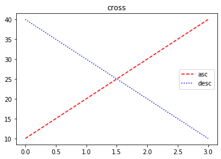

# 기본 그래프 그리기


```python
import matplotlib.pyplot as plt
plt.plot([1,5,10,15,20])
plt.show()
```


```python
# y축 / x축
plt.plot([1,5,10,15,20],[1,4,8,10,30])
plt.show()
```


# 그래프에 제목 넣기 - title() 
---


```python
#title() 함수를 통해 제목을 넣을 수 있다.
plt.title("Title")  
plt.plot([1,5,10,15,20])
plt.show()
```


# 그래프에 범례 넣기 
---


```python
#범례
plt.title('cross')
plt.plot([10,20,30,40],label ='asc')    #증가를 의미하는 asc 범례
plt.plot([40,30,20,10],label='desc')    #감소를 의미하는 desc 범례
plt.legend()
plt.show()
```


# 그래프 색상 지정 하기
---
color 속성을 생략하면 자동으로 색상이 설정된다.


```python
plt.title('cross')
plt.plot([10,20,30,40],label ='asc',color='red')    #컬러를 red로
plt.plot([40,30,20,10],label='desc',color='blue')  #컬러를 blue 로
plt.legend()
plt.show()
```


# 그래프 선 모양 바꾸기
---


```python
plt.title('cross')
plt.plot([10, 20, 30, 40], label='asc', color='red', ls='--')  #선 모양을 --으로
plt.plot([40, 30, 20, 10], label='desc', color='blue', ls=':')  #선 모양을 .. 으로
plt.legend()
plt.show()
```





# 마커 모양 바꾸기


```python
plt.title('cross')
# 색상과 선 모양을 동시에 설정할 수있다.
plt.plot([10, 20, 30, 40], 'r.--', label='circle')  #선 모양을 --으로
plt.plot([40, 30, 20, 10], 'b^:', label='triangle')  #선 모양을 .. 으로
plt.legend()
plt.show()


```


