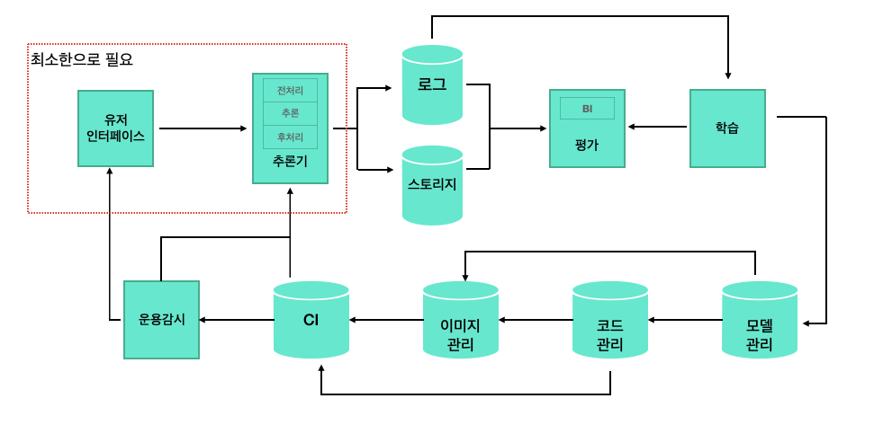

# 머신러닝, MLops 및 시스템

머신러닝을 사용자에게 제공하기 위해서는 추론을 수행하는 시스템이 필요하다.  
시스템 엔지니어링에는 크게 개발과 운용의 두 가지 측면이 존재하고, 이들을 조합한 프랙티스를 DevOps라고 한다.  
이번 챕터에서는 데브옵스에 머신러닝의 개발, 개선 프로세스를 포함한 MLOps에 대해 알아보자.  

## 머신러닝 시스템에 필요한 요소 

머신러닝을 도입하기 위해서는 먼저 데이터를 수집해야 하므로 본격적인 모델을 만들기 이전에 과제 해결에 필요한 데이터를 정의하고 수집하는 파이프라인, 기반, 검색과 같은 시스템을 만들어야 한다.  
또한 머신러닝을 활용하기에 앞서 추론의 목적을 명확하게 할 필요가 있다. 머신러닝을 적용하지 않아도 되는 작업까지 머신러닝으로 대체할 필요는 없기 떄문이다.    

## 머신러닝 시스템 패턴화하기  

머신러닝 모델로 추론을 수행하기 위해서는 시스템이 필요하다.  머신러닝 시스템은 일반적인 소프트웨어 시스템과 더불어 머신러닝만이 가지는 고안이 필요하다. 

### 학습

머신러닝 모델의 개발에 있어 어떤 알고리즘이나 파라미터로 언제 학습할 것인가 하는 요소들은 중요한 기준이 된다. 알고리즘은 해결하고 싶은 과제나 데이터에 의해서 선택하는 것이 일반적이다.    

**어떻게 학습할 것인가?** 만큼이나 **언제 학습할 것인가** 역시 중요한 검토 사항이다. 새로운 데이터를 얻을 수 있다고 해서 매일 모델을 학습하는 것이 적절하다고는 할 수 없다. 머신러닝의 학습은 대부분의 고가의 리소스를 필요로 하기 때문에 데이터의 패턴이 빈번하게 바뀌지 않는다면 모델을 자주 학습할 필요는 없다.  

가동 중인 추론기의 모델을 재학습 하는 타이밍은 모델의 성능을 측정하고 평가한 뒤에 정하면 된다.  

데이터 패턴이 바뀌는 타이밍을 파악하기 어려운 모델이라면  모델의 평가에 따라 유연하게 재학습이 필요하다.  
계절성을 보이는 데이터라면 한 달이나 분기 단위로 학습하는 편이 좋다. 그리고 새로운 방법(ex. 새로운 모델 등장) 개발되어 현재 모델보다 더 좋은 결과를 낼 수 있다면 새롭게 학습해서 릴리스하는 방법도 있을 것이다.  어쩃든 모델 학습은 단순히 학습만 하는 것이 아니라, 인프라와 운용 비용이 발생하기 때문에 그에 상응하는 타이밍에 학습하는 것이 필요하다.  

### 모델 배포  
모델을 추론기로 배포하는 방법은 여러개가 있다.  대표적으로 `서버 사이드`와`에지 사이드`로 나뉠수  있다.  
서버 사이드에서 수행하는 추론은 최근에는 도커로 대표되는 컨테이너로 추론 프로그램을 가동하는 경우를 많이 볼 수 있다.   컨테이너에서 행해지는 추론은 모델을 컨테이너 이미지로 사전 설치할 것인지 또는 컨테이너 가동 시에 모델을 다운로드 할 것인지와 같은 선택지가 있다. 어떤 방법을 선택하는 것은 운용 나름이다.  
에시 사이드에서 추론하는 경우에는 모델을 배포하는 방법이 중요하다. 에지 디바이스에 모델을 설치해야 하므로 모델에 문제가 있다고 해도 쉽게 모델을 교체할 수 없다.  모델 및 애플리케이션 품질관리와 동시에 배포한 모델의 인벤토리 및 갱신 관리를 하도록 주의해야 한다. 

### 추론의 흐름
추론기는 실제 시스템의 일부로 포함할 수 있다.  그러므로 추론기는 실제 시스템의 워크플로에서 가동할 필요가 있고, 실제 시스템이 요구하는 품질을 충족해야 한다.   
모든 모델이 적은 비용으로 빠르게 가동할수 있지는 않다. 모델의 정밀도와 속도 비용에는 트레이드 오프가 있어, 보다 정확한 모델을 가동하기 위해서는 속도나 비용을 희생해야 하는 비즈니스 판단이 필요하다.  

### 품질관리  

머신러닝의 품질관리는 리릴스 이전의 테스트와 이후에 이뤄지는 보수로 나눌 수 있다.  

시스템으로써 추론기를 평가할 때는 비즈니스 및 시스템에 의해 정해진 요건을 충족하고 있을을 입증하기 위해 통합 테스트나 시스템 테스트, 성능 테스트, 인수 테스트를 통과해야 한다. 

이미 다른 모델이 시스템에서 가동되고 있다면, A/B 테스트를 통해 모델 및 추론기의 품질을 검증하는 것이 좋다.  
A/B 테스트에서는 추론 결과의 상태가 좋고 나쁨뿐만 아니라, 지연이나 추론에 대한 사용자의 행동까지도 고려해서 평가해야 한다.   

릴리스 이후에도 모델을 지속적으로 평개햐아 한ㄷ. 릴리스 직전에는 시스템이 미숙해 메뉴엘어 의한 평가를 피할수 없겠지만, 릴리스 이후에는 해당 모델을 정지할 때까지 추론 결과를 계측하고 평가해야 한다.    

## 디자인 패턴

- 패턴명 : 머신러닝 시스템 디자인을 표현하는 패턴의 명칭
- 유스케이스 : 머신러닝 시스템 패턴이 유효한 상황이나 과제를 말한다. 
- 해결하려는 과제 