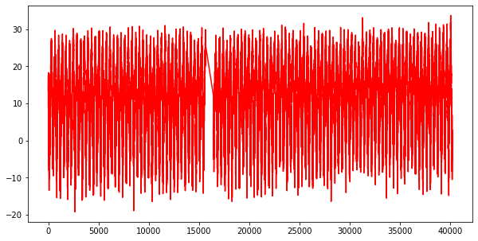
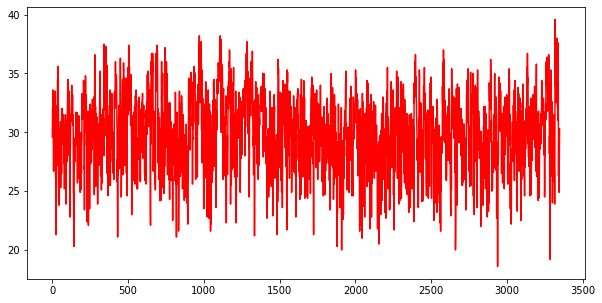
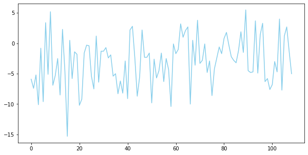

# 새해 첫날의 기온 그래프 그리기


```python
# 데이터 읽어오기

import csv
f = open('./excel/seoul.csv')
data = csv.reader(f)                
next(data) # 헤더 부분을 next() 함수를 사용해 제외

result = []

for row in data:
    if row[-1] != '': #최고 기온의 값이 존대한다면
        result.append(float(row[-1])) # result 리스트에 최고 기온의 값 추가
print(len(result))
```


```python
import pandas as pd
data =pd.read_csv('./excel/seoul.csv',encoding='cp949')
print(data.info())
data.head()
```

    <class 'pandas.core.frame.DataFrame'>
    RangeIndex: 40221 entries, 0 to 40220
    Data columns (total 5 columns):
     #   Column   Non-Null Count  Dtype  
    ---  ------   --------------  -----  
     0   날짜       40221 non-null  object 
     1   지점       40221 non-null  int64  
     2   평균기온(℃)  39465 non-null  float64
     3   최저기온(℃)  39464 non-null  float64
     4   최고기온(℃)  39463 non-null  float64
    dtypes: float64(3), int64(1), object(1)
    memory usage: 1.5+ MB
    None
    


<div>
<style scoped>
    .dataframe tbody tr th:only-of-type {
        vertical-align: middle;
    }

    .dataframe tbody tr th {
        vertical-align: top;
    }

    .dataframe thead th {
        text-align: right;
    }
</style>
<table border="1" class="dataframe">
  <thead>
    <tr style="text-align: right;">
      <th></th>
      <th>날짜</th>
      <th>지점</th>
      <th>평균기온(℃)</th>
      <th>최저기온(℃)</th>
      <th>최고기온(℃)</th>
    </tr>
  </thead>
  <tbody>
    <tr>
      <th>0</th>
      <td>1907-10-01</td>
      <td>108</td>
      <td>13.5</td>
      <td>7.9</td>
      <td>20.7</td>
    </tr>
    <tr>
      <th>1</th>
      <td>1907-10-02</td>
      <td>108</td>
      <td>16.2</td>
      <td>7.9</td>
      <td>22.0</td>
    </tr>
    <tr>
      <th>2</th>
      <td>1907-10-03</td>
      <td>108</td>
      <td>16.2</td>
      <td>13.1</td>
      <td>21.3</td>
    </tr>
    <tr>
      <th>3</th>
      <td>1907-10-04</td>
      <td>108</td>
      <td>16.5</td>
      <td>11.2</td>
      <td>22.0</td>
    </tr>
    <tr>
      <th>4</th>
      <td>1907-10-05</td>
      <td>108</td>
      <td>17.6</td>
      <td>10.9</td>
      <td>25.4</td>
    </tr>
  </tbody>
</table>
</div>


## 결측치 처리 
---


```python
data = data.dropna(axis=0)
print(data.info())
```

    <class 'pandas.core.frame.DataFrame'>
    Int64Index: 39463 entries, 0 to 40220
    Data columns (total 5 columns):
     #   Column   Non-Null Count  Dtype  
    ---  ------   --------------  -----  
     0   날짜       39463 non-null  object 
     1   지점       39463 non-null  int64  
     2   평균기온(℃)  39463 non-null  float64
     3   최저기온(℃)  39463 non-null  float64
     4   최고기온(℃)  39463 non-null  float64
    dtypes: float64(3), int64(1), object(1)
    memory usage: 1.8+ MB
    None
    

## 평균 온도 시각화 하기
---


```python
import matplotlib.pyplot as plt
result = data['평균기온(℃)']
plt.figure(figsize=(10,5))
plt.plot(result,'r')
plt.show()
```





# 1년 중 8월의 최고 기온 데이터만 추출해서 그래프로 그리기
---


```python
# 날짜 데이터에서 월, 일 데이터 추출해서 새로운 컬럼 생성
month = []
day = []
for d in data['날짜']:
    month.append(d.split('-')[1])
    day.append(d.split('-')[2])
data['달'] = month
data['일'] = day
data.head()
```


<div>
<style scoped>
    .dataframe tbody tr th:only-of-type {
        vertical-align: middle;
    }

    .dataframe tbody tr th {
        vertical-align: top;
    }

    .dataframe thead th {
        text-align: right;
    }
</style>
<table border="1" class="dataframe">
  <thead>
    <tr style="text-align: right;">
      <th></th>
      <th>날짜</th>
      <th>지점</th>
      <th>평균기온(℃)</th>
      <th>최저기온(℃)</th>
      <th>최고기온(℃)</th>
      <th>달</th>
      <th>일</th>
    </tr>
  </thead>
  <tbody>
    <tr>
      <th>0</th>
      <td>1907-10-01</td>
      <td>108</td>
      <td>13.5</td>
      <td>7.9</td>
      <td>20.7</td>
      <td>10</td>
      <td>01</td>
    </tr>
    <tr>
      <th>1</th>
      <td>1907-10-02</td>
      <td>108</td>
      <td>16.2</td>
      <td>7.9</td>
      <td>22.0</td>
      <td>10</td>
      <td>02</td>
    </tr>
    <tr>
      <th>2</th>
      <td>1907-10-03</td>
      <td>108</td>
      <td>16.2</td>
      <td>13.1</td>
      <td>21.3</td>
      <td>10</td>
      <td>03</td>
    </tr>
    <tr>
      <th>3</th>
      <td>1907-10-04</td>
      <td>108</td>
      <td>16.5</td>
      <td>11.2</td>
      <td>22.0</td>
      <td>10</td>
      <td>04</td>
    </tr>
    <tr>
      <th>4</th>
      <td>1907-10-05</td>
      <td>108</td>
      <td>17.6</td>
      <td>10.9</td>
      <td>25.4</td>
      <td>10</td>
      <td>05</td>
    </tr>
  </tbody>
</table>
</div>


```python
# 8월 최고 기온 데이터 추출
data_Aug = data[data['달'] == '08']
#data_Aug= data_Aug.reset_index()
result = data_Aug['최고기온(℃)']

# 데이터 시각화
plt.figure(figsize=(10, 5))
plt.plot(result, 'r')
plt.show()
```

    3348
    





# 매년 새해 첫날의 평균기온 그래프
---


```python
data_new = data[data['달'] == '01']
data_new = data_new[data_new['일']=='01']

data_new = data_new.reset_index() #인덱스 초기화
result = data_new['평균기온(℃)']

# 데이터 시각화
plt.figure(figsize=(10, 5))
plt.plot(result, 'skyblue')
plt.show()
```




