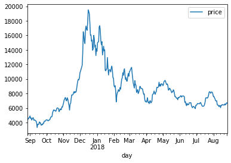

# 시간 정보간 포함된 데이터 살펴보기
---
데이터는 결측값 없이 날짜와 가격에 대한 2개의 피처로 구성되어 있다. 
이러한 데이터셋을 **시게열 데이터셋** 이라고 한다.


```python
import pandas as pd
import numpy as np
import matplotlib.pyplot as plt

import warnings
warnings.filterwarnings('ignore')
```


```python
file_path = 'C:/Users/ariz/Desktop/슬기로운 방학생활/이것이 데이터 분석이다/data/market-price.csv'
bitcoin_df = pd.read_csv(file_path, names = ['day','price'])

# 기본 정보 출력
print(bitcoin_df.info())
bitcoin_df.head()

```

    <class 'pandas.core.frame.DataFrame'>
    RangeIndex: 365 entries, 0 to 364
    Data columns (total 2 columns):
     #   Column  Non-Null Count  Dtype  
    ---  ------  --------------  -----  
     0   day     365 non-null    object 
     1   price   365 non-null    float64
    dtypes: float64(1), object(1)
    memory usage: 5.8+ KB
    None
    


<div>
<style scoped>
    .dataframe tbody tr th:only-of-type {
        vertical-align: middle;
    }

    .dataframe tbody tr th {
        vertical-align: top;
    }

    .dataframe thead th {
        text-align: right;
    }
</style>
<table border="1" class="dataframe">
  <thead>
    <tr style="text-align: right;">
      <th></th>
      <th>day</th>
      <th>price</th>
    </tr>
  </thead>
  <tbody>
    <tr>
      <th>0</th>
      <td>2017-08-27 00:00:00</td>
      <td>4354.308333</td>
    </tr>
    <tr>
      <th>1</th>
      <td>2017-08-28 00:00:00</td>
      <td>4391.673517</td>
    </tr>
    <tr>
      <th>2</th>
      <td>2017-08-29 00:00:00</td>
      <td>4607.985450</td>
    </tr>
    <tr>
      <th>3</th>
      <td>2017-08-30 00:00:00</td>
      <td>4594.987850</td>
    </tr>
    <tr>
      <th>4</th>
      <td>2017-08-31 00:00:00</td>
      <td>4748.255000</td>
    </tr>
  </tbody>
</table>
</div>


시계열 정보를 데이터 프레임의  index로 설정하여 가격의 추이를 시각화 해보자


```python
# to_datetime으로 day 피처를 시계열 피처로 변환합니다. 
bitcoin_df['day'] = pd.to_datetime(bitcoin_df['day'])

# day 데이터프레임의 index로 설정합니다.
bitcoin_df.index = bitcoin_df['day']
bitcoin_df.set_index('day', inplace=True)
bitcoin_df.head()
```


<div>
<style scoped>
    .dataframe tbody tr th:only-of-type {
        vertical-align: middle;
    }

    .dataframe tbody tr th {
        vertical-align: top;
    }

    .dataframe thead th {
        text-align: right;
    }
</style>
<table border="1" class="dataframe">
  <thead>
    <tr style="text-align: right;">
      <th></th>
      <th>price</th>
    </tr>
    <tr>
      <th>day</th>
      <th></th>
    </tr>
  </thead>
  <tbody>
    <tr>
      <th>2017-08-27</th>
      <td>4354.308333</td>
    </tr>
    <tr>
      <th>2017-08-28</th>
      <td>4391.673517</td>
    </tr>
    <tr>
      <th>2017-08-29</th>
      <td>4607.985450</td>
    </tr>
    <tr>
      <th>2017-08-30</th>
      <td>4594.987850</td>
    </tr>
    <tr>
      <th>2017-08-31</th>
      <td>4748.255000</td>
    </tr>
  </tbody>
</table>
</div>


```python
# 일자별로 비트코인 시세 시각화
bitcoin_df.plot()
plt.show()
```




