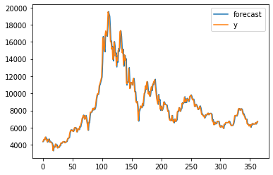
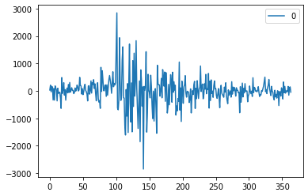
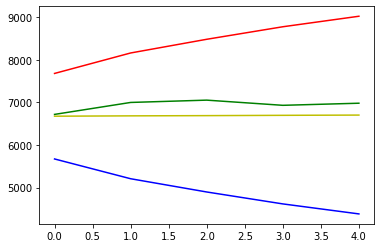
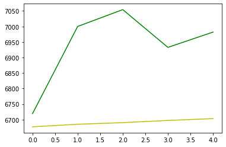

# 모델의 성능 & 예측 결과 시각화
---
- 학습한 모델이 학습 데이터에 대해서 예측한 결과만을 시각화 


```python
fig = model_fit.plot_predict() # 학습 데이터에 대한 예측 결과 ( 첫번째 그래프)
residuals = pd.DataFrame(model_fit.resid) # 잔차의 변동 시각화 ( 두번째 그래프 )
residuals.plot()
```


    <matplotlib.axes._subplots.AxesSubplot at 0x2356f3026c8>








두 번쨰 그래프는 실제값과 예측값 사이의 오차 변동을 나타내는 그래프다. 만약 이 그래프의 폭이 일정하다면 좋은 예측 모델을 학습시킨 것이다.  
하지만 실행 결과에서는 오차 변동이 매우 불안정한 것을 알 수 있다.

# 모델 평가
- 예측 결과인 마지막 5일의 예측값을 실제 데이터와 비교
- 불규칙적 시계열 예측의 경우에는 먼 미래를 예측하는 것이 큰 의미가 없으므로 '앞으로 N일 동인 어느정도로 상승/하락  할것이다' 정도의 경향 예측만 수행하는 것이 일반적.
- 모델의 평과 과정
    - model_fit.forecats(steps=5)로 향후 5일의 가격을 예측하여 pred_y로 정의
    - 실제 향후 5일의 가격을 test_y로 정의
    - 모델이 예측한 상한값, 하한값을 pred_y_upper,pred_y_lower로정의
    - 정의한 모든 값을 비교하여 5일동인의 상승 경향 예측일 얼마나 정확한지 평가


```python
# 학습 데이터셋으로부터 5일 뒤를 예측
forecast_data = model_fit.forecast(steps=5)

# 테스트 데이터셋을 불러옴
test_file_path = 'C:/Users/ariz/Desktop/슬기로운 방학생활/이것이 데이터 분석이다/data/market-price-test.csv'
bitcoin_test_df = pd.read_csv(test_file_path, names=['ds', 'y'])

# 마지막 5일의 예측 데이터
pred_y = forecast_data[0].tolist()

# 실제 5일의 가격 데이터
test_y = bitcoin_test_df.y.values

# 마지막 5일의 예측 데이터 최솟값
pred_y_lower = []

#마지막 5일의 에측 데이터 최댓값
pred_y_upper = []

for lower_upper in forecast_data[2]:
    
    lower = lower_upper[0]
    upper = lower_upper[1]
    pred_y_lower.append(lower)
    pred_y_upper.append(upper)
```

- 다음 코드는 이를 그래프로 시각화 한것이다.
    - 파란색 : 하한가
    - 빨간색 : 상한가
    - 초록색 : 실제 5일간의 가격 그래프
    - 노란색 : 모델이 예측한 5일간의 가격 그래프
    


```python
plt.plot(pred_y,c = 'y')
plt.plot(test_y,c = 'g')
plt.plot(pred_y_lower,c='b')
plt.plot(pred_y_upper,c='r')
plt.show()
```





- 이번에는 상한가와 하한가를 제외한 뒤, 그래프를 살펴보면 예측결과는 다소 좋지않다.
- 상승 할것이라나는 경향정도만 예측 가능하다.


```python
plt.plot(pred_y,c = 'y')
plt.plot(test_y,c = 'g')
```


    [<matplotlib.lines.Line2D at 0x2356f4b7888>]




