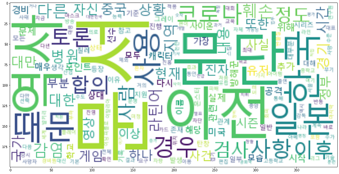

# 워드 클라우드 시각화
---


```python
#워드클라우드 라이브러리 불러오기
import matplotlib.pyplot as plt
from wordcloud import WordCloud
import platform

#폰트 경로 설정
font_path = "c:/Windows/Fonts/malgun.ttf"
```

#### WordCloud함수의 주요 파라미터
---
`font_path` : 사용될 폰트의 경로  
`max_words` : 허용되는 최대 단어 ( 기본값 200 )  
`backgroud_color` : 워드클라우드 이미지의 배경색 ( 기본값 `black`)


```python
wc = WordCloud(font_path=font_path,
               background_color="white",
               relative_scaling=1,
               stopwords=stopwords)
```

`generate_from_frequencies` : 미리 정의된 단어의 빈도수 를 이용하여 워드 클라우드를 그림


```python
wc = wc.generate_from_frequencies(remove_char_counter)
```


```python
# 생성된 워드클라우드를 쥬피터 노트북 상에 표시
plt.figure(figsize=(30,10))
plt.imshow(wc,interpolation='bilinear')
plt.axis=('off')
plt.show()
```




