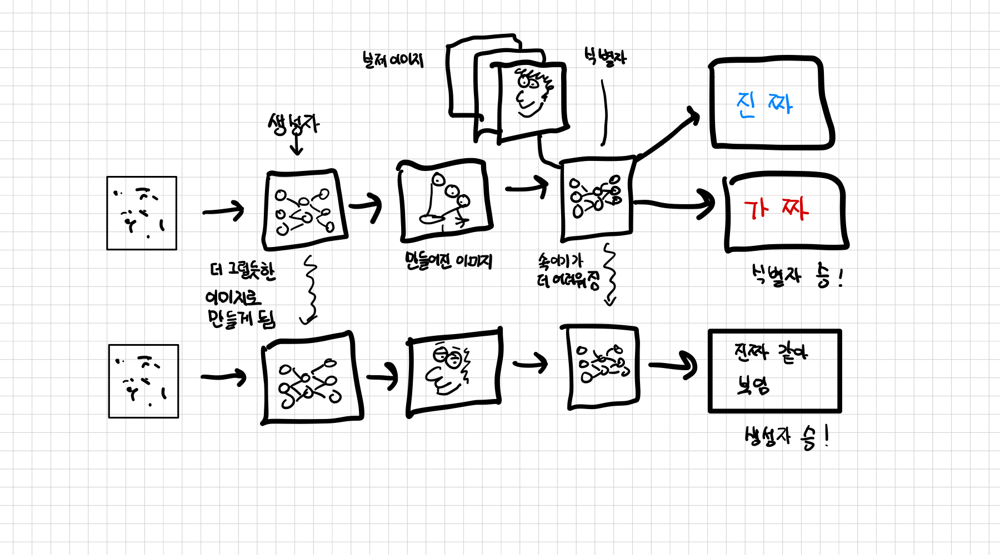
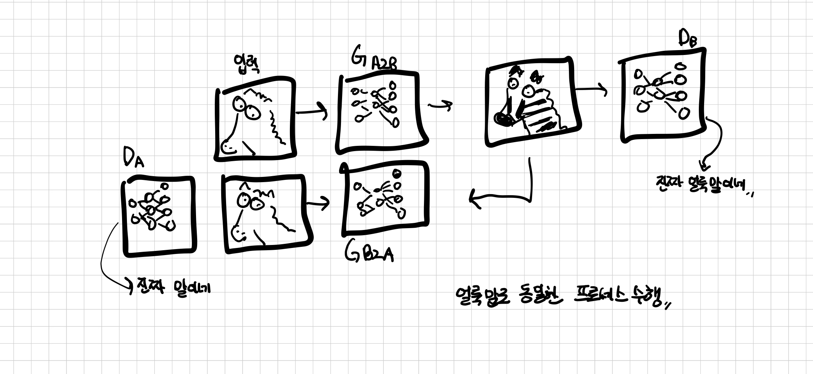
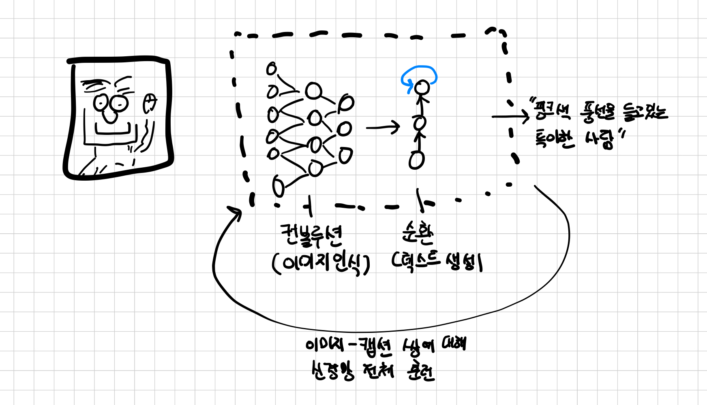

## 2.2 가짜 이미지를 만드는 사전 훈련된 모델
신경망을 통해 하나의 미술 모조품을 만든다고 할때, 두 개의 신경망에서 하나는 화가 역할, 다른 하나는 미술사가(미술의 역사를 연구하는 사람) 역할을 하여 최고의 화가와 최고의 위작 감별사가 되기 위해 서로 경쟁시키듯이 학습시킨다.    
    
GAN은 `생성적 적대 신경망(Generative Adversarial Network)`의 약자로 용어의 순서대로 (가짜 작품이) 만들어지고(generative), 서로 더 뛰어나기 위해 경쟁하는(adversarial) 신경망(network)이라는 의미이다.  
    
GAN의 목표는 원본과 구별할 수 없는 합성된 그림을 만드는 것읻. 이 위작이 합법적인 진짜 작품과 섞여 있을 때 경험 많은 전문가도 어떤 그림이 진짜인지 구별하기 어려울 것이다.  

    

GAN에서 화가 역할을 하는 것이 **생성자**신경망으로, 임의의 입력데 해새 사실같은 이미지를 만들어 내는 작업을 수행한다. **식별자**신경망은 도덕성을 갖추지 않은 미술 작품 감별사가 되어 생성자가 조작한 이미지인지 실제 이미지인지를 말해주는 역할이다.  
대부분의 딥려닝 아키텍처와 비교할 때 이례적인 두 개의 신경망을 사용한 이 디자인은  높은 수준의 결과를 만들어 낸다.  

위 그림은 GAN의 동작 원리를 개략적으로 보여준다. 생성자의 궁극적인 목표는 진짜와 가짜 이미지를 구분하지 못하게 식별자를 속이는 것이다. 맨 처음, 생성자는 램브란트 초상화와는 전혀 닮지 않은 눈이 세 개 달린 뭔지 모를 괴물을 하나 만든다. 식별자는 진짜 그림과 이 엉망진창인 그림을 쉽게 구분할 수 있다. 훈련 과정이 진행됨에 따라 식별자로부터 얻은 정보로 생성자는 점점 개선된다. 
훈련이 끝날 즈음이면 생성자는 그럴싸한 가짜 이미지를 만들며, 식별자는 더 이상 진짜와 가짜를 구별할 수 없다.  

`식별자 승리` 혹은 `생성자 승리`같은 명시적인 대결은 없고, 두 신경망은 각각 상대의 출력값을 기준으로 신경망을 훈련시켜 각 신경망의 파라미터를 최적화 한다.  

GAN은 생성자로 하여금 노으지 값과 속성(예를 들어  얼굴이라면 안경을 쓴, 젊은, 남성)등의 조건 시그널만으로 진짜 같은 이미지를 만들어낸다. 잘 훈련된 생성자는 심지어 사람이 보기에도 진짜 같은 이미지를 생성하는 그럴듯한 모델을 학습해낸다.  

### 사이클 GAN
GAN 개념을 더 흥미롭게 발전시킨 것으로 `Cycle GAN`이 있다. `Cycle GAN`은 훈련셋에서 매칭된 쌍을 제공하지 않아도 한 도메인에 대한 이미지를 다른 도메인으로 바꿔준다.(반대로도 가능).   

위 그림은 말 사진을 얼룩말로바꾸거나 혹은 반대로 바꾸는 작업에 대한 Cycle GAN의 워크플로를 나타낸다. 두 개의 개별 생성자 신경망이 있고 마찬가지로 두 개의 식별자 신경망도 있다.   

    

그림에서 보듯이, 첫 번째 생성자는 다른 이미지(말 이미지) 분포 값을 가진 그림에서 시작하여 목표에 해당하는 얼룩말 이미지의 분포 값과 일치하는 이미지를 만들도록 학습한다. 그래서 말 사진으로 부터 만들어진 이미지가 진짜 얼룩말 사진인지 아닌지를 식별자가 구별하지 못하게 한다. 동시에 만들어진 가짜 얼룩말 사진이 다른 생성자로 전달되어 맞은편의 식별자가 판별하도록 보내는 사이클이 있다. 그래서 Cycle Gan이라 불린다.  이렇게 사이클을 만듦으로써 훈련 과정에서 문제가 되었던 GAN의 안정화 이슈를 해결할 수 있다.  

   

각도가 동일한 말과 얼룩말 사진이 필요하지 않다는 점이 상당히 흥미롭다. 서로 관련 없는 말과 얼룩말 이미지 모음만으로 충분히 생성자가 학습을 시작할 수 있으며, 이는 지도 학습 설저ㅇ을 뛰어 넘는다. 뿐만 아닝라 생성자는 뭘 어떻게 해야 하는지 알려주지 않아도 사진 속 사물의 모습을 어떻게 바꿔야 하는지 배운다. 어떤게 갈기인지 다리인지 알려주는 시그널도 없지만 다른 동물의 구조에맞춰 변환 작업을 진행한다.  

## 장면을 설명하는 사전 훈련된 신경망

자연어와 관련된 모델을 가볍게 알아보자.   
아래 그림에서 볼 수 있등시 해당 모델은 사진을 보여주면 해당 장면을 설명하는 영어 자막을 만들어 낸다. 모델은 **얼룩무늬 고양이가 나무 탁자에 기대어 있고, 앞발 하나는 마우스 위에, 다른 앞발은 검은 노트북 위에 놓여았다.** 같은 설명 문장과 사진이 쌍으로 들어 있는 대량의 데이터 셋으로 훈련 되었다.   
  

캡션 모델은 크게 반으로 나뉜 신경망이 연결되어 있다. 첫 번째는 장면(얼룩무늬 고양이, 마우스, 발)을 숫자로 **표현하는 법**을 학습하는 신경망으로서, 두 번쨰 신경망의 입력으로 사용한다.  두 번째 신경망의 입력으로 사용한다. 두 번째는 **순환 신경망**으로 숫자로 기술된 정보로 연관된 문장을 만드는 역할을 한다. 두 모델은 모두 이미지-자막 쌍으로 훈련 된다.  

두 번째 모델이 **순환** 신경망이라 불리우는 이유는 출력을 만드는 방식에서 기인ㅚ었다. 순방향으로 값을 전달할 때 이전 순방향 전달의 출력값을 함꼐 넣기 떄문이다. 이로 인해 우리가 단어를 연속적으로 나열하며 문장을 만들듯 앞에서 만들어진 단어가 다음 단어에 영향을 주게 된다.  

 