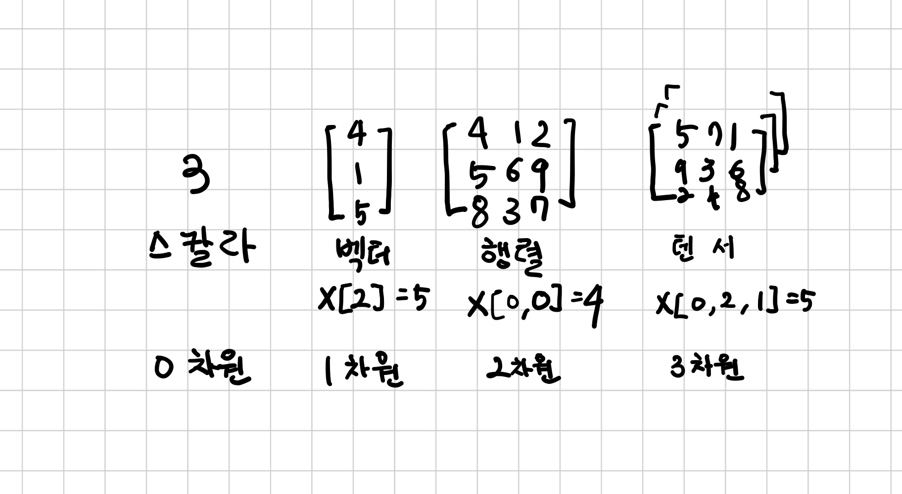

## 부동소수점 수의 세계

심층 신경망은 보통 여러 단계를 거쳐 데이터 변환을 학습한다. 그래서 각 단계 사이의 일부 변환된 데이터들은 중간 단계를 표현하는 연속적인 흐름으로 생각할 수 있다.  

이미지 인식의 경우 앞 단계에서 모서리를 검출하거나 털 같은 질감을 잡아내고 깊이 들어갈수록 귀나 코 혹은 눈 같은 복잡한 구조를 파악한다.  

일반적으로 이러한 중간 단계는 입력값의 특징을 잡아내는 부동소수점 수의 모음인 동시에 신경망에서 입력이 최종적으로 출력으로 표현되는 방법을 기술하기 위한 수단으로 데이터 구조를 잡아낸다.  

데이터를 부동소수점 입력으로 바꾸기 전에 먼저, 파이토치가 입력과 중간 표현 그리고 출력으로서 어떻게 데이터를 다루고 저장하는지 잘 이해할 필요가 있다.  

데이터 처리와 저장을 위해 파이토치에서는 `텐서`라는 기본 자료구조를 제공한다.  딥러닝에서의 텐서는 아래 그림에서 보는 것과 같은 임의의 차원을 가진 벡터나 행렬의 일반화된 개념으로 생각하면 된다.  

텐서의 차원 수는 텐서 안의 스칼라 값을 참조하기 위해 사용하는 인덱스 수와 동일하다.  

