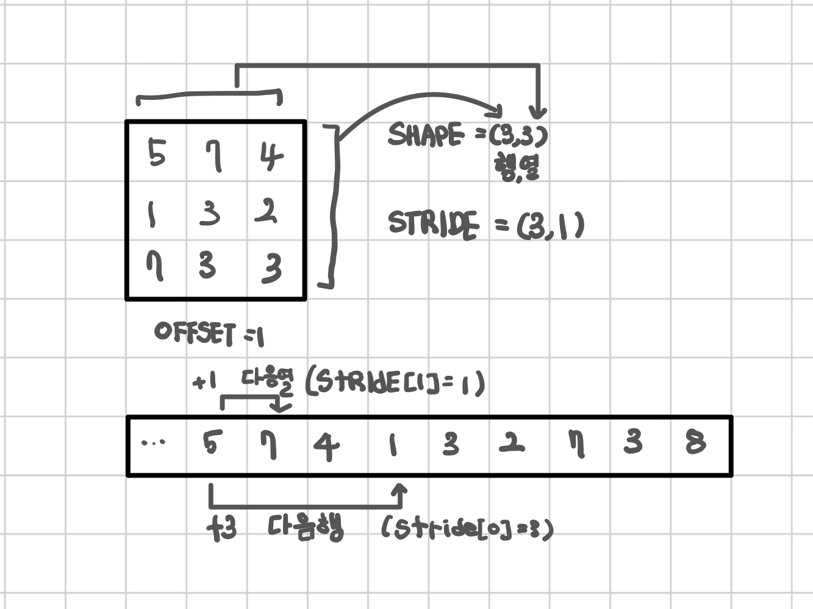
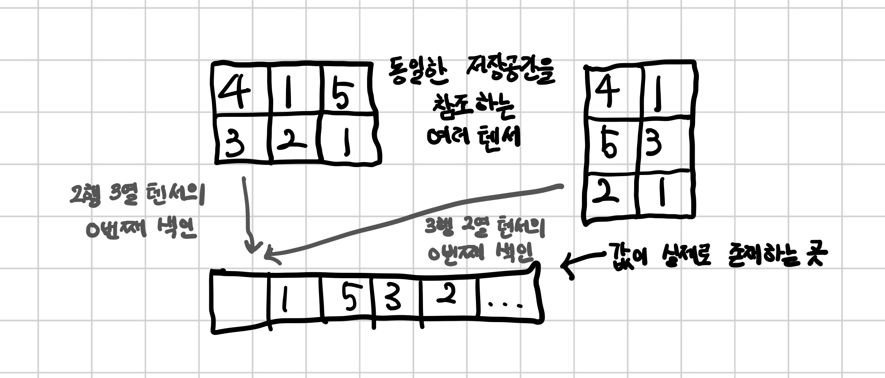

## 부동소수점 수의 세계

심층 신경망은 보통 여러 단계를 거쳐 데이터 변환을 학습한다. 그래서 각 단계 사이의 일부 변환된 데이터들은 중간 단계를 표현하는 연속적인 흐름으로 생각할 수 있다.  

이미지 인식의 경우 앞 단계에서 모서리를 검출하거나 털 같은 질감을 잡아내고 깊이 들어갈수록 귀나 코 혹은 눈 같은 복잡한 구조를 파악한다.  

일반적으로 이러한 중간 단계는 입력값의 특징을 잡아내는 부동소수점 수의 모음인 동시에 신경망에서 입력이 최종적으로 출력으로 표현되는 방법을 기술하기 위한 수단으로 데이터 구조를 잡아낸다.  

데이터를 부동소수점 입력으로 바꾸기 전에 먼저, 파이토치가 입력과 중간 표현 그리고 출력으로서 어떻게 데이터를 다루고 저장하는지 잘 이해할 필요가 있다.  

데이터 처리와 저장을 위해 파이토치에서는 `텐서`라는 기본 자료구조를 제공한다.  딥러닝에서의 텐서는 아래 그림에서 보는 것과 같은 임의의 차원을 가진 벡터나 행렬의 일반화된 개념으로 생각하면 된다.  

텐서의 차원 수는 텐서 안의 스칼라 값을 참조하기 위해 사용하는 인덱스 수와 동일하다.  

    

## 텐서 : 다차원 배열
텐서는 일종의 배열이다. 즉 한 개나 여러 개의 인덱스를 사용해 개별적으로 값에 접근할 수 있는 형태의 숫자 모음을 저장하는 자료구조이다.  

### 텐서의 핵심
숫자값으로 만든 파이썬 리스트나 튜플 객체는 아래 왼쪽 그림처럼 메모리에 따로따로 할당된다.  
반면 파이토치 텐서나 넘파이 배열은 파이썬 객체가 아닌 `언박싱(unboxing)`된 C 언어 숫자 타입을 포함한 연속적인 메모리가 할당되고 이에 대한 뷰를 제공한다.  
여기서 각 요소는 32비트 float 타입이며 오른쪽 그림에서 볼 수 있다. 100만 개의 float 타입 숫자를 1차원 텐서에 보관한다면 400만 바이트의 연속적인 공간과 (차원이나 숫자 타입을 기록하는 용도) 메타데이터 공간을 조금 더 차지한다.  

    

### 텐서 인덱싱
만일 모든 포인트에서 첫 번째 값만 구해야 한다면? 다음처럼 표준 파이썬과 마찬가지로 범위 인덱싱을 사용한다. 
```python
tensor[1:] # 첫 번째 이후 모든 행에 대해.
tensor[1:,:] # 첫 번째 이후 모든 행에 대해
tensor[1:, 0] # 첫 번째 이후 모든 행에 대해 첫 번째 열만 포함
tensor[None] # 길이가 1인 차원을 추가함. unsqueeze와 동일
```


## 이름이 있는 텐서
우리가 다루는 텐서는 차원이나 축이 있으며, 각 차원은 픽셀 위치나 컬러 채널에 해당한다. 때문에 텐서를 접근하려면 차원의 순서를 기억해서 인덱싱해야 한다.  
데이터가 여러 텐서 형태를 거치며 다양하게 변환되면, 어느 차원에 어떤 데이터가 들어있는지 헷갈려 실수하기 쉽다.  

```python
img_t = torch.randn(3, 5, 5) # 각각이 [채널, 행, 열]이 됨.
weights = torch.tensor([0.1234, 0.5942, 0.0439])
```
이런 코드는 일반화 하면 좋다. 예를 들어 높이와 너비를 가진 2차원 텐서로 이뤄진 흑백이미지로부터 RGB값을 담을 세 번째 채널 차원을 더하는 코드로 만드는 것이다. 아니면 개별 이미지 여러 개를 묶어 배치로 만드는 코드를 생각할 수 있다. 배치 크기 2로 바꿔보다

```python
batch = torch.randn(2, 3, 5, 5) # [배치, 채널, 행, 열]
```

경우에 따라 RGB채널은 0 번 혹은 1번 차원에 있다. 두 경우 모드 뒤에서부터 세 번째 차원이므로 RGB 채널은 -3번 차원에 있는 것으로 일반화 할 수 있다. 이러면 다음 코드로 배치 차원 유무에 상관없이 평균을 구할 수 있다.  

```python
batch_t = torch.randn(2, 3, 5, 5)
batch_gray_naive = batch_t.mean(-3)
batch_gray_naive.shape
# output
# torch.Size([2, 5, 5])
```

파이토치는 동일한 차원 정보의 텐서끼리 연산할 수 있고, 각 차원의 길이가 1인 텐서도 가능하다. 혹은 길이가 1인 차원을 알아서 늘려주기도 하는데, 이런 방식을 `브로드캐스팅`이라 한다.  
(2, 3, 5, 5)차원을 가진 batch_t를 (3, 1, 1) 차원의 unsqueezed_weights로 곱하면 (2, 3, 5, 5)차원이 되고, 채널 정보를 가진, 뒤에서 세 번째 차원에 있는 값에 대한 합을 구할 수 있다.  

```python
weights = torch.tensor([0.1234, 0.5942, 0.0439])
unsqueezed_weights = weights.unsqueeze(-1).unsqueeze(-1)
batch_weights = (batch_t * unsqueezed_weights)
batch_gray_weighted = batch_weights.sum(-3)
batch_weights.shape, batch_t.shape, unsqueezed_weights.shape
# output
# (torch.Size([2, 3, 5, 5]), torch.Size([2, 3, 5, 5]), torch.Size([3, 1, 1]))
```

<br/>  
파이토치에서는 이름 지정이 가능한 텐서가 있다. tensor나 rand 가은 텐서 팩토리 함수에 이름으로 사용한 문자열 리스트를 names 인자로 전달할 수 있다.  

```python
weights_named = torch.tensor([0.2126, 0.7152, 0.0722], names = ['channels'])
weights_named
# output
# tensor([0.2126, 0.7152, 0.0722], names=('channels',))
```
텐서를 먼저 만들고 나중에 이름을 지정하려면 redefine_names 함수를 사용하면 된다. 텐서 접근시 인덱싱하듯 생략 부호 ...를 사용하면 다른 차원은 건드리지 않는다. 비슷한 함수인 rename을 사용하면 이미 있는 이름을 바꿀 수 있고, 징려면 이름으로 None를 넘기면 된다.   

```python
batch_named = batch_t.refine_names(...,'channels', 'rows', 'columns')
print('batch named:', batch_named.shape, batch_named.names)
# output
# batch named: torch.Size([2, 3, 5, 5]) (None, 'channels', 'rows', 'columns')
```

텐서끼리의 연산은 먼저 각 차원의 크기가 같은지 혹은 한졲이 1이고 다른 쪽으로 브로드캐스팅될 수 있는지도 확인해야 한다.  
이때 이름이 지정되어 있다면 파이토치가 우리를 대신해 알아서 체크해줄 것이다. 파이토치가 차원을 자동으로 정렬해주지는 않기에 우리는 명시적으로 이런 작업을 수행할 필요가 있다.   
align_as 함수는 빠진 차원을 채우고, 존재하는 차원을 올바른 순서로 바꿔준다.  


```python
weights_aligned = weights_named.align_as(batch_named)
weights_aligned.shape, weights_aligned.names
# output 
# (torch.Size([1, 3, 1, 1]), (None, 'channels', 'rows', 'columns'))
```

여러 텐서에서 같은 이름끼리 연산하는 기능등 여러가지 기능을 제공하긴 하지만 아직까지 해당 기능은 실험 단계이다.    

## 텐서 요소 타입
표준 파이썬 타입은 여려 이유로 최적은 아니다. 
- 파이썬에서 숫자는 객체이다. 
    - 통산 부동소수점 수는 컴퓨터에서 32비트 공간을 사용한다. 하지만 파이썬은 참조 카운터까지 만들어 부동소수점 수를 완전한 파이썬 객체로 변환한다. `박싱`이라 부르는 이 연산은 수를 소량만 저장하는 경우라면 큰 문제가 없겠지만, 수백만 개가 넘어가면 상당히 비효율적이다.
- 파이썬에서 리스트는 연속된 객체의 컬렉션이다. 
    - 파이썬은 두 벡터의 내적을 효율적으로 수행하는 연산이 없다. 벡터 합도 마찬가지이다. 파이썬 리스트에 들어있는 데이터를 메모리에 최적화하여 배치할 방법은 딱히 없고, 리스트는 숫자 뿐만 아니랑 임의의 파이썬 객체에 대한 임의 접근이 가능한 포인터의 모음이다. 게다가 파이썬 리스트는 단일 차원이며, 비록 리스트의 리스트를 만들 수도 있지만 이런 방식은 매우 비효율적이다. 
- 파이썬 인터프리터는 최적화를 거치는 컴파일된 코드보다 느리다.
    - 다랸의 숫자 데이터 모음에 대한 수학적 연산을 수행하는 일은 C 같은 저수준 컴파일을 통해 최저고하한 바이너리 코드가 훨씬 빠르다. 

이런 이유 때문에 dats scientist 라이브러리는 넘파이에 의존하거나 파이토치 텐서같이 전용 데이터 구조를 만든 후 숫자 데이터 연산은 저수준 어어로 효율을 높이도록 구현하고 동시에 고차원 API로 이런 구현을 래핑하여 편리성을 더한다.  
성능 최적화를 위해 텐서 내의 모든 객체는 같은 타입의 숫자여야 하고 파이토치는 실행 중에 이런 숫자 타입을 계속 추적하고 있어야 한다.  

### dtype으로 숫자 타입 지정하기
tensor나 zeros, ones 같은 텐서 생성자 실행 시 넘겨주는 dtype 인자로 텐서 내부에 들어갈 데이터 타입(data, type을 줄여 dtype라 함)을 지정할 수 있다. 이를 통해 텐서가 가질 값이 정수 혹은 부동소수점 수 같은 타입을 지정하고 각 값이 차지하는 바이트 수도 명세한다. **텐서의 기본 데이터 타입은 32비트 부동소수점이다.**  

### 모든 경우에 사용하는 dtype
신경망 연산은 대부분 32비트 부동소수점 연산이다. 64비트를 사용해봐야 모델의 정확도는 거의 개선되지 않고 더 많은 메모리와 시간만 낭비한다. 
16비트 반정밀도 부동소수점을 표준 CPU 구현은 찾기 힘들지만 최신 GPU에는 내부에 구현되어 있다. 필욯다ㅏ면 약간의 정확도를 희생해서 정밀도를 반으로 떨어뜨려 신경망이 차지하는 공간을 줄이는 방식도 가능하다.    


### 텐서의 dtype 속성 관리
숫자 타입의 올바르게 지정된 텐서를 하나 할당할 때에는 생성자에 dtype인자를 정확하게 전달해야 한다. 예를 들면 다음과 같다. 

```python
double_points = torch.ones(10, 2, dtype = torch.double)
short_points = torch.tensor([[1, 2],[3, 4]], dtype = torch.short) 
```
어떤 텐서가 가진 dtype을 알고 싶다면 다음과 같이 대응하는 속성을 읽어보면 된다.  


```python
double_points.dtype
# output
# torch.float64
```
그리고 여러 타입을 가진 입력들이 연산을 거치며 서로 섞일 때 자동으로 제일 큰 타임으로 만들어진다. 따라서 만약 32비트 연산을 원한다면 입력 타입 중 가장 큰 것이 32비트인지 확인해보자.  

## 텐서 API 
파이토치가 제공하는 텐서 연산을 훑어보자. 텐서끼리의 연산 대부분은 torch 모듈에 있고 대부분이 텐서 객체에 대해 메소드처럼 호출할 수 있다. 예를 들어 앞에서 본 transpose 함수도 torch 모듈로 호출한다.  


```python
a = torch.ones(3,2)
a_t = torch.transpose(a, 0, 1)
a.shape, a_t.shape

# output
# (torch.Size([3, 2]), torch.Size([2, 3]))
```
혹은 텐서 메스드로 다음과 같이 할 수 있다.  

```python
a = torch.ones(3,2)
a_t = a.transpose(0,1)
a.shape, a_t.shape

# output
# (torch.Size([3, 2]), torch.Size([2, 3]))
```
위와 같은 내용이 파이토치 온라인 문서(http://pytorch.org/docs)에 텐서 연산이 완벽하게 정리 되어 있다. 대략정인 내용은 다음과 같다. 
- Creation ops : ones나 from_numpy같이 텐서를 만드는 함수
- Indexing, slicing, joining, mutating ops: shape, stride, transpose처럼 텐서 내부를 바꾸는 함수
- Math ops : 연산을 통해 ㄴ텐서 내부를 조작하는 함수
    - Pointwise ops: abs나 cos처럼 텐서 요소 하나 하나에 대한 함수 슬행 결과로 새 텐서를 만드는 함수
    - Comparison ops : equal 이나 max처럼 텐서 요소에 대해 참거짓을 숫자로 평가해서 반환하는 함수
    - Spectral ops: stft나 hamming_window처럼 주파수 영역에 대해 변환이나 연산을 수행하는 함수
    - Other operations : cross처럼 벡터에 대한 연산을 수행하거나, trace처럼 행렬에 대한 복수 연산을 실행하는 함수
    - Blas and LAPACK operations: 기본 선형 대수 서브프로그램 정의를 따르며 스칼라, 벡터 - 벡터, 행렬 - 벡터, 행렬 - 행렬에 대해 연산을 수행할 수 있는 함수
- Random snapling: randn이나 normal 처럼 확률 분포에 기반해서 난수를 만드는 함수
- Serialization: load와 save처럼 텐서를 저장하거나 불러오는 함수
- Parallelism: set_num_threds처럼 병렬 CPU 처리 시 스레드 수를 제어하는 함수  


## 텐서를 저장소 관점에서 머릿속에 그려보기
텐서의 내부 구조를 좀더 자세하게 살펴보자. 텐서 내부 값은 실제로는 torch.Storage 인스턴스로 관리하며 연속적인 메모리 조각으로 할당된 상태다. 저장 공간은 숫자 데이터를 가진 1차원 배열이다. 부동소수점 수를 나타내기 위한 32 비트 공간의 float나 정수를 표현하기 위한 64비트 공간의 int64 타입으로 된 숫자들이 연속해서 들어 있는 메모리 블럭으로 보면 된다.  
 
 <br/>  

 서로 다른 방식으로 구성된 텐서가 동일한 메모리 공간을 가리키고 있을 수도 있다. 아래 그림을 살펴보자. 메모리는 한 번만 할당되었지만 동일한 데이터에 대해 다른 텐서 뷰를 만드는 작업은 Storage 객체가 관리하는 데이터 크기에 상관없이 빠르게 수행된다.  

 

 ## 텐서 메타데이터: 사이즈, 오프셋, 스트라이드
 저장 공간을 인덱스로 접근하기 위해 텐서는 저장 공간에 포함된 몇 가지 명확한 정보, 즉 `size`, `offset`, `stride`에 의존한다. 아래 그림은 텐서가 이를 어떻게 사용하는지 보여준다. 
 텐서의 사이즈는 **텐서의 각 차원 별로 들어가는 요소의 수를 표시한 튜플**이다. 저장 공간에 대한 오프셋은 **텐서의 첫 번째 요소를 가리키는 색인 값과 동일**하다. 스트라이드는 각 차원에서 다음 요소를 가리키고 싶을 때 실제 저장 공간상에서 몇 개의 요소를 건너뛰어야 하는지를 알려주는 숫자다. 

 

 ### 높은 차원에서의 전치 연산
 파이토치의 전치 연산은 행렬에만 국한되지 않는다. 다차원 배열에 대해서도 차원 정보와 스트라이드가 바뀔두 차원을 각각 지정해주면 전치된다.  

 ```python
some_t = torch.ones(3, 4, 5)
transpose_t = some_t.transpose(0, 2)
some_t.shape, transpose_t.shape
# output
# (torch.Size([3, 4, 5]), torch.Size([5, 4, 3]))
 ```

 ```python
 some_t.stride(), transpose_t.stride()
 # output
 # ((20, 5, 1), (1, 5, 20))
 ```
 가장 오른쪽 차원에서 시작해서 증가되는 형태로 저장소에 값이 펼쳐진 텐서는 contiguous로 정의된다. 인접한 텐서는 값 순회 시 띄엄띄엄 찾모하지 않기 때문에 데이터 지역성(data locality) 관점에서 CPU 메모리 접근 효율이 좋다. 실제 효율 여부는 이를 사용하는 알고리즘에 따라 다를 수 있다.  

 

