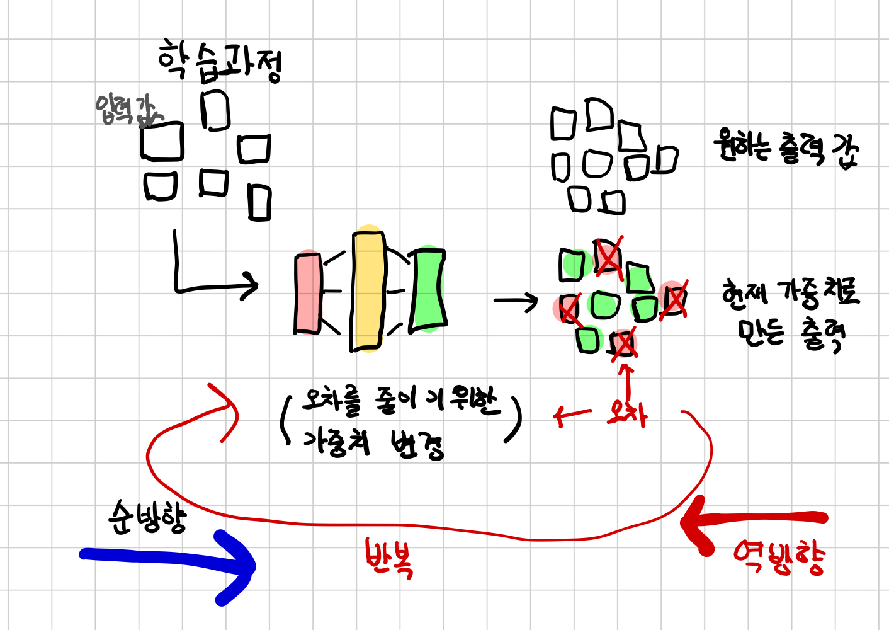
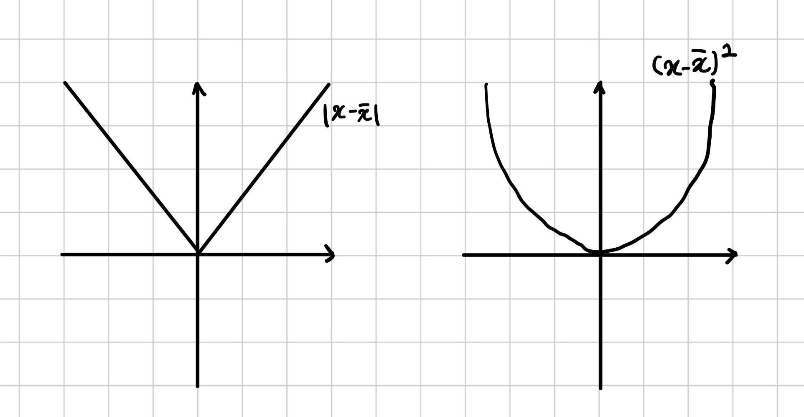

# 학습 기법

## 5.1 시대를 초월하는 모델링 학습

입출력 관계를 설명하는 모델 구축의 기원은 수 세기 전으로 거슬러 올라간다.   
독일의 수학천문학자인 케플러는 1600년대 초 행성의 운동에 대한 세 가지 법칙을 발견하는데, 이 법칙은 그의 멘토인 튀코 브라해가 맨눈으로 밤하늘에 관찰한 결과를 종이에 적은 데이터에 기반했다.  
  
컴퓨터도 없고 심지어 미적분학도 없던 시절에 케플러는 어떻게 이 많은 법칙을 계산하고 발견할 수 있었을까?  
6년 동안 케플러가 이뤄낸 업적을 요약하면 다음과 같다.  
1. 동료 라헤로부터 좋은 데이터를 얻음.
2. 수상한 점을 느껴서 이를 가시화해봄
3. 데이터에 가장 잘 부합할 만한 최대한 단순한 모델(타원)을 고름.
4. 데이터를 쪼개서 일부만 사용하고 나머지는 검증을 위해 남겨둠.
5. 장정적으로 타원에 대한 이심률과 크기를 정하고 이 모델이 관찰 결과와 맞을 때까지 반복
6. 별도의 관찰을 통해 자신의 모델을 검증
7. 의심스러운 부분을 되돌아봄.

이와 같은 과정은 1609년에서 날아온, 일종의 `데이터 과학 핸드북`이나 마찬가지이다. 위 과정은 우리가 데이터로부터 무언가를 배울 때 정의하는 순서와 정확하게 일치한다.  
실제로 이 책에서 **데이터에 맞춰(fitting)**가는 과정과 데이터로부터 **학습(learing)**하는 알고리즘을 만드는 과정도 이와 같다.   

## 5.2 학습은 파라미터 추정에 불과하다.
아래 그림은 입력 및 입력에 대응하는 출력인 실측 자료(ground truth)와 가중치 초깃값이 주어졌을 떄, 모델에 입력 데이터가 들어가고(순방향 전달) 실측값과 출력 결괏값을 비교해서 오차를 계산한다.  
그리고 모델의 파라미터(가중치)를 최적화 하기 위해 가중치를 오차값에 따라 일정 단위만큼(파라미터별 오류의 기울기로 보면 됨) 변경한다. 
이 변경값은 합성 함수(역방향 전달)의 미분값을 연속으로 계산하는 규칙(chain rule)을 통해 정해진다. 이렇게 하면 오차가 줄어드는 방향으로 가중치값이 조정된다.   
이 과정은 학습 때 사용하지 않았던 데이터에 대한 출력값과 실측값과의 오류가 일정 수준 이하로 떨어질 때까지 반복된다. 




### 5.3 손실을 줄이기 위한 방안
 **손실 함수**는 학습 과정이 최소화하고자 하는 단일 값을 계산하는 함수다.  
 손실 하수는 일반적으로 훈련데이터로부터 기대하는 출력값과 모델이 샘플에 대해 실제 출력한 값 사이의 차이를 계산한다. 
 손실함수는 항상 양수의 차이가 나오게 해서 계산해야된다. 이를 위해 간단하게 $|x-\bar{x}|$혹은 $(x-\bar{x})^2$를 사용할 수 있다.  

아래 두 손실 함수 모두 최소 오차는 0이고, 어느 방향으로든 예측값이 실젯값보다 커지면 오차도 단조적으로 증가한다.  
$|x-\bar{x}|$와 $(x-\bar{x})^2$에서 차이값에 제곱을 한 형태가 최솟값 근처에서 더 잘 동작할 같아 보인다. 예를 들어 $x = \bar{x}$인 경우 오른쪽 함수는 미분값이 0이 된다. 반면 왼쪽 함수는 미분값을 정의 할 수 없다.   

  

또한 오른쪽 함수가 왼쪽함수보다 잘못된 결과에 더 많은 불이익을 준다는 사실에 주목해야 한다. 대부분은 빈번하더라도 조금 틀린 값이 많이 나오는 편이 완전히 틀린 값이 어느 정도 나올 때보다 더 바람직한데, 차이를 제곱한 경우는 이런 식으로 오차 보정에 우선순위를 주도록 동작한다. 

## 5.4 경사를 따라 내려가기  
`gradient descent(경사 하강법)`알고리즘을 사용해 파라미터 관점에서 손실 함수를 최적화해보자.  
경사하강법은 매우 단순한 개념이며 수백만 개의 파라미터를 가진 대규모 신경망에도 놀라울 정도로 쉽게 확장 적용 가능하다.   
경사하강법은 각 파라미터와 관련해 손실의 변화율을 계산해 손실이 줄어도는 방향으로 파라미터 값을 바꿔나간다. w와 b값을 아주 조금 늘리거나 줄여서 그 사이에 손실값이 얼마나 변하는지 확인하는 것이다.  

```python
delta  = 1
loss_ratee_of_change_w = (loss_fn(model(t_u, w+delta, b), t_c) - loss_fn(model(t-u, w - delta, b), t_c)) / (2.0 * delta)
```
위 코드는 현재의 w와 b값에서 특정 단위만큼 w가 증가했을 때의 손실이 변하게 만드는데, 값이 줄어들면 w를 더 늘려서 손실을 최소화하고, 값이 늘어나면 반대로 w를 줄여서 손실을 최소화 하는 식이다.  얼마만큼 바꿔갈 것인지에 대한 스케일링 비율을 나타내는  이름은 많은데 머신러닝에서는 주로 `learning_rate라는` 변수명을 쓴다.  

```python
learing_rate = 1e-2

w = w - learning_rate * loss_rate_of_change_w
```

이것은 경사 하강에서 기본적인 파라미터 조정을 표현한다. 이런 식의 평가를 반복함으로써 주어진 데이터에 대해 손실 계산값이 최소로 떨어지는 최적의 파라미터 값으로 수렴하게 되는 것이다.   

### 분석
w와 b 인접 영역에서 손실 함수의 동작 방식을 조사하기 위해서 모델과 손실값을 반복적으로 평가하며 변화율을 계산하는 것을 파라미터가 많은 모델로 확장하기란 쉽지 않다. 또 인접 영역을 얼마의 거리까지로 볼 것인지 규정하기도 어렵다. 위 코드에서 지정한 delta 값에 비해 손실밧이 너무 빠르게 변한다면, 손실값을 최소화하기 위해 어떤 방향으로 파라미터를 조정할지에 대한 판단을 내리기가 쉽지는 않을 것이다. 
아래 그림 처럼 인접한 거리를 극단적으로 줄이면 어떻게 될까? 이렇게 하는 것은 정확하게 파라미터에 대해 손실 함수를 미분하는 것과 일치한다. 우리가 다루고 있는 것처럼 두 개 이상의 파라미터를 가진 모델에서는 각 파라미터에 대한 손실 함수의 편미분을 구하고 이 편미분 값들을 미분 벡터에 넣자. 이것이 바로 **기울기**이다.

   

#### 미분 계산하기
파라미터에 대한 손실 함수의 미분을 계산하려면 연쇄 규칙을 적용하여 입력(여기에서는 모델의 출력값)에 대한 손실 함수의 미분을 게산해서 파라미터에 대한 미분을 곱할 수 있다. 

## 파이토치의 자동미분 : 모든 것을 역전파 하라
**연쇄 규칙**을 사용하여 미분을 역방향으로 전파하는 방법을 통해 w와 b를 내부 파라미터로 가지는 모델과 손실에 대한 합성 함수의 기울기를 계산했다. 
이 과정의 기본 전제는 우리가 다루는 모든 함수가 해석적으로 미분가능해야 한다는 것이다. 미분 가능한 경우라면 파라미터에 대해 우리가 **손실값이 변하는 비율**이라 부른 기울기를 단번에 계산해낼 수 있다.   
<br/>   

모델이 수백만의 파라미터를 가지는 복잡한 경우라고 하더라도 미분만 가능하면 파라미터에 대해 손실값의 기울기를 계산하고 미분에 대한 해석 가능한 표현식을 작성해 단번에 계산 가능하다.  

### 기울기 자동 계산 
위 문제로 인해 파이토치 자동미분(autograd)기능과 함께 파이토치 텐서가 등장한다. 파이토치 텐서는 자신이 어디로부터 왔는지, 즉 어느 텐서에서 어떤 연산을 수행해서 만들어진 텐서인지 기억하고 있으며, 때문에 자연스럽게 미분을 최초 입력까지 연쇄적으로 적용해 올라 갈 수 있다. 이 사실 때문에 우리는 모델에서 미분을 수동으로 도출 할 필요가 없다.  

#### 자동미분 적용하기

```python
def model(t_u, w, b):
    return w * t_u + b

def loss_fn(t_p, t_c):
    squared_diffs = (t_p - t_c)**2
    return squared_diffs.mean()

params = torch.tensor([1.0, 0.0], requires_grad = True)
```
텐서를 생성할 때 `requires_grad = True`옵션은 params에 가해지는 연산의 결과로 만들어지는 모든 텐서를 이은 전체 트리를 기록하라고 파이토치에게 요청하고 있다. 바꿔 말하면 params를 조상으로 두는 모든 텐서는 pamras로부터 해당 텐서가 만들어지기까지 그 사이에 있는 모든 함수에 접근할 권한을 가진다는 의미다. 이 함수들이 미분 가능한 경우, 미분값은 params 텐서의 grad 속성으로 자동 기록된다.  


```python
loss = loss_fn(model(t_u, *params), t_c)
loss.backward()

params.grad

#output 
tensor([4517.2969, 82.6000])
```
params의 grad는 params의 각 요소에 대한 손실값의 미분을 포함하고 있다. 
loss를 계산할 때, 실제 게산을 수행하는 이외에 파라미터 w와 b가 기울기를 요구하는 경우 아래 그림의 상단 처럼 파이토치 연산을 노드로 하는 자동미분 그래프를 만든다.  
이후 loss.backward()를 호출할 때, 파이토치는 그림 아래쪽에서 왼쪽 화살표 방향으로 그래프를 거꾸로 따라가면서 기울기를 계산한다.  


## 핵심 요약
- 선형 모델은 모델 적합을 위한 가장 합리적이면서도 단순한 모델이다.
- 볼록 함수 최적화 기법은 선형 모델에 사용 가능하지만 신경망에 적용할 수 있을 만큼 일반화하기는 어렵다. 이 때문에 파라미터 값의 추정을 위해서는 통계적 경사 하강을 사용한다.
- 딥러닝은 특정 문제를 풀기 위한 엔지니어링이 아닌 일반적인 경우에 사용하는 모델로서, 스스로 적용하여 문제풀이에 최적화 시키는 특징이 있다. 
- 학습 알고리즘은 관찰을 통해 모델 파라미터를 최적화하는 수준에 다다른다. 손실 함수는 작업 수행시 발생하는 오차를 측정하는 수단으로 기대값과 실제 측정값 사이의 오차를 의미한다. 여기에서의 목표는 손실 함수를 최대한 작게 만드는 것이다.
- 모델 파라미터에 대한 손실 함수의 변화율은 손실을 줄이는 방향으로 동일한 파라미터를 조정하는 데 사용할 수 있다. 
- 파이토치의 optim 모듈은 바로 사용 가능한 옵티마이져를 제공하여 손실 함수를 최소화하는 방향으로 파라미터를 조정한다. 
- 옵티마이저는 최종  출력에 대한 기여도에 따라 각 파라미터에 적용할 기울기를 계산하기 위해 파이토치의 자동 미분 기능을 사용한다. 사용자는 복잡한 순방향 전달 중에 필요한 작업을 동적 연산 그래프에 맡길 수 있다.
- with torch.no_grad(): 같은 콘텍스트 관리자는 자동미분 기능의 동작을 제어하는 데 사용할 수 있다. 
- 데이터는 훈련 샘플과 검증 샘플로 분리해 둔다. 이를 통해 훈련에 사용하지 않았던 데이터로 모델을 평가할 수 있다.
- 과적합은 모델이 훈련셋에 대해서는 발전하는 반면, 검증셋에 대해서는 떨어지는 경우를 말한다. 주로 모델이 일반화된 학습을 수행하는 대신 훈련셋의 출력을 암기하는 식으로 전개되기 때문에 발생한다.  

 

