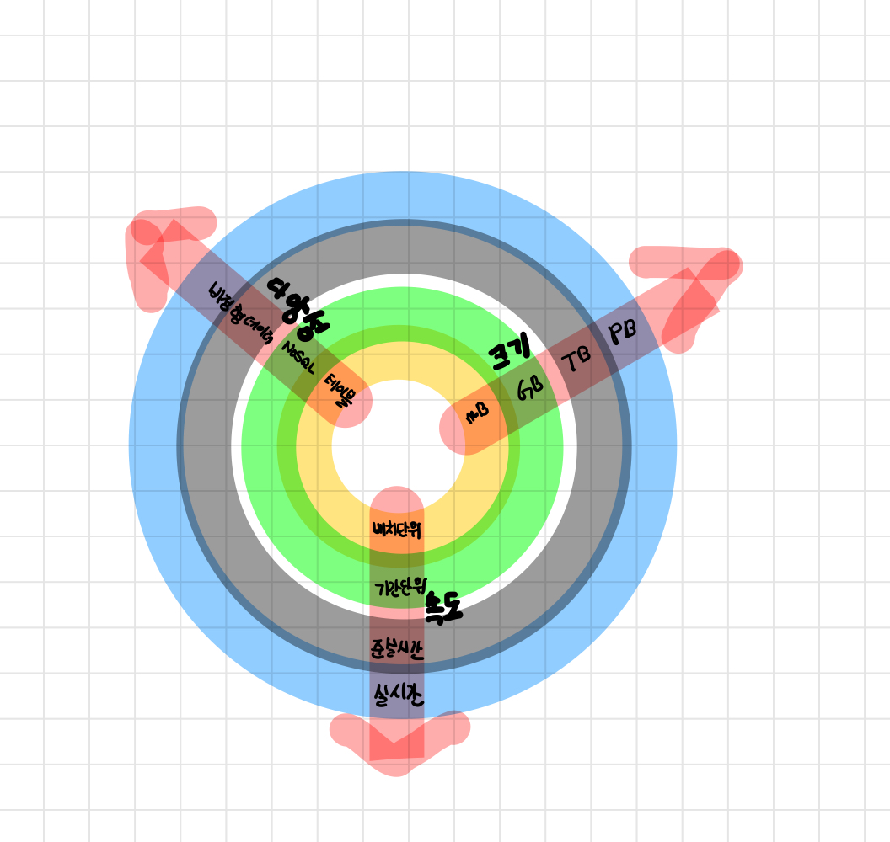

## 1.4 알고리즘 설계 기법 이해하기
알고리즘이란 현실 세계의 문제에 대한 수학적 해결책이다.  
알고리즘을 설계할 때는 다음과 같은 세 가지 사항을 고려해야 한다.  
1. 알고리즘이 우리가 기대한 결과를 출력하는가?
2. 이 결과를 얻기 위해 선택한 방법이 최적인가? 
3. 이 알고리즘이 규모가 더 큰 데이터셋에도 동작할까? 

해결책을 설계하기 전에 가장 중요한 것은 문제 자체의 복잡성을 이해하는 것이다.  
- 데이터 집약적 알고리즘 : 대규모 데이터를 처리하기 위해 설계된 알고리즘으로, 알고리즘의 원리 자체는 상대적으로 간단한 데이터인 경우가 많다.    
- 연산 집약적 알고리즘: 상당히 높은 프로세싱 요구사항이 있지만 대규모 데이터에 사용되지는 않는다. 매우 큰 소수(prime number)를 찾는 알고리즘이 그 사례 중 하나이다.  병렬화는 연산 집약적 알고리즘의 성능을 귿해화할 수 있는 핵심 요소이다.  
- 데이터/연산 집약적 알고리즘: 이 알고리즘은 대규모 데이터에 상당히 큰 연산을 수행한다. 실시간으로 들어오는 동영상 데이터에 대해 감성 분석을 수행하는 것이 데이터/연산 집약적 알고리즘의 사례이다.    

### 데이터 차원
데이터를 `크기`, `속도`, `다양성`의 세 가지 측면(3V)에 대해 살펴보자.
- 크기 : 알고리즘이 처리할 것으로 예상되는 데이터의 크기
- 속도: 새로운 데이터가 생성되는 속도. 0일수도 있다.
- 다양성: 알고리즘이 처리할 것으로 예상되는 데이터 유형의 수를 의미.

아래 그름의 중심에서 부피가 작고 다양성이 적으며 속도가 느린 가장 단순한 형태의 데이터가 있다. 중심에서 멀어질수록 데이터의 복잡도가 증가한다.  
속도 차원에서 예를 들면, *배치 프로세스*, *주기적 프로세스*, *준 실시간 프로세스*, *실시간 프로세스* 순으로 복잡도가 늘어난다. 


   

### 연산 차원
연산 차원은 문제를 처리한느 데 소요되는 컴퓨팅 자원에 대한 것이다. 여러 해결책 중 가장 적절한 옵션을 결정하는 요소는 프로세싱 요구사항이다.  
예를 들어, 딥러닝 알고리즘은 보통 상당히 많은 처리 능력이 필요하다. 따라서 딥러닝 알고리즘을 사용한다면 다중 노드 병렬 아키텍처를 최대한 많이 사용하는 것 이 좋다.     


## 1.5 성능 분석하기 
알리즘의 성능을 추정하는 방법 중 하나는 알고리즘의 복잡성을 파악하는 것이다.   
알고리즘의 복잡도는 두 가지 방법으로 분석한다.  
- 공간 복잡도 분석: 알고리즘을 실행하는 데 필요한 런타임 메모리 크기를 추정한다.  
- 시간 복잡도 분석: 알고리즘을 실행하는데 걸리는 시간을 추정한다.     

### 공간 복잡도 분석  

**공간 복잡도 분석**은 알고리즘이 입력 데이터를 처리하는 데 필요한 메모리 양을 추정한다.   
알고리즘은 입력 데이터를 처리할 때 임시로 만들어지는 자료 구조를 메모리에 저장한다.  
알고리즘이 설계되는 방식은 임시 데이터 개수, 유형, 크기를 결정한다.  그리고 이는 다시 알고리즘 실행을 위해 필요한 하드웨어의 메모리 사양을 정한다.      
<br/>   
공간 복잡도 분석은 알고리즘의 효율적인 설계를 위해 필수적이다. 알고리즘 설계 과정에서 공간 복잡도 분석이 제대로 수행되지 않는다면, 임시 데이터를 저장할 메모리가 부족한 현상이 발생하여  알고리즘의 성능과 효율성에 악영향을 줄 수 있다.   


### 시간 복잡도 분석
**시간 복잡도 분석**은 알고리즘의 구조에 따라 할당된 작업을 완료하는데 걸리는 시간을 추정한다.  공간 복잡도와 달리 시간 복잡도는 알고리즘을 실행하는 하드웨어의 성능이 아니라 알고리즘 자체의 구조에만 영향을 받는다.    
보통 알고리즘은 여러 방법으로 설계할 수 있다. 시간 복잡도 분석을 수행하는 목표는 다음과 같다.  
> 특정 문제를 여러 알고리즘으로 풀 수 있을 때 어떤 알고리즘이 시간 효율성 측면에서 가장 좋은가?  
알고리즘의 시간 복잡도는 다음과 같은 두 가지 방식으로 계산할 수 있다.  
- 구현 후 프로파일링 분석 방식: 다양한 후보 알고리즘을 구현하고 실행하여 성능을 비교
- 구현 전 이론적 분석 방식 : 알고리즘을 실행하지 않고 성능을 수학적으로 근사하여 비교  


### 알고리즘 선택

어떤 알고리즘을 선택하는 것이 가장 좋을까? 이 질문에 대한 답을 구할 수 있는 도구는 시간 복잡도와 빅요 표기법이다.  

### 빅오 표기법
빅오 표기법은 알고리즘의 성능을 정량화하는 도구로써 **최악의 경우 분석**에 널리 사용되고 있다. 

**상수 시간 복잡도 : O(1)**  
입력 데이터의 크기에 관계없이 알고리즘의 실행 시간이 동일하다면 실행에 상수 시간이 소요 된다고 하면 `O(1)`로 표기한다.  아래는 예시 코드이다.

```python
def getFirst(myList):
    return myList[0]
```
상수 시간이 소요되는 작업은 다음과 같다. 
- push로 스택에 새 요소를 추가하거나 pop으로 스택에서 요소를 제거하는 작업
- 해시 테이블에 담긴 요소에 접근하는 작업  

<br/>

**선형 시간 복잡도 : O(n)**    
알고리즘의 실행 시간이 입력 크기에 비례한다면 이를 선형 시간 복잡도라고 하며 `O(n)`으로 표기한다.  
```python
def getSum(myList):
    sum = 0
    for item in myList:
        sum = sum + item
    return sum
```
이 함수의 for 루프 구문을 보면 배열의 크기(n)이 커지면 그에 비례 하여 반복문의 횟수가 늘어난다. 따라서 이 함수의 복잡도는 `O(n)` 이다.  
선형 시간 복잡도를 가지는 작업 사례는 다음과 같다.  
- 일차원 배열에서 요소를 검색하는 작업
- 일차원 배열에서 가장 작은 값을 가진 요소를 찾아내는 작업

<br/>

**이차 시간 복잡도 O($n^2$)**
입력 데이터 크기의 제곱에 비례하여 실행 시간이 증가하는 알고리즘은 이차 시간 복잡도를 가진다.  

```python
def getSum(myList):
    sum = 0
    for row in myList:
        for itme in row:
            sum += item
    return sum
```
보통 중첩된 루프는 O($n^2$)의 복잡도를 가진다.  

<br/>

**로그 시간 복잡도 O(long)**
알고리즘의 실행 시간이 입력 데이터의 크기에 로그를 취한 값에 비례한다면 로그 시간 복잡도를 가진다고 표현한다. 루프를 순회할 때마다 입력 데이터의 크기는 일정한 배수로 줄어든다. 대표적인 사례는 **이진 검색**이 있다.  

<br/>  

알고리즘의 복잡도를 줄이는 방법 중 하나는 정확도를 희생하는 것이다. 이러한 유형의 알고리즘을 **근사 알고리즘**이라고 한다.  
문제 해결에 적합한 알고리즘을 찾는 과정은 설계, 구현, 성능 분석을 반복적으로 거친다.  

## 알고리즘 검증하기 

유효성 검사를 통해 우리가 만든 알고리즘이 문제에 대한 수학적 해결책인지 확인할 수 있다.   
검증 프로세스는 가능한 많은 유형과 값으로 구성된 입력 데이터를 사용하여 결과를 확인해야 한다.  

### 결정론적, 비결정론적 알고리즘과 최적, 근사 알고리즘 
검증 기법은 알고리즘의 종류에 따라 달라진다. 알고리즘은 결정론적 알고리즘과 비결정론적 알고리즘으로 나뉜다. 
결정론적 알고리즘은 같은 입력 데이터에 대해 언제나 동일한 결과를 출력한다. 이에 반해 비결정론적 알고리즘은 일련의 난수를 추가로 사용하기 때문에 입력 데이터가 동일하더라도 매번 다른 결과를 출력할 수 있다. 

  
또한, 알고리즘은 실행 속도를 높이기 위해 작동 방식을 단순화하거나 근사를 사용하는지에 따라 다음과 같은 두 가지로 분류할 수 있다.  
- 최적 알고리즘: 문제에 대한 정확한 해결책을 찾아내는 알고리즘
- 근사 알고리즘: 주어진 자원에 비해 당면한 문제가 지나치게 복잡한 경우, 몇가지 가정을 사용하여 문제를 단순화한다. 또한 문제에 대한 최적의 해결책을 제공하지는 않는다. 

### 해석 가능성 
