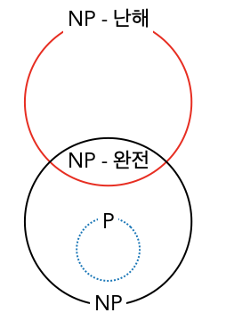

# 알고리즘 설계의 기본 개념

알고리즘을 설계한다는 것은 `특정 목표`를 가장 효율적으로 달성할 수 있는 **명료한 요구사항으로 구성된 유한한 집합**을 고안하는 것이다.   
좋은 알고리즘을 설계하기 위해서는 먼저 풀려는 문제를 완벽히 이해해야 하고 문제 이해 단계에서는 문제가 가진 기능적 요구사항과 비기능적 요구사항을 모두 파악해야 한다.   
- 기능적 요구사항 
    - 풀려는 문제의 입출력 인터페이스와 이에 관한 함수
- 비기능적 요구사항
    - 알고리즘의 성능과 보안에 관한 기대치

위 두개의 요구사항을 모두 만족할 수 있는 좋은 방안을 구하기 위해 서는 아래 세 가지 관점을 고려해야 한다. 
- 관점 1 : 설계한 알고리즘이 우리가 기대하는 결과를 출력하는가?
- 관점 2 : 설계한 알고리즘이 결과를 얻을수 있는 최적의 방법인가?
- 관점 3 : 설계한 알고리즘이 규모가 더 큰 데이터셋을 다룰 수 있는가?

## 관점 1 -  설계한 알고리즘이 우리가 기대하는 결과를 출력하는가?

알고리즘의 정확성을 검증하는 것은 가장 우선시 되어야 한다. 알고리즘을 검증하기 위해 다음 두가지 측면을 고려할 필요가 있다.

- 정답 정의하기
    - 알고리즘을 검증하려면 일련의 입력 데이터와 그에 대응하는 `정확한 결과(정답)`가 있어야 한다. 
- 지표 선택하기
    - 알고리즘이 출력한 답이 정답으로부터 얼마나 멀리 떨어져 있는지 정량화하는 방법을 고민해야 한다. 
    - 올바른 지표를 고를 수 있다면 알고리즘의 성능을 정확하게 측정할 수 있다.  

## 관점 2 - 설계한 알고리즘이 결과를 얻을수 있는 최적의 방법인가?
두 번째 관점은 *현재 해결책이 최선인가? 현재 구현한 해결책보다 더 나은 해결책이 존재 하지않음을 확신하고 증명 가능한가?* 에 대한 답을 찾는 것이다.    
먼저 문제와 그 요구사항, 그리고 알고리즘을 실행하는 데 투입해야 하는 자원을 명확히 이해해야 한다. 

### 문제의 복잡도 파악하기
알고리즘 연구자는 시간 복잡도를 기준으로 문제를 여러 카테고리로 분류한다. 일반적으로 문제는 3가지 유형으로 구분할 수 있다. 
- 유형 1 : 문제를 해결하는 다항시간 알고리즘이 존재한다는 것이 보장된 문제
- 유형 2 : 다항시간 알고리즘으로 풀 수 없다는 것을 중명할 수 있는 문제
- 유형 3 : 문제를 해결하는 다항시간 알고리즘을 찾아낼 수 없으며, 다항시간 알고리즘으로 문제를 해결할 수 없다는 것도 증명할 수 없는 문제
또한, 문제는 다음과 같은 종류로도 정의할 수 있다.  
- 비결정론적 다항시간(Non-deterministic Polynomial time, NP)문제 
    - 후보 해결책이 최적이라는 것을 증명하는 다항시간 알고리즘이 존재
- 다항시간(Polynomial time, P) 문제 
    - 문제를 풀 수 있는 다항시간 알고리즘이 최소 한 개 이상 존재.

- NP- 완전 문제 : NP-완전 문제는 NP 문제 중에서도 가장 어려운 문제들로 구성된 하위 집합.
    - 해결책을 생성할 수있는 알려진 다항시간 알고리즘이 존재하지 않는다.
    - 제안된 해결책이 최적이라는 것을 검증할 수 있는 알려진 다항시간 알고리즘이 존재한다.
- NP-난해 문제 : NP 집합에 있는 문제 만큼 풀기 어렵지만 NP 집합에는 속하지 않는 문제.

## 관점3 - 설계한 알고리즘이 규모가 더 큰 데이터셋을 다룰 수 있는가?
일반적으로 데이터의 크기가 커질수록 이를 처리하는 데 더 많은 시간이 소요된다.    
설계가 잘 된 알고리즘의 특징 중 하나는 확장성이다. 이는 알고리즘이 어떠한 상황에서도 주어진 자원을 적절히 활용하여 합리적인 시간 내에 정확한 결과를 낼 수 있어야 한다는 의미이다.  알고리즘의 확장성은 다음과 같은 두 가지 측면에서 측정할 수 있다.  
- **입력 데이터가 증가하면 필요한 자원도 증가한다.** 이러한 요구사항을 추정하는 것을 공간복잡도 분석이라고 한다.
- **입력 데이터가 증가하면 이를 처리하는 시간도 증가한다.** 이를 분석하는 것을 시간 복잡도 분석 이라고 한다.     

알고리즘 개발과 검증 단계에서는 보통 전체 데이터 대신 그 일부를 사용한다. 그러나 실제 단계에서는 반드시 알고리즘을 대규모 데이터에 적용할 수 있는지, 적용하려면 어떤 방식을 취해야하는지 고려해야 한다.
