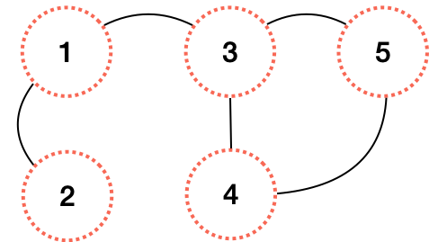
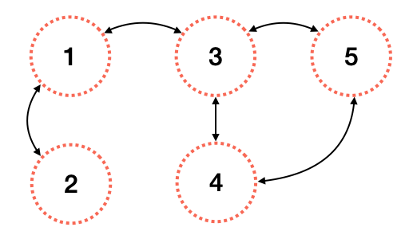
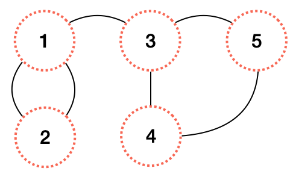
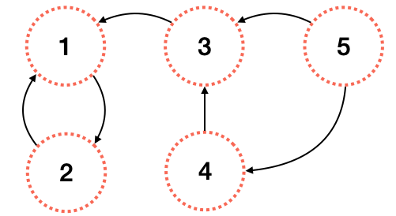
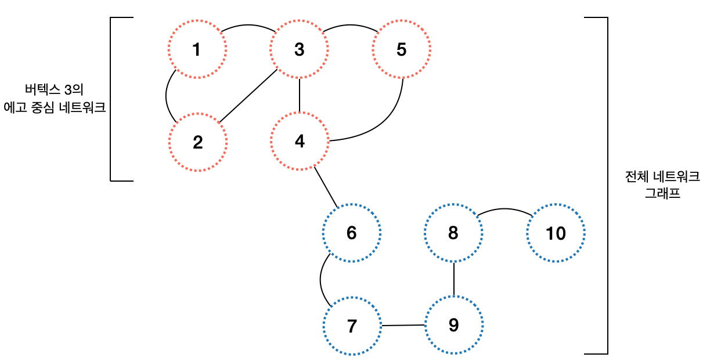
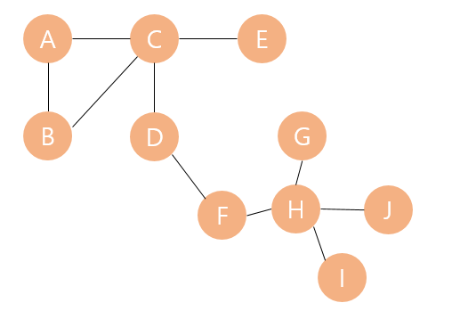

# 그래프 알고리즘
어떤 종류의 연산 문제들은 그 내용과 데이터의 구조를 그래프를 통해 효과적으로 표현할 수 있다. 이러한 문제에 적용할 수 있는 알고리즘을 `그래프 알고리즘`이라고 한다.   
여러 활용 분야 중에서도 그래프 알고리즘이 특히 각곽받는 영역은 `검색`이다.   그래프 알고리즘은 복잡하고 상호연결성이 높은 자료 구조에서 원하는 정보를 빠르게 찾을 수 있는 가장 효율적인 방법이다.  
빅데이터, 소셜미디어, 분산형 데이터의 시대에 그래프 알고리즘은 매우 주목받는 기법으로 떠오르고 있다.  

## 그래프 표현 이해하기  
그래프는 `vertex`와 `edge`로 구성된 자료 구조이다.  vertex는 네트워크를 구성하는 개체를 의미한다. edge는 두 버텍스를 있는다.   
## 그래프 유형
### 무방향 그래프
무방향 그래프는 서로 연결된 노드사이에 어떠한 상하 관계나 순서가 존재하지 않는 네트워크이다. 
  

### 방향 그래프
노드 사이의 관계가 어떠한 방향성을 갖는 경우 해당 그래프를 방향 그래프 라고한다.  
  

### 무방향 멀티그래프
노드들이 여러 관계로 얽혀 있는 경우도 있다. 두 노드 사이를 잇는 엣지가 두 개 이상인 셀이다. 이러한 형태의 연결을 허용하는 그래프를 `멀티그래프`라 부른다.
  
무방향 멀티 그래프의 사례는 다음과 같다.
- 박씨와 김씨는 같은 팀 동료이다. 이들은 주말에 테니스 동호회를 같이 한다. 박씨와 김씨는 직장 동료이다 테니스 동호회 동기이다.  

### 방향 멀티그래프 
멀티그래프에 있는 노드 사이에 방향 관계가 존재한다면 이를 방향 멀티그래프라 부른다.  

 

방향 멀티그래프의 사례는 다음과 같다. 
- 박씨는 김씨에게 파이썬을 가르친다. 김씨는 박씨의 직장 상사이다.

### 에고 중심 네트워크
어떤 사람을 알고 싶다면 그 친구들을 보라는 말이 있다. 네트워크 분석에도 비슷한 접근 방식이 있다. 특정반 버텍스 m에 대한 중요한 정보는 그와 연결된 다른 버텍스들에서 얻을 수 있을지 모른다. 버텍스 $m$을 중심으로 한 에고 중심 네트워크는 $m$과, $m$에 직접적으로 연결된 이웃들로 구성되어 있다.  
이들은 도수(degree)가 1인 이웃이다. 여기서 버텍스 $m$을 `에고`라 하며, 바로 인접한 이웃을 `알터(alter)`라 한다. 

 

## 네트워크 분석 이론 살펴보기

네트워크의 기본 단위는 버텍스(또는 노드)이다. 네트워크는 버텍스로 구성된 거미줄이다. 버텍스를 연결하는 선들은 이들 사이의 관계를 표현한다. 네트워크로 문제를 풀기 위해서는 버텍스가 가진 중요성 또는 유용성을 정량화해야 한다.  

### 최단 경로
**경로**란 시작 버텍스와 끝 버텍스 사이에 있는 일련의 연속적인 버텍스들을 의미한다. 경로의 길이는 이를 구성하는 엣지의 개수이다. 모든 가능한 경로 중에서 가장 거리가 짧은 경로를 **최단 경로**라고 한다. 최단 경로 계산은 그래프 이론 알고리즘에서 상당히 자주 사용하지만 그 계산이 항상 쉬운 것은 아니다.  
- 최단 경로 알고리즘중 가장 인기있는 알고리즘은 `다익스트라 알고리즘`이다. 
- 다익스트라 알고리즘은 단일 출발지로부터의 최단 경로를 게산하는 알고리즘이다. 만약 모든 출발지-도착지 쌍의 최단 경로를 구하고 싶다면 `플로이드-워셜` 알고리즘을 쓰는 것이 좋다.  

### 밀도
모든 버텍스들이 서로 연결된 네트워크를 `완전 연결 네트워크`라고 한다.  
버텍스의 개수가 N인 완전 연결 네트워크의 엣지 수는 다음과 같이 구할 수 있다.  
$Edges_{total}$ = $\frac{N(N-1)}{2}$   
여기서 밀도의 개념이 등장하는데, 네트워크에서 확인한 엣지의 개수를 $Edges_{observed}$라고 한다면 밀도는 다음과 같은 수식으로 표현할 수 있다.   

$density$ = $\frac{Edges_{observed}}{Edges_{total}}$   

모든 버텍스가 상호 연결되어 있는 삼각형 네트워크의 밀도는 1이다. 여기에 엣지를 더 추가하는 것은 불가능하므로 밀도는 1을 초과할 수 없다.   

### 중심성 지표 이해하기

중심성 지표는 **해당 버텍스가 그래프 내에서 얼마나 중요한지 나타내는 지표**이다. 아래 네 가지 중심성 지표를 살펴보자 
- 도수
- 매개
- 근접
- 고유벡터

**도수 중심성**   

특정 버텍스에 연결된 엣지의 수를 **도수**라고 한다. 도수는 해당 버텍스가 다른 버텍스와 얼마나 잘 연결되어 있는지, 네트워크 내에서 메시지를 얼마나 빠르게 전파할 수 있는지 표현한다.  
학급 내에서 친하게 지내는 친구가 많을수록 **도수 중심성**이 높아진다.  

 

위 그림에서 버텍스 C의 도수는 4이다. 버텍스 ㅊ의 도수 중심성은 다음과 같이 계산된다.    
$C_{DC_{c}} = \frac{deg(c)}{|V| = 1} = \frac{4}{10 - 1} = 0.44$  

**매개 중심성**  
매개 중심성은 그래프 내에서 버텍스가 다른 버텍스들 사이에 위치하는 정도를 표현한다.  
학급 내에 여러 개의 작은 소모임이 있다. 매개 중심성이 높은 학색은 각 소모임에 친한 친구들이 하나씩 있다.  
컴퓨터 네트워크 분야에서는 통신 장애와 같은 부정적인 효과를 매개 중심성을 이용해 측정한다.  

그래프 `aGraph`에 속한 버텍스 a의 매개 중심성 계산
- aGraph에 있는 버텍스들로 페어를 구성하고 페어 간 최단 경로를 계산한다. 이를 $n_{sbortest_{Total}}$이라고함.
- $n_{sbortest_{Total}}$를 이용해 버텍스 a를 지나는 최단 경로의 갯수를 센다. 이를 $n_{sbortest_{a}}$라고 함. 
- 매개 중심성의 계산 공식은 다음과 같다. $\frac{n_{sbortest_{a}}}{n_{sbortest_{Total}}}$  

**공정성과 근접 중심성**
그래프 gGraph에서 버텍스 a의 `공정성`은 자기 자신과 그래프 내 다른 버텍스와의 거리를 모두 더한 것이다.  
도수 중심성과 달리 공정성은 대상 버텍스에 직접 연결되어 있지 않은 버텍스와의 거리도 반영한다. 공정성에 역수를 취하면 `근접 중심성`이 된다.  계산 과정은 아래와 같다.  
1. 버텍스 a와 다른 버텍스들을 잇는 최단 경로들을 구한다.
2. 이 최단 경로의 거리를 모두 더한다. 이를 $n_{sum}_{a}$라고 한다. 
3. 이 값에 역수를 취한다.  

**고유 벡터 중심성**
`고유 벡터 중심성`지표는 다른 버텍스의 중심성을 가중치로 반영한다. 학급 내에서도 인기가 많은 친구들과 친하게 지내는 친구는 고유벡터 중심성이 높다.**구글에서 개발한 웹 페이지에 점수를 매기는 `페이지랭크` 알고리즘은 고유벡터 중심성 지표에서 파생되었다. **