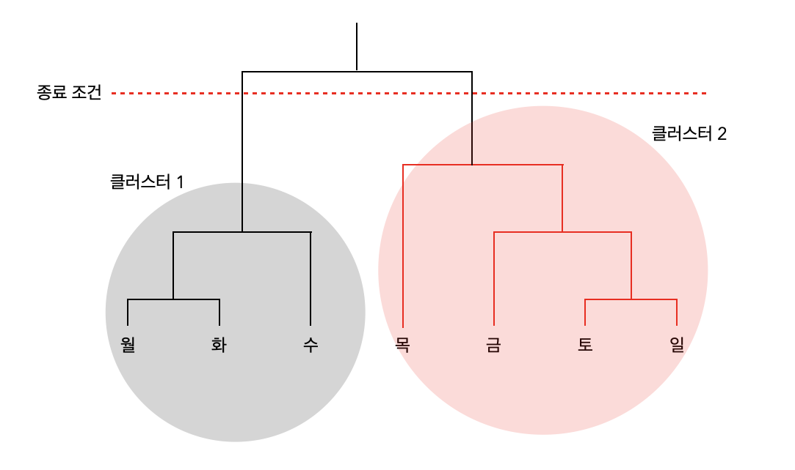
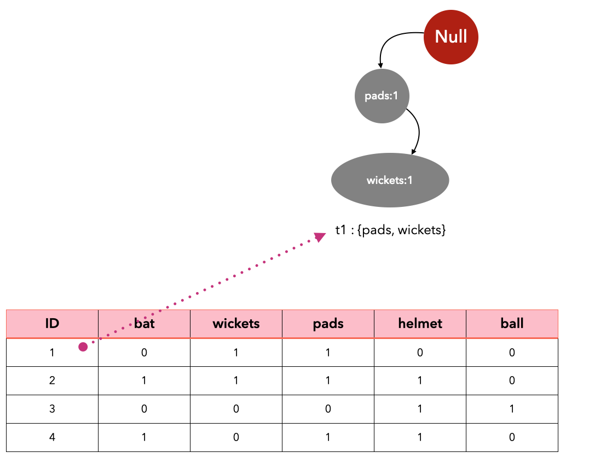
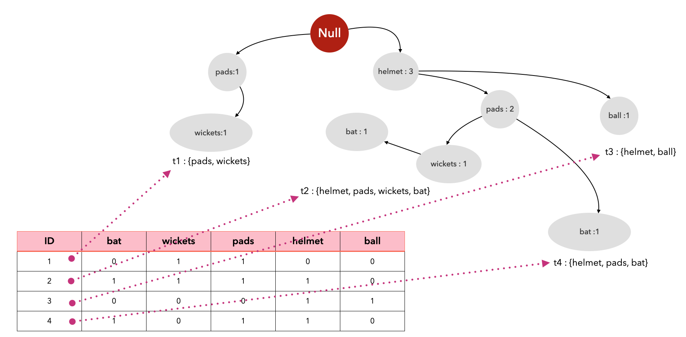

# 비지도 학습

## 비지도 학습 이해하기

비지도 학습 : 데이터에 내재된 패턴을 탐색하고 이를 이용해 비정형 데이터를 구조화하는 프로세스  
데이터가 무작위로 생성된 것이 아니라면 데이터 요소 간에는 다차원 문제 공간상에서 어떤 패턴이 있기마련이다.  
비지도 학습은 그러한 숨겨진 패턴을 찾아내 데이터셋에 구조를 부여한다.    

## 비지도 학습의 최신 연구 트렌드
비지도 학습의 자점은 지도하지 않기 때문에 가정(assumption)에 덜 의존적이며, 어떤 차원에서든 잠재적으로 수렴할 수 있다는 것이다.  
비록 비지도 학습이 지도 학습에 비해 요구사항과 범위를 조정하기가 어렵지만 숨겨진 패턴을 더 잘 찾아낼 수 있는 잠재력이 있다.  
최근 연구자들은 더 강력한 알고리즘을 고안나기 위해 비지도 학습 기법을 지도 학습 기법과 결합하려 노력하고 있다.  

## 비지도 학습의 활용 사례
비지도 학습은 데이터를 더 자세히 이해하고 구조화하는 데 유용하다. `마케팅 세분화`, `사기 탐지`, `장바구니 분석`등에 비지도 학습을 널리 사용한다. 

### 음성 분류
음성 파일에 담긴 목소리를 분류하는 데 비지도 학습을 사용할 수 있다. 각 개인의 음성은 분류할 수 있을 정도로 독창적인 패턴이 있다는 점을 이용해 음성을 분류한다.  
예를 들어, 구글 홈은 음성 분류 기술을 이용해 서로 다른 사람의 음성을 구분하도록 훈련할 수 있다. 훈련이 끝나면 구글 홈은 개별 사용자의 요청을 분리해서 처리할 수 있다.  

### 문서 분류
비지도 학습은 비정형 텍스트 데이터에도 적용할 수 있다. pdf 문서 데이터셋에 비지도 학습을 이용해 다음과 같은 작업을 수행할 수 있다.
- 데이터셋에 담긴 여러 주제 발굴하기
- 각 PDF 문서를 발굴한 주제에 연결 짓기.  

## 클러스터링 알고리즘 이해하기  
클러스터링 알고리즘은 문제 공간에서 여러 데이터 포인트들이 형성하는 유사도를 활용해 그루핑한다. 그렇다면 유사도는 어떻게 계산될까?  
데이터 포인트 간 유사도를 계산하는 최적의 방식은 문제마다 다르다. 우리가 해결하려는 문제의 성격에 적합한 유사도 계산 방식을 선택해야 한다.   

### 계층적 클러스터링 알고리즘
k-평균 알고리즘은 클러스터 중심점으로부터 알고리즘을 시작하는 `top-down` 방식이다. 
이와 반대로, 밑바닥부터 시작하는 알고리즘도 있다. 여기에서 밑바닥이란 문제 공간에 있는 개별 데이터 포인트를 의미한다.   
이 알고리즘은 비슷한 데이터 포인트끼리 묶어서 점진적으로 클러스터 중심점으로 이동한다. 이 `bottom-up` 방식 중 하나가 계층적 클러스터링 알고리즘 이다.  

  
**계층적 클러스터링 알고리즘의 단계**  
다음은 계층적 클러스터링의 실행 단계이다. 
1. 문제 공간에 있는 각 데이터 포인트마다 클러스터릴 생성한다. 만약 데이터 포인트를 100개 가지고 있다면 클러스터가 100개 만들어진다.  
2. 서로 가장 가까이 위치한 포인트끼리 묶는다.
3. 종료 조건을 확인한다. 만약 종료 조건이 달성되지 않았다면 2단계를 반복한다. 
이 알고리즘을 통해 얻는 클러스터 구조를 `덴드로그램`이라고 한다.  
덴드로그램에서 수직선의 높이는 데이터 포인트들이 얼마나 서로 가까이 있는지 표현한다.   

  

위 그림에서 종료 조건은 점선으로 표시된 부분이다.

## 연관 규칙 마이닝 이해하기
연관 규칙 마이닝의 특징은 다음과 같다
- 패턴의 빈도를 측정할 수 있다.
- 패턴들이 형성하는 인과 관계를 분석할 수 있다. 
- 무작위 추측 대비 정확도를 계산하여 패턴의 유용성을 정량화 할 수 있다. 

### 연관 규칙 마이닝의 활용 사례

연관 규칙 마이닝은 여러 변수들이 가진 인과 관계를 조사할 때 유용하다. 연관 규칙 마이닝을 이용하면 다음과 같은 질문을 해결할 수 있다.  
- 현재 습도, 구름 양, 온도 중 어떤 요소가 내일 비가 내리는 것과 연관이 있습니까?
- 어떤 종류의 보험 청구가 사기로 밝혀질 가능성이 높습니까?
- 어떤 약물의 조합이 환자에게 합병증을 일으킬 가능성이 높습니까? 
### 장바구니 분석
추천 엔진의 간단한 버전이 바로 `장바구니 분석`이다. 장바구니 분석에서는 어떤 아이템들을 함께 구매했는지에 대한 정보만 사용한다.   
사용자가 어떤 사람인지에 대한 정보나 이들이 구매한 아이템을 만족스럽게 사용했는지에 대한 정보는 분석에 사용하지 않는다.    
이러한 형태의 데이터느 보통 대형마트, 온라인 쇼핑몰에서 쇼핑할 때 생성된다. 이렇게 어느 정도 기간을 두고 모은 데이터를 `거래 데이터`라고 하고, 편의점, 슈퍼마켓등에 서 모은 거래 데이터에 연관 규칙 분석을 적용한 것을 `장바구니 분석` 이라고 한다.  

   
장바구니 분석은 아이템들이 어떻게 서로 연결되어 있는지 분석할 수 있기 때문에 슈퍼마켓, 편의점, 약국 등 다양한 매스 마켓 리테일 기업에서 널리 사용한다.  

### 연관 규칙
연관 규칙은 거래 데이터에 담긴 아이템들이 형성하는 관계를 수학적으로 표현한다.  이 관계는 거래 데이터에 존재하는 아이템 세트 $X$와 $Y$를  $X$⇒$Y$ 형태로 표현한다.  
여기서  $X$와 $Y$는 서로 겹치지 않아야 한다.  

**규칙의 종류**  
거래 데이터에 연관 규칙 마이닝을 실행하면 보통은 규칙이 꽤 많이 생성된다. 이 중 대다수는 쓸모없는 규칙이다. 유용한 정보를 담은 규칙을 선별하기 위해 생성한 규칙들을 다음과 같이 세가지로 분류한다.  
- 사소한 규칙
    - 생성된 규칙 중 대다수는 아주 상식적이어서 쓸모가 없다. 이들을 `사소한 규칙`이라고 한다.  
    - 사소한 규칙은 신뢰도가 높더라도 쓸 만한 의사결정으로 이어지기 어렵다. 이런 규칙은 무시해도 좋다. 
    - 사소한 규칙 사례
        - 고층 건물에서 뛰어내리면 죽을 가능성이 높다.
        - 열심히 공부하면시험에서 좋은 점수를 받는다.
        - 기온이 떨어지면 온풍기 판매량이 늘어난다.
        - 고속도로에서 과속하면 사고 날 가능성이 높다.  

- 해석 불가능한 규칙
    - 해석이 불가능한 어려운 규칙은 우리가 이해할 수 없기때문에 전략적으로 활용하기에 한계가 있어 사용하기 어렵다. 
    - 이벤트 X가 왜 이벤트 Y로 이어지는지 설명할 수 없다면, 이를 `해석 불가능한 규칙`이라고 한다.  
    - 해석 불가능한 규칙 사례
        - 빨간 셔츠를 입은 학생들이 더 높은 시험 성적을 받는 경향이 있다.
        - 녹색 자전거가 도난당할 확률이 높다.
        - 피클을 구매하면 기저귀를 함꼐 구매한다.
- 실행 가능한 규칙  
    - `실행 가능한 규칙`은 이해하기도 쉽고 중요한 인사이트를 담고 있다.
    - 해당 비즈니스 분야에 대한 지식이 있는 담당자들은 실행 가능한 규칙으로 다양한 활용방안을 모색할 수 있다.
    - 연관 규칙 마이닝으로 얻으려는 규칙이 `실행 가능한 규칙`이다.
    - 실행 가능한 규칙과 그 활용 방안
        - 규칙 1 : 특정 사용자 집단에 SNS광고를 노출하면 구매로 이어질 확률이 높아 진다.
            - 활용 방안 : 옥외 관고 예산을 줄이고 SNS 광고를 집행
        - 규칙 2: 제품의 가격 범위를 늘리면 매출이 증가할 가능성이 높아진다.
            - 활용 방안 : 제품 용량을 줄여 가격대가 낮은 품목을 새롭게 추가. 

### 평가 척도
연관 규칙을 평가 하는 세가지 척도로는 `지지도`, `신뢰도`, `향상도`이다.  

**지지도**  
지지도는 해당 패턴이 데이터셋에서 얼마나 자주 등장하는지 나타낸다. 이는 대상 규칙의 발생 빈도를 전체 거래 기록의 개수로 나누어 구한다. 

예를 들어, 전체 6개의 거래 중 $itemset_a$ = {$helmet, ball$}이 등장하는 거래 기록이 2건이라면 지지도 = 2/6 = 0.33 이다.   

지지도를 보면 해당 패턴이 얼마나 희귀한지 알 수있다.

**신뢰도**  
신뢰도는 조건부 확률을 이용해 왼편(X)과 오른편(Y)을 얼마나 강하게 연관 지을 수 있을지 정량화한 척도이다. 이는 이벤트 X가 발생했을 때 X가 Y로 이어질 확률을 뜻한다.  
$confidence(X \Rightarrow Y) = \frac{support(X \cup Y)}{support(X)}$    
다음과 같은 규칙의 신뢰도를 구해 보자  
${helmet, ball} \Rightarrow {wickets}$  
신뢰도 공식을 적용하면  
$confidence(helmet, ball \Rightarrow wickets)$ = $\frac{helmet, ball \cup wickets}{helmet, ball}$ = $\frac{1/6}{2/6}$ = 0.5  

이는 곧 어떤 사람이 {helmet, ball}을 장바구니에 담고 있다면 0.5 또는 50%의 확률로  wickets도 담고 있을 것이라는 의미이다.  

**향상도**  
규칙의 품질을 측정하는 또 다른 방법은 향상도(lift)이다. 향상도는 무작위로 Y를 예측하는 것에 비해 주어진 조건 X를 이용한 예측의 개선 효과가 얼마나 더 큰지 표현한다. 향상도 공식은 다음과 같다.  

$Lift(X \Rightarrow Y) = \frac{support(X \cup Y)}{support(X) \times support(Y)}$ 

### 연관 규칙 마이닝 알고리즘 

#### Apriori 알고리즘
Apriori 알고리즘은 여러 단계를 반복적으로 실행하여 연관 규칙을 생성한다. 이 알고리즘은 생성과 테스트 접근 방식을 취한다.  
Aprior 알고리즘을 실행하기 전에 먼저 두 가지 변수를 정의해야 한다. 하나는 $support_{threshold}$이며 다른 하나는 $Confidence_{threshold}$이다.  
이 알고리즘은 두 단계로 구성된다. 
1. 후보 생성 단계 : 후보 아이템 셋을 여럿 생성한다. 이 아이템 셋들의 지지도는 $support_{threshold}$를 넘어야 한다.  
2. 필터링 단계 : $Confidence_{threshold}$보다 신뢰도가 낮은 규칙 제거  
필터링을 거치고 남은 규칙이 알고리즘의 결과가 된다. 

**Apriori 알고리즘의 한계점**  
Apriror 알고리즘에서 병목 현상이 가장 크게 발생하는 지점은 후보 생성 단계이다. 예를 들어, 전체 아이템이m개라면, 가능한 아이템 세트의 개수는 $2^m$개가 된다. 이 알고리즘은 단게별로 실행되는 구조이므로 먼저 후보 생성 단계에서 규칙을 만드는 과정이 끝나야 다음 단계로 넘어갈 수 있다. 이러한 구조상의 단점 때문에 Aprior 알고리즘은 많은 수의 아이템을 처리하는 데는 적합하지 않다.  

#### FP-growth 알고리즘
FP-growth 알고리즘 또는 **빈출 패턴 성장**은 Apriori 알고리즘의 개선 버전이다. 이 알고리즘은 다음과 같은 두 단계로 구성된다.  
1. FP-트리 생성
2. 빈출 패텅 마이닝

각 단계를 하나씩 살펴보자

**FP-트리 생성**    
다음 테이블과 같은 거래 데이터를 예로 들어 보자. 이 테이블은 0이 많이 들어 잇는 희소 행렬 이다.  

|ID|bat|wickets|pads|helmet|ball|
|:---:|:---:|:---:|:---:|:---:|:---:|
t1|0|1|1|0|0|
t2|1|1|1|1|0|
t3|0|0|0|1|1|
t4|1|0|1|1|0|

각 아이템의 발생 빈도를 계산하고 이를 내림차순으로 정렬한다.  

|아이템|빈도|
|---|:---:|
|pads|3|
|helmet|3|
|bat|2|
|wickets|2
|ball|1|

빈도를 이용해 거래 데이터를 다시 정리한다.  

|ID|원래 아이템| 정렬된 아이템 |
|---|---|---|
|t1|wickets, pads|pads, wickets|
|t2|bat, wickets, pads, helmet|helmet, pads, wickets, bat|
|t3|helmet, ball|helmet, ball|
|t4|bat, pads, helmet|helmet, pads, bat|  

FP-트리를 만드려면 먼저 트리의 첫 브랜치부터 시작해야 한다.   

FP-트리의 루트는 널이다. 트리의 노드는 아이템이다. 다음 그린은 t1을 트리로 시각화 한것이다. 각 노드의 라벨은 해당 아이템의 이름과 그 빈도로 되어 있다. 여기서 pads의 빈도는 1이라는 점을 유념해야한다. 

  
이와 같은 방식으로 4개의 거래를 모두 그리면 FP-트리가 완성된다. FP-트리에 거래 기록을 추가하면 각 아이템의 발생 횟수를 업데이트해야 한다. 

     

**빈출 패턴 마이닝**  
FP-gorwth 마이닝의 두 번째 단계는 FP-트리로부터 자주 발생하는 패턴을 추출하는 것이다.  순서 트리라는 효율적 구조를 이용해 트리를 만들었기 때문에 발생 빈도가 높은 패턴을 쉽게 탐색 할 수 있다.  
`리프 노드(트리 가장자리의 노드)`부터 시작해서 위로 이동한다. 예를 들어, 리프 노드 중 하나인 bat에서 출발한다. bat를 이용해조건부 규칙을 계산해야 한다. 조건부 규칙은 해당 리프 노드에서부터 최상단 노드에 이르는 모든 경로를 이용해 계산한다. bat의 빈출 패턴은 다음과 같다. 
- ${wicket, pads, helmet} : bat$
- ${pads, helmet} : bat$

