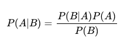

# 지도 학습 이해하기
머신러닝은 사람의 개입이 없거나 적은 상황에서도 의사결정할 수 있는 자동화 시스템을 만드는 데이터 기반 접근 방식을 취한다.  
자동화 시스템을 만들기 위해 머신러닝은 데이터에 존재하는 반복 패턴을 도출하는 여러 알고리즘과 기법을 사용한다.  

그중 가장 인기 있고 강력한 기법이 `지도 학습`이다. 지도 학습은 `feature`라는 입력 정보와 `target`라는 출력 정보를 사용한다.  지도 학습 알고리즘은 수학적 공식을 이용해 특성과 타깃 변수가 이루는 복잡한 관계를 표현하는 모델을 훈렪나다.  
그리고 훈련이 끝난 모델로 새로운 데이터에 대한 예측을 수행한다. 

## 지도 학습의 필요 조건  

지도 학습 알고리즘은 사례를 이용해 모델을 훈련한다.  이 알고리즘을 실행하려면 몇 가지 특정한 조건을 만족해야 한다. 
- 충분히 많은 사례 : 지도 학습 알고리즘으로 모델을 훈련하려면 훈련에 사용하려는 사례가 충분히 많아야 한다.
- 데이터의 패턴 : 훈련에 사용하려는 사례는 어떤 패턴이 있어야 한다. 우리가 관심 있는 이벤트가 발생할 가능성은 어떤 패턴이나 트렌드, 이벤트의 조합에 의존적이어야 한다. 그렇지 않다면 우리에게 주어진 데이터는 무작위 소음과 다르지 않으므로 이를 모델 훈련에 사용할 수 없다.
- 유효한 가정 : 지도 학습 알고리즘을 사용할 때 우리는 훈련에 사용한 사례에 적용된 가정이 미래에도 여전히 유효할 것이라고 기대한다. 구체적으로 학생이 비자를 받을 지 예측하는 모델을 만들어 정부에 납품할 때 우리는 훈련에 사용한 관련 법령이나 정책이 예측 단계에서도 그대로 유지될 것이라 가정한다.  만약 훈련이 끝난 후에 새로운 정책이나 법이 제정된다면 새로운 정보를 처리하기 위해 모델을 다시 학습해야 할 수도 있다.  

## 나이브 베이즈 알고리즘
나이브 베이즈 알고리즘은 확률론에 기반을 둔 단순한 알고리즘이다. 하지만 적절히 사용하면 아주 정확한 예측 결과를 얻을 수 있다.  
다음과 같은 특징 때문에 나이브 베이즈라는 이름이 붙었다.
- 입력 특성들이 서로 독립적이라는 `나이브한 가정`을 사용한다. 
- `베이즈 정리`를 사용한다.

나이브 베이즈 알고리즘은 입력 특성들이 **완전히 독립적이라는 가정**을 사용하며, 특성/인스턴스의 확률을 이용해 인스턴스를 분류한다. 
사건은 크게 세 가지 종류로 나누어 볼 수 있습니다.  

- 독립적(independent) 사건 : 다른 사건의 확률에 영향을 미치지 않는다. 예를 들어, 테크 콘퍼런스에서 무료 초대장을 받는 사건과 회사에서 구조 조정을 단행하는 사건은 아무런 관련이 없다.
- 의존적(dependent) 사건 : 다른 사건의 확률에 영향을 미친다. 즉, 이 사건들은 서로 어떤 방식으로든 연결되어 있다. 예를 들어, 콘퍼런스에 제시간에 도착할 확률은 비행기 승무원들의 파업이나 
기체 결합에 영향을 받을 수 있다.  
- 상호 배타적(mutually exclusive) 사건 : 동시에 일어날 수 없다. 예를 들어, 주사위 하나를 굴려 3과 6이 동시에 나올 확률은 0이다. 이 사건은 상호 배타적이다.  

---
 
### 베이즈 정리 이해하기 
베이즈 정리는 **두 독립 사건 A와 B의 조건부 확률을 계산하는 데 사용한다. **A와 B의 발생 확률이 각각 $P(A)$, $P(B)$이고, A가 발생했을 때 B가 발생할 조건부 확률은 P(B|A)이다. ** 베이즈 정리를 이용하면 다음과 같이 P(A|B)를 계산할 수 있다.    
    

---

### 확률 계산하기
나이브 베이즈는 기본적 확률론에 따라 작동한다. 단일 사건이 발생할 확률은 해당 사건의 발생 빈도를 해당 사건으로 이어질 가능성이 있는 프로세스의 전체 개수로 나누어 구한다.  
하루에 100통가량 전화를 받는 콜센터를 예로 들어보면, 과거 50일 동안의 기록으로 전화 1통당 평균 처리 시간이 3분 이내일 확률을 알아내고자 한다. 만약 콜센터의 평균 처리 시간이 50일 중 27일 동안 3분 이내였다면, 관측 확률은 다음과 같다.  
P(하루 평균 3분 내에 전화를처리할 확률) = (27/50) = 0.54(54\%)   
과거 50일 동안의 기록을 통해 하루 평균 전화 처리 시간이 3분 이내일 확률은 절반이다.  

---

### AND 사건과 곱셈 법칙
두 개 이상의 사건이 동시에 일어날 확률을 구하기 위해서는 각 사건이 서로 독립적인지 파악해야 한다. 이들이 독립적이라면, 간단한 곱셈 법칙으로 각 사건이 동시에 발생할 확률을 구할 수 있다.    
P(사건 1 $AND$ 사건 2) = P(사건1)*P(사건2)
예를 들어, 테크 콘퍼런스에서 무료 초대장을 받는 사건과 회사에서 구조 조정을 단행하는 사건이 서로에게 영향을 미치지 않으므로(독립적이므로) 곱셈 법칙으로 동시에 발생할 확률을 구할 수 있다.  

테크 콘퍼런스에서 무료 초대장을 받을 확률이 31%이고, 회사에서 구조 조정을 단행하는 확률이 82%라면, 두 사건이 모두 발생할 확률은 다음과 같다.    

P(무료 초대장 AND 구조 조정) = P(무료 초대장)*P(구조 조정) = (0.31) * (0.82) = 0.2542(25%)  

---

### 일반적인 곱셈 법칙

만약 두 개 이상의 사건들이 독립적이 아니라면 일반적인 곱셈 법칙을 사용해야 한다. 이 공식은 독립적 사건과 의존적 사건 모두에 사용할 수 있다.  
P(사건 1 $AND$ 사건 2) = P(사건1)*P(사건2 | 사건1)

P(사건2 | 사건1)은 사건 1이 이미 일어났을 때 사건 2가 발생할 조건부 확률이다. 이 공식에는 두 사건이 형성하는 의존 관계가 반영되어 있다. 두 사건이 독립적이라면 서로 영향을 미치지 않기 때문에 조건부 확률은 의미가 없어진다. 즉 P(사건 2 | 사건 1)은 P(사건2)나 마찬가지이다. 즉 더 단순한 곱셈 법칙이 되어버리는 셈이다.  

---

### OR 사건과 덧셈 법칙
상호 배타적 두 사건 중 하나가 발생할 확률을 계산하려면 다음과 같이 덧셈 법칙을 사용한다.   
P(사건 1 OR 사건 2) = P(사건 1)+P(사건 2)  
주사위를 굴려서 6이나 3이 나올 확률은 얼마일까? 답을 구하기 전에 두 사건이 동시에 발생할 수 없다는 점에 유념해야 한다. 주사위를 굴려 6이 나올 확률은 1/6이고 3이 나올 확률도 1/6이다.  
P(6 $OR$ 3) = (1/6) + (1/6) = 0.33(33%) 
두 사건이 상호 배타적이지 않고 동시에 발생할 수 있다면, 다음과 같은 일반적인 덧셈 법칙을 사용해야 한다. 이를 사용하면 상호 배타적인 경우와 비상호 배타적인 경우의 확률을 모두 구할 수 있다. 
P(사건1 $OR$ 사건 2) = P(사건 1) + P(사건 2) - P(사건 1 AND 사건 2)

