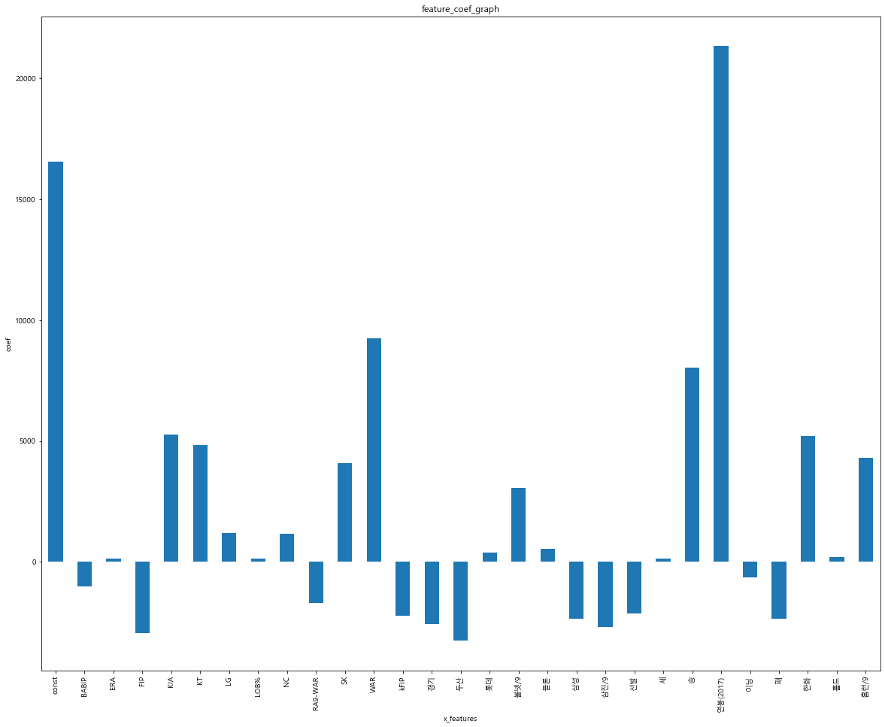

# 회귀 모델 평가
---
회귀 분석은 statsmodel 라이브러리의 OLS 클래스로도 실행이 가능하다. 
OLS 클래스의 summary() 함수를 사용하면 다음의 실행 결과 처럼 계수에 대한 자세한 분석 내용을 살펴 볼 수 있다.


```python
import statsmodels.api as sm

# statsmodel 라이브러로 회귀 분석 수행
X_train = sm.add_constant(X_train)
model = sm.OLS(y_train, X_train).fit()
model.summary()
```


<table class="simpletable">
<caption>OLS Regression Results</caption>
<tr>
  <th>Dep. Variable:</th>            <td>y</td>        <th>  R-squared:         </th> <td>   0.935</td>
</tr>
<tr>
  <th>Model:</th>                   <td>OLS</td>       <th>  Adj. R-squared:    </th> <td>   0.916</td>
</tr>
<tr>
  <th>Method:</th>             <td>Least Squares</td>  <th>  F-statistic:       </th> <td>   49.56</td>
</tr>
<tr>
  <th>Date:</th>             <td>Mon, 12 Oct 2020</td> <th>  Prob (F-statistic):</th> <td>5.90e-44</td>
</tr>
<tr>
  <th>Time:</th>                 <td>20:39:45</td>     <th>  Log-Likelihood:    </th> <td> -1261.4</td>
</tr>
<tr>
  <th>No. Observations:</th>      <td>   121</td>      <th>  AIC:               </th> <td>   2579.</td>
</tr>
<tr>
  <th>Df Residuals:</th>          <td>    93</td>      <th>  BIC:               </th> <td>   2657.</td>
</tr>
<tr>
  <th>Df Model:</th>              <td>    27</td>      <th>                     </th>     <td> </td>   
</tr>
<tr>
  <th>Covariance Type:</th>      <td>nonrobust</td>    <th>                     </th>     <td> </td>   
</tr>
</table>
<table class="simpletable">
<tr>
      <td></td>        <th>coef</th>     <th>std err</th>      <th>t</th>      <th>P>|t|</th>  <th>[0.025</th>    <th>0.975]</th>  
</tr>
<tr>
  <th>const</th>    <td> 1.655e+04</td> <td>  792.164</td> <td>   20.890</td> <td> 0.000</td> <td>  1.5e+04</td> <td> 1.81e+04</td>
</tr>
<tr>
  <th>BABIP</th>    <td>-1017.3681</td> <td> 1395.046</td> <td>   -0.729</td> <td> 0.468</td> <td>-3787.654</td> <td> 1752.918</td>
</tr>
<tr>
  <th>ERA</th>      <td>  137.1900</td> <td> 2529.654</td> <td>    0.054</td> <td> 0.957</td> <td>-4886.201</td> <td> 5160.581</td>
</tr>
<tr>
  <th>FIP</th>      <td>-2947.3239</td> <td> 9.79e+04</td> <td>   -0.030</td> <td> 0.976</td> <td>-1.97e+05</td> <td> 1.91e+05</td>
</tr>
<tr>
  <th>KIA</th>      <td> 5275.2563</td> <td> 2871.812</td> <td>    1.837</td> <td> 0.069</td> <td> -427.593</td> <td>  1.1e+04</td>
</tr>
<tr>
  <th>KT</th>       <td> 4843.0193</td> <td> 2549.086</td> <td>    1.900</td> <td> 0.061</td> <td> -218.961</td> <td> 9905.000</td>
</tr>
<tr>
  <th>LG</th>       <td> 1182.6851</td> <td> 2393.452</td> <td>    0.494</td> <td> 0.622</td> <td>-3570.237</td> <td> 5935.607</td>
</tr>
<tr>
  <th>LOB%</th>     <td>  124.4955</td> <td> 1627.245</td> <td>    0.077</td> <td> 0.939</td> <td>-3106.891</td> <td> 3355.882</td>
</tr>
<tr>
  <th>NC</th>       <td> 1180.2419</td> <td> 2787.097</td> <td>    0.423</td> <td> 0.673</td> <td>-4354.381</td> <td> 6714.865</td>
</tr>
<tr>
  <th>RA9-WAR</th>  <td>-1685.5906</td> <td> 3023.433</td> <td>   -0.558</td> <td> 0.579</td> <td>-7689.530</td> <td> 4318.349</td>
</tr>
<tr>
  <th>SK</th>       <td> 4075.6642</td> <td> 2418.479</td> <td>    1.685</td> <td> 0.095</td> <td> -726.957</td> <td> 8878.285</td>
</tr>
<tr>
  <th>WAR</th>      <td> 9247.0872</td> <td> 2763.813</td> <td>    3.346</td> <td> 0.001</td> <td> 3758.702</td> <td> 1.47e+04</td>
</tr>
<tr>
  <th>kFIP</th>     <td>-2220.9496</td> <td> 8.39e+04</td> <td>   -0.026</td> <td> 0.979</td> <td>-1.69e+05</td> <td> 1.64e+05</td>
</tr>
<tr>
  <th>경기</th>       <td>-2555.7614</td> <td> 3219.967</td> <td>   -0.794</td> <td> 0.429</td> <td>-8949.978</td> <td> 3838.456</td>
</tr>
<tr>
  <th>두산</th>       <td>-3254.6585</td> <td> 2714.090</td> <td>   -1.199</td> <td> 0.234</td> <td>-8644.303</td> <td> 2134.986</td>
</tr>
<tr>
  <th>롯데</th>       <td>  375.9425</td> <td> 3084.319</td> <td>    0.122</td> <td> 0.903</td> <td>-5748.904</td> <td> 6500.789</td>
</tr>
<tr>
  <th>볼넷/9</th>     <td> 3055.9000</td> <td> 6034.107</td> <td>    0.506</td> <td> 0.614</td> <td>-8926.641</td> <td>  1.5e+04</td>
</tr>
<tr>
  <th>블론</th>       <td>  548.4130</td> <td> 1391.563</td> <td>    0.394</td> <td> 0.694</td> <td>-2214.956</td> <td> 3311.782</td>
</tr>
<tr>
  <th>삼성</th>       <td>-2349.7579</td> <td> 2720.863</td> <td>   -0.864</td> <td> 0.390</td> <td>-7752.853</td> <td> 3053.337</td>
</tr>
<tr>
  <th>삼진/9</th>     <td>-2694.8963</td> <td> 8162.306</td> <td>   -0.330</td> <td> 0.742</td> <td>-1.89e+04</td> <td> 1.35e+04</td>
</tr>
<tr>
  <th>선발</th>       <td>-2115.7436</td> <td> 5184.359</td> <td>   -0.408</td> <td> 0.684</td> <td>-1.24e+04</td> <td> 8179.366</td>
</tr>
<tr>
  <th>세</th>        <td>  129.8052</td> <td> 1676.040</td> <td>    0.077</td> <td> 0.938</td> <td>-3198.479</td> <td> 3458.089</td>
</tr>
<tr>
  <th>승</th>        <td> 8024.2904</td> <td> 2660.238</td> <td>    3.016</td> <td> 0.003</td> <td> 2741.586</td> <td> 1.33e+04</td>
</tr>
<tr>
  <th>연봉(2017)</th> <td> 2.133e+04</td> <td> 1391.920</td> <td>   15.325</td> <td> 0.000</td> <td> 1.86e+04</td> <td> 2.41e+04</td>
</tr>
<tr>
  <th>이닝</th>       <td> -644.9880</td> <td> 6636.030</td> <td>   -0.097</td> <td> 0.923</td> <td>-1.38e+04</td> <td> 1.25e+04</td>
</tr>
<tr>
  <th>패</th>        <td>-2342.8019</td> <td> 2052.597</td> <td>   -1.141</td> <td> 0.257</td> <td>-6418.853</td> <td> 1733.249</td>
</tr>
<tr>
  <th>한화</th>       <td> 5219.9733</td> <td> 2448.718</td> <td>    2.132</td> <td> 0.036</td> <td>  357.305</td> <td> 1.01e+04</td>
</tr>
<tr>
  <th>홀드</th>       <td>  205.7793</td> <td> 1822.883</td> <td>    0.113</td> <td> 0.910</td> <td>-3414.104</td> <td> 3825.663</td>
</tr>
<tr>
  <th>홈런/9</th>     <td> 4309.9257</td> <td> 1.65e+04</td> <td>    0.262</td> <td> 0.794</td> <td>-2.84e+04</td> <td>  3.7e+04</td>
</tr>
</table>
<table class="simpletable">
<tr>
  <th>Omnibus:</th>       <td>34.528</td> <th>  Durbin-Watson:     </th> <td>   1.864</td>
</tr>
<tr>
  <th>Prob(Omnibus):</th> <td> 0.000</td> <th>  Jarque-Bera (JB):  </th> <td> 453.475</td>
</tr>
<tr>
  <th>Skew:</th>          <td> 0.299</td> <th>  Prob(JB):          </th> <td>3.38e-99</td>
</tr>
<tr>
  <th>Kurtosis:</th>      <td>12.465</td> <th>  Cond. No.          </th> <td>3.10e+16</td>
</tr>
</table><br/><br/>Warnings:<br/>[1] Standard Errors assume that the covariance matrix of the errors is correctly specified.<br/>[2] The smallest eigenvalue is 8.98e-31. This might indicate that there are<br/>strong multicollinearity problems or that the design matrix is singular.


- `F-통계량에대한 p-value < 0.05` : F 통계량이 유의미한 의미를 가진다 (회귀 식이 유의하다)
- `표의 P > |t| ` : 각 피처의 검정 통계량의 유의 여부 판단.
위의 분석에서 'war', '연봉(2017)' , '한화' 3개의 피처의 p-value가 0.05 미만으로 나타났기 때문에 회귀 부넛ㄱ에서 유의미한 피처들이라는 결론을 내릴 수 있다.

#### 회귀 계수 시각화
---


```python
import matplotlib as mpl

plt.rc('font',family = 'malgun gothic')
plt.figure(figsize = (20,16))

#회귀 계수를 리스트로 반환
coefs = model.params.tolist()
coefs_series = pd.Series(coefs)

# 변수명을 리스트로 반환
x_labels = model.params.index.tolist()

# 회귀 계수를 출력.
ax = coefs_series.plot(kind = 'bar')
ax.set_title('feature_coef_graph')
ax.set_xlabel('x_features')
ax.set_ylabel('coef')
ax.set_xticklabels(x_labels)
```


    [Text(0, 0, 'const'),
     Text(0, 0, 'BABIP'),
     Text(0, 0, 'ERA'),
     Text(0, 0, 'FIP'),
     Text(0, 0, 'KIA'),
     Text(0, 0, 'KT'),
     Text(0, 0, 'LG'),
     Text(0, 0, 'LOB%'),
     Text(0, 0, 'NC'),
     Text(0, 0, 'RA9-WAR'),
     Text(0, 0, 'SK'),
     Text(0, 0, 'WAR'),
     Text(0, 0, 'kFIP'),
     Text(0, 0, '경기'),
     Text(0, 0, '두산'),
     Text(0, 0, '롯데'),
     Text(0, 0, '볼넷/9'),
     Text(0, 0, '블론'),
     Text(0, 0, '삼성'),
     Text(0, 0, '삼진/9'),
     Text(0, 0, '선발'),
     Text(0, 0, '세'),
     Text(0, 0, '승'),
     Text(0, 0, '연봉(2017)'),
     Text(0, 0, '이닝'),
     Text(0, 0, '패'),
     Text(0, 0, '한화'),
     Text(0, 0, '홀드'),
     Text(0, 0, '홈런/9')]





위 코드의 시각화 결과  const,WAR,승,연봉(2017) 피처가 영향력이 가장 큰것을 알 수 있다.  


#### 결정계수
---


```python
# 학습 데이터와 테스트 데이터로 분리
X = picher_df[picher_df.columns.difference(['선수명','y'])]
y = picher_df['y']

X_train,X_test,y_train,y_test = train_test_split(X,y,test_size=0.2,random_state=19)

lr = linear_model.LinearRegression()
model = lr.fit(X_train,y_train)

print(model.score(X_train,y_train)) # train R2 score를 출력
print(model.score(X_test,y_test)) # test R2 score를 출력
```

    0.9276949405576705
    0.8860171644977812
    

실행 결과가 최대한 벌어지지 않는 것이 좋다. 만약 학습 점수가 테스트 점수에 비해 높다면 과적합이 발생한 것이다.


#### RMSE 
___


```python
# 회귀 분석 모델 평가
y_pred = lr.predict(X_train)
print(sqrt(mean_squared_error(y_train,y_pred)))## train RMSE score
y_pred = lr.predict(X_test)
print(sqrt(mean_squared_error(y_test,y_pred)))## train RMSE score
```

    7282.7186847463745
    14310.696436889164
    

####  각피처들의 상관관계 시각화(heat map)
---


```python
import seaborn as sns

# 피처간의 상관계수 행렬을 계산합니다.
corr = picher_df[scale_columns].corr(method='pearson')
show_cols = ['win', 'lose', 'save', 'hold', 'blon', 'match', 'start', 
             'inning', 'strike3', 'ball4', 'homerun', 'BABIP', 'LOB', 
             'ERA', 'RA9-WAR', 'FIP', 'kFIP', 'WAR', '2017']

# corr 행렬 히트맵을 시각화합니다.
plt.rc('font', family='NanumGothicOTF')
sns.set(font_scale=1.5)
hm = sns.heatmap(corr.values,
            cbar=True,
            annot=True, 
            square=True,
            fmt='.2f',
            annot_kws={'size': 15},
            yticklabels=show_cols,
            xticklabels=show_cols)

plt.tight_layout()
plt.show()
```


회귀 분석은 피처 간의 `독립성`을 전제로 하는 분석 방법 이기 때문에 올바른 회귀 분석을 위해서는 이러한 피처 쌍을 제거 해야 한다.   
  
그래서 `다중공선성` 이라는 것을 살펴봐야 하는데 `다중공선성` 이란 변수 간 상관 관계가 높아 분석에 부정적인 영향을 미치는 것을 의미한다.  
`다중공선성`은 **분산팽창요인(VIF)** 라는 계수로 평가할 수 있다. 일반적으로 VIF 계수가 10~15정도를 넘으면 그 피처는 다중 공선성의 문제가 발생했다고 판단한다.  


#### 다중 공선성
---


```python
from statsmodels.stats.outliers_influence import variance_inflation_factor

# 피처마다 VIF 계수를 출력
vif = pd.DataFrame()
vif['VIF Factor'] = [variance_inflation_factor(X.values, i ) for i in  range(X.shape[1])]
vif['features'] = X.columns
vif.round(1)
```


<div>
<style scoped>
    .dataframe tbody tr th:only-of-type {
        vertical-align: middle;
    }

    .dataframe tbody tr th {
        vertical-align: top;
    }

    .dataframe thead th {
        text-align: right;
    }
</style>
<table border="1" class="dataframe">
  <thead>
    <tr style="text-align: right;">
      <th></th>
      <th>VIF Factor</th>
      <th>features</th>
    </tr>
  </thead>
  <tbody>
    <tr>
      <th>0</th>
      <td>3.2</td>
      <td>BABIP</td>
    </tr>
    <tr>
      <th>1</th>
      <td>10.6</td>
      <td>ERA</td>
    </tr>
    <tr>
      <th>2</th>
      <td>14238.3</td>
      <td>FIP</td>
    </tr>
    <tr>
      <th>3</th>
      <td>1.1</td>
      <td>KIA</td>
    </tr>
    <tr>
      <th>4</th>
      <td>1.1</td>
      <td>KT</td>
    </tr>
    <tr>
      <th>5</th>
      <td>1.1</td>
      <td>LG</td>
    </tr>
    <tr>
      <th>6</th>
      <td>4.3</td>
      <td>LOB%</td>
    </tr>
    <tr>
      <th>7</th>
      <td>1.1</td>
      <td>NC</td>
    </tr>
    <tr>
      <th>8</th>
      <td>13.6</td>
      <td>RA9-WAR</td>
    </tr>
    <tr>
      <th>9</th>
      <td>1.1</td>
      <td>SK</td>
    </tr>
    <tr>
      <th>10</th>
      <td>10.4</td>
      <td>WAR</td>
    </tr>
    <tr>
      <th>11</th>
      <td>10264.1</td>
      <td>kFIP</td>
    </tr>
    <tr>
      <th>12</th>
      <td>14.6</td>
      <td>경기</td>
    </tr>
    <tr>
      <th>13</th>
      <td>1.2</td>
      <td>두산</td>
    </tr>
    <tr>
      <th>14</th>
      <td>1.1</td>
      <td>롯데</td>
    </tr>
    <tr>
      <th>15</th>
      <td>57.8</td>
      <td>볼넷/9</td>
    </tr>
    <tr>
      <th>16</th>
      <td>3.0</td>
      <td>블론</td>
    </tr>
    <tr>
      <th>17</th>
      <td>1.2</td>
      <td>삼성</td>
    </tr>
    <tr>
      <th>18</th>
      <td>89.5</td>
      <td>삼진/9</td>
    </tr>
    <tr>
      <th>19</th>
      <td>39.6</td>
      <td>선발</td>
    </tr>
    <tr>
      <th>20</th>
      <td>3.1</td>
      <td>세</td>
    </tr>
    <tr>
      <th>21</th>
      <td>8.0</td>
      <td>승</td>
    </tr>
    <tr>
      <th>22</th>
      <td>2.5</td>
      <td>연봉(2017)</td>
    </tr>
    <tr>
      <th>23</th>
      <td>63.8</td>
      <td>이닝</td>
    </tr>
    <tr>
      <th>24</th>
      <td>5.9</td>
      <td>패</td>
    </tr>
    <tr>
      <th>25</th>
      <td>1.1</td>
      <td>한화</td>
    </tr>
    <tr>
      <th>26</th>
      <td>3.8</td>
      <td>홀드</td>
    </tr>
    <tr>
      <th>27</th>
      <td>425.6</td>
      <td>홈런/9</td>
    </tr>
  </tbody>
</table>
</div>


# 적절한 피처를 선택해 다시 학습
---


```python
# 피처 재선정
X = picher_df[['FIP','WAR','볼넷/9','삼진/9','연봉(2017)']]
y = picher_df['y']
X_train, X_test, y_train, y_test = train_test_split(X,y ,test_size=0.2,random_state=19)
```


```python
lr = linear_model.LinearRegression()
model = lr.fit(X_train, y_train)
```


```python
# 결과 출력
print(model.score(X_train,y_train))
print(model.score(X_test,y_test))
```

    0.9150591192570362
    0.9038759653889862
    


```python
# 회귀 분석모델을 평가
y_pred = lr.predict(X_train)
print(sqrt(mean_squared_error(y_train,y_pred)))
y_pred = lr.predict(X_test)
print(sqrt(mean_squared_error(y_test,y_pred)))
```

    7893.462873347695
    13141.866063591098
    


```python
# 피처마다의 VIF 계수를 출력합니다.
X = picher_df[['FIP', 'WAR', '볼넷/9', '삼진/9', '연봉(2017)']]
vif = pd.DataFrame()
vif["VIF Factor"] = [variance_inflation_factor(X.values, i) for i in range(X.shape[1])]
vif["features"] = X.columns
vif.round(1)
```


<div>
<style scoped>
    .dataframe tbody tr th:only-of-type {
        vertical-align: middle;
    }

    .dataframe tbody tr th {
        vertical-align: top;
    }

    .dataframe thead th {
        text-align: right;
    }
</style>
<table border="1" class="dataframe">
  <thead>
    <tr style="text-align: right;">
      <th></th>
      <th>VIF Factor</th>
      <th>features</th>
    </tr>
  </thead>
  <tbody>
    <tr>
      <th>0</th>
      <td>1.9</td>
      <td>FIP</td>
    </tr>
    <tr>
      <th>1</th>
      <td>2.1</td>
      <td>WAR</td>
    </tr>
    <tr>
      <th>2</th>
      <td>1.9</td>
      <td>볼넷/9</td>
    </tr>
    <tr>
      <th>3</th>
      <td>1.1</td>
      <td>삼진/9</td>
    </tr>
    <tr>
      <th>4</th>
      <td>1.9</td>
      <td>연봉(2017)</td>
    </tr>
  </tbody>
</table>
</div>


