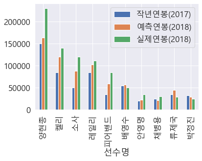

# 시각화 : 분석 결과 시각화 하기
---
마지막으로 회귀 분석을 통해 얻어낸 예측 연봉과 2018년으 ㅣ실제 연봉 데이터를 비교하는 시각화 자료를 만들어 보자.


```python
# 2018년 연봉을 예측하여 데이터프레임의 column으로 생성
X = picher_df[['FIP','WAR','볼넷/9','삼진/9','연봉(2017)']]
predict_2018_salary = lr.predict(X)
picher_df['예측연봉(2018)'] =pd.Series(predict_2018_salary)
```


```python
# 원래의 데이터 프레임을 다시 로드합니다.
picher = pd.read_csv(picher_file_path)
picher = picher[['선수명', '연봉(2017)']]

# 원래의 데이터 프레임에 2018년 연봉 정보를 합칩니다.
result_df = picher_df.sort_values(by=['y'], ascending=False)
result_df.drop(['연봉(2017)'], axis=1, inplace=True, errors='ignore')
result_df = result_df.merge(picher, on=['선수명'], how='left')
result_df = result_df[['선수명', 'y', '예측연봉(2018)', '연봉(2017)']]
result_df.columns = ['선수명', '실제연봉(2018)', '예측연봉(2018)', '작년연봉(2017)']

# 재계약하여 연봉이 변화한 선수만을 대상으로 관찰합니다.
result_df = result_df[result_df['작년연봉(2017)'] != result_df['실제연봉(2018)']]
result_df = result_df.reset_index()
result_df = result_df.iloc[:10, :]
result_df
```


<div>
<style scoped>
    .dataframe tbody tr th:only-of-type {
        vertical-align: middle;
    }

    .dataframe tbody tr th {
        vertical-align: top;
    }

    .dataframe thead th {
        text-align: right;
    }
</style>
<table border="1" class="dataframe">
  <thead>
    <tr style="text-align: right;">
      <th></th>
      <th>index</th>
      <th>선수명</th>
      <th>실제연봉(2018)</th>
      <th>예측연봉(2018)</th>
      <th>작년연봉(2017)</th>
    </tr>
  </thead>
  <tbody>
    <tr>
      <th>0</th>
      <td>0</td>
      <td>양현종</td>
      <td>230000</td>
      <td>163930.148696</td>
      <td>150000</td>
    </tr>
    <tr>
      <th>1</th>
      <td>1</td>
      <td>켈리</td>
      <td>140000</td>
      <td>120122.822204</td>
      <td>85000</td>
    </tr>
    <tr>
      <th>2</th>
      <td>2</td>
      <td>소사</td>
      <td>120000</td>
      <td>88127.019455</td>
      <td>50000</td>
    </tr>
    <tr>
      <th>3</th>
      <td>4</td>
      <td>레일리</td>
      <td>111000</td>
      <td>102253.697589</td>
      <td>85000</td>
    </tr>
    <tr>
      <th>4</th>
      <td>7</td>
      <td>피어밴드</td>
      <td>85000</td>
      <td>58975.725734</td>
      <td>35000</td>
    </tr>
    <tr>
      <th>5</th>
      <td>13</td>
      <td>배영수</td>
      <td>50000</td>
      <td>56873.662417</td>
      <td>55000</td>
    </tr>
    <tr>
      <th>6</th>
      <td>21</td>
      <td>안영명</td>
      <td>35000</td>
      <td>22420.790838</td>
      <td>20000</td>
    </tr>
    <tr>
      <th>7</th>
      <td>22</td>
      <td>채병용</td>
      <td>30000</td>
      <td>21178.955105</td>
      <td>25000</td>
    </tr>
    <tr>
      <th>8</th>
      <td>23</td>
      <td>류제국</td>
      <td>29000</td>
      <td>45122.360087</td>
      <td>35000</td>
    </tr>
    <tr>
      <th>9</th>
      <td>24</td>
      <td>박정진</td>
      <td>25000</td>
      <td>29060.748299</td>
      <td>33000</td>
    </tr>
  </tbody>
</table>
</div>


```python
# 선수별 연봉 정보(작년 연봉, 예측연봉, 실제 연봉) 을 bar 그래프로 출력
plt.rc('font',family = 'malgun gothic')
result_df.plot(x='선수명', y=['작년연봉(2017)', '예측연봉(2018)', '실제연봉(2018)'], kind="bar")
```


    <matplotlib.axes._subplots.AxesSubplot at 0x22d8cff0b00>





예측 결과를 살펴보면 학습한 회귀 모델은 연봉 상승의 전체적인 경향을 비교적 잘 맞춰내고 있다.

