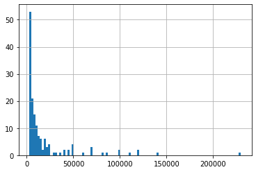
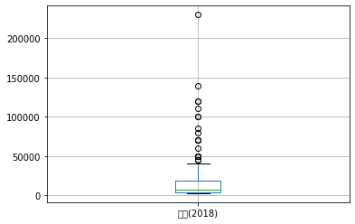
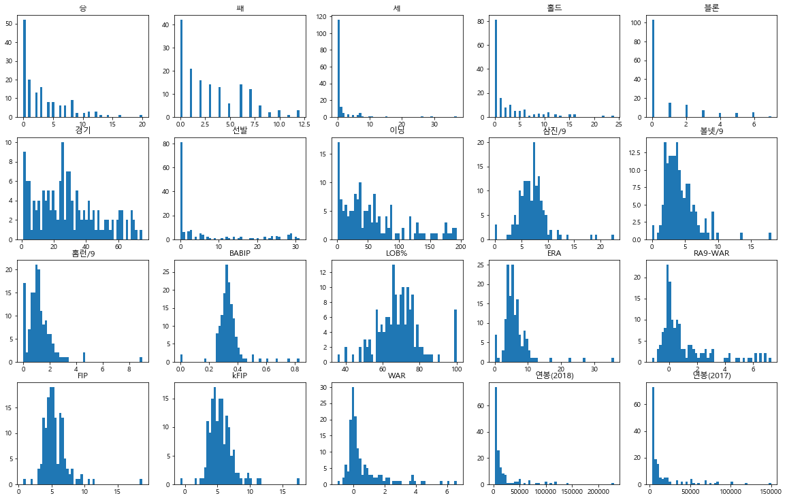

# 프로야구선수 연봉 데이터 살펴보기
---


```python
import pandas as pd
import numpy as np
import matplotlib.pyplot as plt

import warnings
warnings.filterwarnings('ignore')

```


```python
# 데이터 불러오기

picher_file_path= './data/picher_stats_2017.csv'
batter_file_path = './data/batter_stats_2017.csv'

picher = pd.read_csv(picher_file_path)
batter = pd.read_csv(batter_file_path)
```


```python
print(picher.columns,'\n')
print(picher.info(),'\n')
picher.head()
```

    Index(['선수명', '팀명', '승', '패', '세', '홀드', '블론', '경기', '선발', '이닝', '삼진/9',
           '볼넷/9', '홈런/9', 'BABIP', 'LOB%', 'ERA', 'RA9-WAR', 'FIP', 'kFIP', 'WAR',
           '연봉(2018)', '연봉(2017)'],
          dtype='object') 
    
    <class 'pandas.core.frame.DataFrame'>
    RangeIndex: 152 entries, 0 to 151
    Data columns (total 22 columns):
    선수명         152 non-null object
    팀명          152 non-null object
    승           152 non-null int64
    패           152 non-null int64
    세           152 non-null int64
    홀드          152 non-null int64
    블론          152 non-null int64
    경기          152 non-null int64
    선발          152 non-null int64
    이닝          152 non-null float64
    삼진/9        152 non-null float64
    볼넷/9        152 non-null float64
    홈런/9        152 non-null float64
    BABIP       152 non-null float64
    LOB%        152 non-null float64
    ERA         152 non-null float64
    RA9-WAR     152 non-null float64
    FIP         152 non-null float64
    kFIP        152 non-null float64
    WAR         152 non-null float64
    연봉(2018)    152 non-null int64
    연봉(2017)    152 non-null int64
    dtypes: float64(11), int64(9), object(2)
    memory usage: 26.2+ KB
    None 
    
    


<div>
<style scoped>
    .dataframe tbody tr th:only-of-type {
        vertical-align: middle;
    }

    .dataframe tbody tr th {
        vertical-align: top;
    }

    .dataframe thead th {
        text-align: right;
    }
</style>
<table border="1" class="dataframe">
  <thead>
    <tr style="text-align: right;">
      <th></th>
      <th>선수명</th>
      <th>팀명</th>
      <th>승</th>
      <th>패</th>
      <th>세</th>
      <th>홀드</th>
      <th>블론</th>
      <th>경기</th>
      <th>선발</th>
      <th>이닝</th>
      <th>...</th>
      <th>홈런/9</th>
      <th>BABIP</th>
      <th>LOB%</th>
      <th>ERA</th>
      <th>RA9-WAR</th>
      <th>FIP</th>
      <th>kFIP</th>
      <th>WAR</th>
      <th>연봉(2018)</th>
      <th>연봉(2017)</th>
    </tr>
  </thead>
  <tbody>
    <tr>
      <th>0</th>
      <td>켈리</td>
      <td>SK</td>
      <td>16</td>
      <td>7</td>
      <td>0</td>
      <td>0</td>
      <td>0</td>
      <td>30</td>
      <td>30</td>
      <td>190.0</td>
      <td>...</td>
      <td>0.76</td>
      <td>0.342</td>
      <td>73.7</td>
      <td>3.60</td>
      <td>6.91</td>
      <td>3.69</td>
      <td>3.44</td>
      <td>6.62</td>
      <td>140000</td>
      <td>85000</td>
    </tr>
    <tr>
      <th>1</th>
      <td>소사</td>
      <td>LG</td>
      <td>11</td>
      <td>11</td>
      <td>1</td>
      <td>0</td>
      <td>0</td>
      <td>30</td>
      <td>29</td>
      <td>185.1</td>
      <td>...</td>
      <td>0.53</td>
      <td>0.319</td>
      <td>67.1</td>
      <td>3.88</td>
      <td>6.80</td>
      <td>3.52</td>
      <td>3.41</td>
      <td>6.08</td>
      <td>120000</td>
      <td>50000</td>
    </tr>
    <tr>
      <th>2</th>
      <td>양현종</td>
      <td>KIA</td>
      <td>20</td>
      <td>6</td>
      <td>0</td>
      <td>0</td>
      <td>0</td>
      <td>31</td>
      <td>31</td>
      <td>193.1</td>
      <td>...</td>
      <td>0.79</td>
      <td>0.332</td>
      <td>72.1</td>
      <td>3.44</td>
      <td>6.54</td>
      <td>3.94</td>
      <td>3.82</td>
      <td>5.64</td>
      <td>230000</td>
      <td>150000</td>
    </tr>
    <tr>
      <th>3</th>
      <td>차우찬</td>
      <td>LG</td>
      <td>10</td>
      <td>7</td>
      <td>0</td>
      <td>0</td>
      <td>0</td>
      <td>28</td>
      <td>28</td>
      <td>175.2</td>
      <td>...</td>
      <td>1.02</td>
      <td>0.298</td>
      <td>75.0</td>
      <td>3.43</td>
      <td>6.11</td>
      <td>4.20</td>
      <td>4.03</td>
      <td>4.63</td>
      <td>100000</td>
      <td>100000</td>
    </tr>
    <tr>
      <th>4</th>
      <td>레일리</td>
      <td>롯데</td>
      <td>13</td>
      <td>7</td>
      <td>0</td>
      <td>0</td>
      <td>0</td>
      <td>30</td>
      <td>30</td>
      <td>187.1</td>
      <td>...</td>
      <td>0.91</td>
      <td>0.323</td>
      <td>74.1</td>
      <td>3.80</td>
      <td>6.13</td>
      <td>4.36</td>
      <td>4.31</td>
      <td>4.38</td>
      <td>111000</td>
      <td>85000</td>
    </tr>
  </tbody>
</table>
<p>5 rows × 22 columns</p>
</div>


```python
print(batter.columns,'\n')
print(batter.info(),'\n')
batter.head()
```

    Index(['선수명', '팀명', '경기', '타석', '타수', '안타', '홈런', '득점', '타점', '볼넷', '삼진', '도루',
           'BABIP', '타율', '출루율', '장타율', 'OPS', 'wOBA', 'WAR', '연봉(2018)',
           '연봉(2017)'],
          dtype='object') 
    
    <class 'pandas.core.frame.DataFrame'>
    RangeIndex: 191 entries, 0 to 190
    Data columns (total 21 columns):
    선수명         191 non-null object
    팀명          191 non-null object
    경기          191 non-null int64
    타석          191 non-null int64
    타수          191 non-null int64
    안타          191 non-null int64
    홈런          191 non-null int64
    득점          191 non-null int64
    타점          191 non-null int64
    볼넷          191 non-null int64
    삼진          191 non-null int64
    도루          191 non-null int64
    BABIP       191 non-null object
    타율          191 non-null float64
    출루율         191 non-null float64
    장타율         191 non-null float64
    OPS         191 non-null float64
    wOBA        191 non-null float64
    WAR         191 non-null float64
    연봉(2018)    191 non-null int64
    연봉(2017)    191 non-null int64
    dtypes: float64(6), int64(12), object(3)
    memory usage: 31.4+ KB
    None 
    
    


<div>
<style scoped>
    .dataframe tbody tr th:only-of-type {
        vertical-align: middle;
    }

    .dataframe tbody tr th {
        vertical-align: top;
    }

    .dataframe thead th {
        text-align: right;
    }
</style>
<table border="1" class="dataframe">
  <thead>
    <tr style="text-align: right;">
      <th></th>
      <th>선수명</th>
      <th>팀명</th>
      <th>경기</th>
      <th>타석</th>
      <th>타수</th>
      <th>안타</th>
      <th>홈런</th>
      <th>득점</th>
      <th>타점</th>
      <th>볼넷</th>
      <th>...</th>
      <th>도루</th>
      <th>BABIP</th>
      <th>타율</th>
      <th>출루율</th>
      <th>장타율</th>
      <th>OPS</th>
      <th>wOBA</th>
      <th>WAR</th>
      <th>연봉(2018)</th>
      <th>연봉(2017)</th>
    </tr>
  </thead>
  <tbody>
    <tr>
      <th>0</th>
      <td>최정</td>
      <td>SK</td>
      <td>130</td>
      <td>527</td>
      <td>430</td>
      <td>136</td>
      <td>46</td>
      <td>89</td>
      <td>113</td>
      <td>70</td>
      <td>...</td>
      <td>1</td>
      <td>0.316</td>
      <td>0.316</td>
      <td>0.427</td>
      <td>0.684</td>
      <td>1.111</td>
      <td>0.442</td>
      <td>7.30</td>
      <td>120000</td>
      <td>120000</td>
    </tr>
    <tr>
      <th>1</th>
      <td>최형우</td>
      <td>KIA</td>
      <td>142</td>
      <td>629</td>
      <td>514</td>
      <td>176</td>
      <td>26</td>
      <td>98</td>
      <td>120</td>
      <td>96</td>
      <td>...</td>
      <td>0</td>
      <td>0.362</td>
      <td>0.342</td>
      <td>0.450</td>
      <td>0.576</td>
      <td>1.026</td>
      <td>0.430</td>
      <td>7.20</td>
      <td>150000</td>
      <td>150000</td>
    </tr>
    <tr>
      <th>2</th>
      <td>박건우</td>
      <td>두산</td>
      <td>131</td>
      <td>543</td>
      <td>483</td>
      <td>177</td>
      <td>20</td>
      <td>91</td>
      <td>78</td>
      <td>41</td>
      <td>...</td>
      <td>20</td>
      <td>0.39</td>
      <td>0.366</td>
      <td>0.424</td>
      <td>0.582</td>
      <td>1.006</td>
      <td>0.424</td>
      <td>7.04</td>
      <td>37000</td>
      <td>19500</td>
    </tr>
    <tr>
      <th>3</th>
      <td>나성범</td>
      <td>NC</td>
      <td>125</td>
      <td>561</td>
      <td>498</td>
      <td>173</td>
      <td>24</td>
      <td>103</td>
      <td>99</td>
      <td>48</td>
      <td>...</td>
      <td>17</td>
      <td>0.413</td>
      <td>0.347</td>
      <td>0.415</td>
      <td>0.584</td>
      <td>0.999</td>
      <td>0.416</td>
      <td>5.64</td>
      <td>43000</td>
      <td>35000</td>
    </tr>
    <tr>
      <th>4</th>
      <td>손아섭</td>
      <td>롯데</td>
      <td>144</td>
      <td>667</td>
      <td>576</td>
      <td>193</td>
      <td>20</td>
      <td>113</td>
      <td>80</td>
      <td>83</td>
      <td>...</td>
      <td>25</td>
      <td>0.374</td>
      <td>0.335</td>
      <td>0.420</td>
      <td>0.514</td>
      <td>0.934</td>
      <td>0.398</td>
      <td>5.60</td>
      <td>150000</td>
      <td>65000</td>
    </tr>
  </tbody>
</table>
<p>5 rows × 21 columns</p>
</div>


```python
# 예측할 대상인 '연봉'에 대한 정보
picher ['연봉(2018)'].describe()
```


    count       152.000000
    mean      18932.236842
    std       30940.732924
    min        2700.000000
    25%        4000.000000
    50%        7550.000000
    75%       18500.000000
    max      230000.000000
    Name: 연봉(2018), dtype: float64


```python
# 2018 연봉 분포
picher['연봉(2018)'].hist(bins=100)

```


    <matplotlib.axes._subplots.AxesSubplot at 0x2bbbb230b00>





```python
picher.boxplot(column = ['연봉(2018)'])
```


    <matplotlib.axes._subplots.AxesSubplot at 0x2bbbb4e57b8>





히스토그램에서는 연봉의 분포를 파악할 수 있고, 박스 플롯에서는 연봉의 일반적인 범주를 파악할 수 있다. '수십억대 연봉'을 받는 프로선수는 별로 없으며 대부분 3억이하의 연봉을 받는다.


# 회귀 분석에 사용할 피처 살펴보기


```python
picher_features_df = picher[['승', '패', '세', '홀드', '블론', '경기', '선발', '이닝', '삼진/9',
       '볼넷/9', '홈런/9', 'BABIP', 'LOB%', 'ERA', 'RA9-WAR', 'FIP', 'kFIP', 'WAR',
       '연봉(2018)', '연봉(2017)']]


#피처 각각에 대한 histogram을 출력.
def plot_hist_each_column(df):
    plt.rcParams['figure.figsize'] = [20, 16]
    fig = plt.figure(1)
    
    # df의 column 갯수 만큼의 subplot를 출력.
    for i in range(len(df.columns)):
        ax = fig.add_subplot(5,5,i+1)
        plt.hist(df[df.columns[i]], bins = 50)
        ax.set_title(df.columns[i])
    plt.show()
    
plt.rc('font',family = 'malgun gothic')
plot_hist_each_column(picher_features_df)
```





```python

```


```python

```
